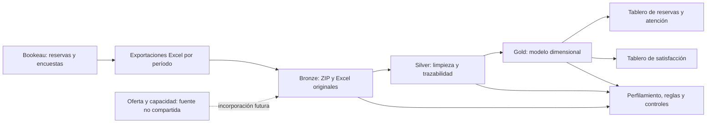

# Ecosistema de analítica propuesto · CupiTaller / Bookeau

## Contexto y alcance conocido

El paquete compartido proviene de reservas y encuestas de CupiTaller en Bookeau. El README describe cómo exportar por período las reservas con todas las categorías, servicios y tipos de horario. No documenta un ecosistema corporativo completo ni proporciona la oferta general de horarios y cupos. Por ello proponemos el ecosistema siguiente, distinguiendo lo conocido de los componentes implementados localmente para esta entrega.

## Componentes y justificación

| Componente | Función | Justificación |
|---|---|---|
| Bookeau / exportaciones | Origen de eventos y respuestas | Conserva el contexto del proceso y el período de extracción |
| Bronze | Archivos originales intactos | Permite reproducir la lectura y volver a la evidencia |
| Silver | Nombres y fechas comunes, programas normalizados, reglas R01/R02, banderas | Evita repetir limpieza en cada análisis y mantiene las discrepancias auditables |
| Gold | Hechos a distintos granos y dimensiones conformadas | Soporta segmentación consistente sin sumar encuestas como reservas nuevas |
| Consumo | Tablero local y consultas SQL | Responde preguntas con población, filtros y denominadores visibles |
| Calidad y metadatos | Diccionarios, reglas, conciliación, revisión de casos | Comprueba integridad y hace explícitas decisiones y limitaciones |

## Componentes intervenidos

Se intervienen Bronze, Silver, Gold y la capa de consumo. Bronze contiene las 114 hojas originales; Silver conserva los 146.952 registros; Gold conserva todos los eventos y excluye solo las encuestas no incluidas según R02. Las respuestas de texto se preservan con vínculos a su pregunta y encuesta para las siguientes entregas.

La implementación local usa Python estándar, CSV y una base SQLite en `data/oro/bookeau.sqlite3`. SQLite materializa el modelo y permite ejecutar SQL con restricciones de integridad. Es una implementación local para esta entrega; el ecosistema propone capas compatibles con una futura plataforma Lakehouse, pero no declara un Lakehouse corporativo ya desplegado. No se ha conectado a Bookeau ni desplegado infraestructura en la nube.

Una migración a la plataforma de clase deberá mantener granos, reglas, restricciones y reconciliación. Formatos, catálogo, acceso, orquestación y estrategia incremental se decidirán según esa plataforma; no se requiere cambiar los objetivos del modelo.

## Oferta y capacidad

Los eventos exportados no permiten reconstruir todos los horarios ofrecidos ni cupos sin reservas. El primer análisis se limita a **patrones de reservas y atención registrada**. No se publican ocupación, cupos libres, duración efectiva ni demanda insatisfecha como magnitudes observadas.

Para incorporar oferta se necesitarían registros de slots ofrecidos, capacidad, recursos y cambios/cancelaciones de disponibilidad, con fechas y claves compatibles. Su grano sería distinto del de reserva; el modelo actual no fabrica esos eventos.
