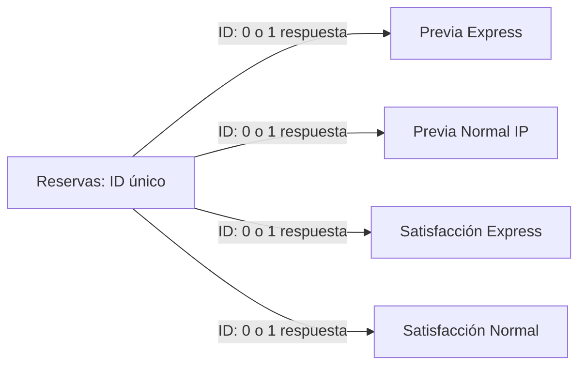

# Caracterización de datos · Bookeau

## 1. Contexto y alcance

Las fuentes corresponden a reservas y encuestas de las tutorías de CupiTaller gestionadas con Bookeau, según el README del paquete. Se analizaron **todos los 114 archivos Excel y sus 114 hojas**, manteniendo intactos los originales. Hay cinco grupos de fuentes y **146.952 filas** en total, pero corresponden a **86.562 eventos de reserva distintos** y respuestas asociadas. Cada encuesta reutiliza el ID de una reserva; sumar las filas de las cinco fuentes sobrecontaría eventos.

La fecha programada de inicio va del **19 de agosto de 2016 al 22 de mayo de 2026**. Los archivos utilizan códigos de período de seis dígitos; no deben convertirse a fechas de mes usando sus dos últimos dígitos. El calendario académico y el significado de períodos terminados en 10, 19 y 20 requieren confirmación.

## 2. Qué representa cada fuente

| Fuente | Archivos | Filas | Variables | Una fila representa |
| --- | --- | --- | --- | --- |
| Reservas | 29 | 86,562 | 17 | Un evento de reserva; incluye atención, cancelación, espera y otros estados. |
| Encuesta Reserva Express | 14 | 13,815 | 22 | Una respuesta previa a la reserva Express: objetivo y aceptación de condiciones. |
| Encuesta Reserva Normal IP | 13 | 23,437 | 22 | Una respuesta previa a la reserva Normal IP: objetivo y aceptación de condiciones. |
| Encuesta Express | 29 | 6,759 | 33 | Una respuesta de satisfacción asociada a una reserva Express. |
| Encuesta Normal | 29 | 16,379 | 35 | Una respuesta de satisfacción asociada a una reserva Normal. |

Reservas contiene 17 atributos; las cuatro encuestas repiten esos atributos (con una diferencia de nombre del código de servicio), agregan `Estado` de validez de encuesta y 4, 15 o 17 preguntas según el grupo. Dentro de cada grupo hay una sola variante de encabezados entre sus archivos; esto no demuestra que el cuestionario ni el significado de las etiquetas hayan sido estables históricamente.

El tamaño de Reservas está dentro del rango de 80.000–200.000 registros del enunciado, utilizando evento de reserva como unidad. Esa unidad debe mantenerse explícita al describir el volumen del proyecto.

## 3. Información disponible

| Bloque | Información | Uso potencial |
| --- | --- | --- |
| Evento y tiempo | ID, inicio/fin programados, llegada, estado y prioridad | Volumen, agenda, estados, duración programada y puntualidad con límites. |
| Servicio | Categoría, tipo de horario, servicio y código | Segmentación de demanda por modalidad y servicio. |
| Participantes | Usuario, correo, código, tipo, programa y prestador | Segmentación y recurrencia después de validar identidades y categorías. |
| Encuesta previa | Objetivo declarado y aceptación de condiciones | Motivos de reserva y caracterización del uso esperado. |
| Encuesta posterior | Calificación, comprensión, percepción del tutor, aprendizaje y uso de IA | Satisfacción y percepción; no demuestra efecto causal sobre aprendizaje. |
| Texto libre | Comentarios sobre tutoría, curso, sugerencias y herramienta de IA | Material textual para siguientes entregas, tras revisar pertinencia y contenido. |

Los nombres, tipos observados, significado inicial y completitud de cada campo están en [diccionario_variables.md](diccionario_variables.md). Los identificadores deben conservarse como identificadores, incluso si Excel los exporta numéricos; no son medidas para promediar.

En Reservas hay 9.943 códigos de usuario distintos, 9.932 correos distintos, 742 nombres de prestador no vacíos y 213 etiquetas de programa. Son cardinalidades de valores exportados, no conteos certificados de personas, tutores o programas homologados.

## 4. Cobertura temporal

| Fuente | Primer inicio observado | Último inicio observado | Archivos sin registros |
| --- | --- | --- | --- |
| Reservas | 2016-08-19 | 2026-05-22 | Ninguno |
| Encuesta Reserva Express | 2019-10-21 | 2026-05-22 | Ninguno |
| Encuesta Reserva Normal IP | 2019-10-21 | 2026-05-22 | Ninguno |
| Encuesta Express | 2017-02-02 | 2026-05-22 | 201620, 202219, 202319, 202419, 202519 |
| Encuesta Normal | 2016-08-19 | 2026-05-22 | 202219 |

Las encuestas previas tienen registros desde octubre de 2019 y no cubren todos los períodos de Reservas. Un archivo ausente o vacío no demuestra falta de demanda. La calificación numérica del tutor tiene respuestas desde 201819; preguntas sobre comprensión y uso de IA aparecen con valores en períodos diferentes según el grupo. Los períodos con respuesta se documentan en `cobertura_variables_periodo.csv`; validar formularios históricos antes de comparar series o interpretar esos períodos como fechas de introducción.

## 5. Identificadores y relaciones

El campo `ID` es completo y único en cada grupo. Se encontraron **cero filas excedentes por ID repetido y cero duplicados exactos** dentro de cada fuente. El 100% de los registros de cada encuesta corresponde a una reserva existente, tanto por ID como por ID y período.

| Encuesta | Filas | ID con reserva | Sin reserva |
| --- | --- | --- | --- |
| Encuesta Express | 6,759 | 6,759 | 0 |
| Encuesta Normal | 16,379 | 16,379 | 0 |
| Encuesta Reserva Express | 13,815 | 13,815 | 0 |
| Encuesta Reserva Normal IP | 23,437 | 23,437 | 0 |

La relación observada es una reserva a cero o una respuesta en cada grupo de encuesta. Las respuestas previas y posteriores pueden pertenecer a la misma reserva. Conservarlas como registros asociados; no concatenarlas como reservas nuevas. La unicidad observada en esta extracción debe volver a comprobarse al recibir nuevos datos.



## 6. Calidad y límites encontrados

### Completitud

| Campo en Reservas | Faltantes | Porcentaje |
| --- | --- | --- |
| Fecha de llegada | 43,422 | 50.1629% |
| Fecha de devolución | 86,562 | 100.0% |
| Programa | 333 | 0.3847% |
| Prestador del servicio | 42,616 | 49.2318% |

**Fecha de devolución está vacía en las cinco fuentes.** No se puede calcular duración efectiva ni tiempo real de salida. Inicio y fin programados son completos y dan duraciones de 20 a 120 minutos en Reservas, con mediana de 50 minutos. Las medianas en satisfacción son 30 minutos para Express y 55 para Normal; no suponer que toda reserva Normal equivale a 60 minutos.

Los faltantes de llegada o prestador dependen del estado del evento y no deben tratarse todos como errores. `estado_llegada.csv` muestra 8 reservas Finalizada sin llegada, 9 No asistió con llegada y pequeñas cantidades de cancelaciones con llegada; son casos para revisión operativa. Una marca de llegada no define por sí sola que la sesión se completó.

### Categorías, unicidad y validez

Reservas contiene 12 estados, 11 categorías, 10 tipos de horario, 11 servicios y 6 tipos de usuario. Hay etiquetas `Deprecated` que requieren un catálogo histórico, y variantes de programa que difieren por mayúsculas, tildes o espacios. `variantes_categoricas.csv` identifica candidatos para homologar, sin aplicar cambios.

Las encuestas de satisfacción tienen 53 respuestas Express y 111 Normal marcadas `Inválida`; la encuesta previa Normal IP tiene 2. La previa Express no tiene respuestas marcadas inválidas. Confirmar el significado de esa etiqueta antes de excluir respuestas.

La calificación del tutor tiene 4.983 respuestas no vacías en Express y 11.326 en Normal; todas tienen valores enteros entre 1 y 5. Faltan 1.776 y 5.053 respuestas respectivamente. El dominio 1–5 se deriva de lo observado; confirmar el cuestionario y sus anclajes antes de interpretar promedios.

No se encontraron fechas fin anteriores al inicio ni inicios fuera del año del código de período. La coherencia llegada–devolución no es evaluable por ausencia total de devolución. Estas comprobaciones son parciales: no validan todas las reglas del negocio.

### Consistencia entre fuentes

El nombre `Código servicio` en Reservas equivale al encabezado `Código del servicio` en encuestas para los pares comparados. Al vincular por ID y período, las fechas y códigos de servicio no muestran diferencias entre pares no vacíos. Sí hay diferencias en estado de reserva, código de usuario, programa, usuario y prestador.

| Encuesta | Diferencias de estado | Diferencias de código usuario | Diferencias de prestador |
| --- | --- | --- | --- |
| Encuesta Reserva Express | 15 | 15 | 82 |
| Encuesta Reserva Normal IP | 36 | 10 | 144 |
| Encuesta Express | 5 | 5 | 67 |
| Encuesta Normal | 17 | 10 | 257 |

Las diferencias no demuestran errores por sí solas: podrían deberse a actualizaciones o a variantes de representación. Definir fuente de referencia y regla de conciliación con el responsable antes de sobrescribir atributos.

## 7. Datos de texto

| Fuente | Campo | Respuestas no vacías | Cobertura |
| --- | --- | --- | --- |
| Encuesta Express | Indique cuál fue la herramienta usada durante la tutoría (si sabe cuál es) y el uso que tuvo la misma en la tutoría. | 4 | 0.0592% |
| Encuesta Express | Comente aspectos positivos y negativos del tutor y la tutoría. Recuerde que las respuestas van a ser anónimas. | 5,453 | 80.6776% |
| Encuesta Express | Escriba en este recuadro cualquier observación o comentario relacionado al curso y sus contenidos. | 564 | 8.3444% |
| Encuesta Express | Sugerencias, reclamos y observaciones | 1,730 | 25.5955% |
| Encuesta Normal | Indique cuál fue la herramienta usada durante la tutoría (si sabe cuál es) y el uso que tuvo la misma en la tutoría. | 22 | 0.1343% |
| Encuesta Normal | Comente aspectos positivos y negativos del tutor y la tutoría. Recuerde que las respuestas van a ser anónimas. | 12,534 | 76.5248% |
| Encuesta Normal | Escriba en este recuadro cualquier observación o comentario relacionado al curso y sus contenidos. | 1,329 | 8.114% |
| Encuesta Normal | Sugerencias, reclamos y observaciones | 4,053 | 24.7451% |

Hay **17.987 respuestas no vacías** al comentario sobre tutor y tutoría entre Express y Normal. La longitud mediana es de 26 y 29 caracteres respectivamente. Tener texto no garantiza un comentario sustantivo: los conteos excluyen vacíos y espacios, pero no clasifican respuestas como “no aplica”, signos o frases genéricas. La pertinencia del corpus se debe evaluar antes del análisis textual.

## 8. Qué podemos analizar y qué falta confirmar

- Demanda: eventos por período, servicio y modalidad. Separar espera, cancelación y atención para no llamar tutorías atendidas a todas las reservas.
- Asistencia: estados y marcas de llegada, una vez confirmadas las reglas del proceso.
- Satisfacción: calificaciones y respuestas por modalidad y período, considerando validez, no respuesta y cambios históricos del cuestionario.
- Motivos y texto: objetivos de reservas, comentarios de tutorías y observaciones sobre el curso.
- No hay notas académicas ni medidas de aprendizaje objetivo, costos, ingresos o capacidad disponible explícita. Estos datos no permiten por sí solos medir impacto causal en aprendizaje, rentabilidad o utilización de capacidad.

Antes del modelo y los indicadores, confirmar: significado de los estados (incluidos Realizada y Finalizada), momento de captura de llegada, códigos de período, catálogos Deprecated, identidad de usuario y prestador, formularios y escalas históricos, y motivo de invalidez de encuestas.

## 9. Método y reproducción

Se leyeron directamente los XML internos de todos los XLSX usando la biblioteca estándar de Python. Las celdas se alinean por coordenada Excel; los huecos no desplazan columnas. Las fechas se decodifican usando estilos y sistema de fechas del libro. Se considera faltante una celda ausente, vacía o con espacios; textos como “No aplica” no se convierten automáticamente en nulos.

Los duplicados exactos se evalúan dentro de cada grupo sobre todas las columnas de origen, sin añadir período ni ruta al contenido. Las diferencias entre fuentes se comparan solo en pares no vacíos con una reserva inequívoca en el mismo período; se tolera hasta un segundo de diferencia en fechas por representación Excel.

Ejecutar desde la raíz del proyecto:

```sh
python3 src/caracterizar_bookeau.py
python3 src/documentar_caracterizacion.py
```

Los scripts regeneran tablas y documentos de caracterización. No limpian ni transforman los originales. El cuaderno `notebooks/01_caracterizacion_bookeau.ipynb` permite consultar los resultados y volver a generarlos.

Los resultados describen esta extracción completa, no la calidad garantizada de futuras cargas ni un diccionario confirmado por el dueño de los datos.
