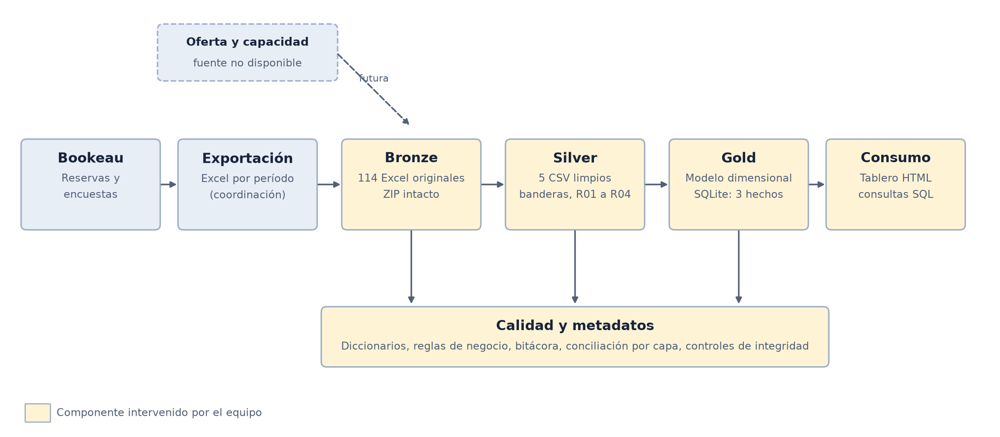
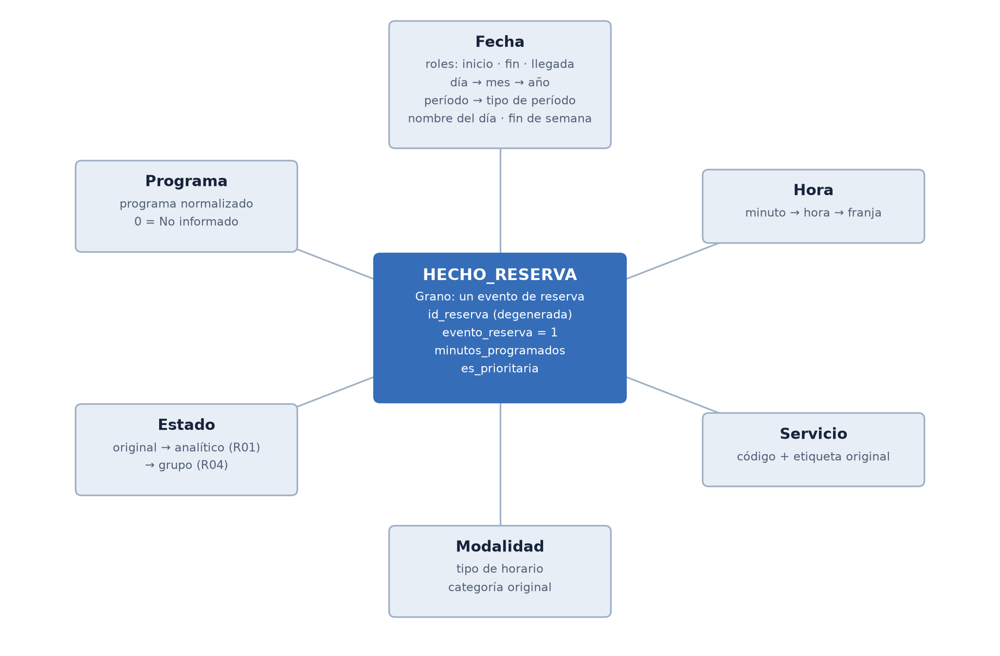
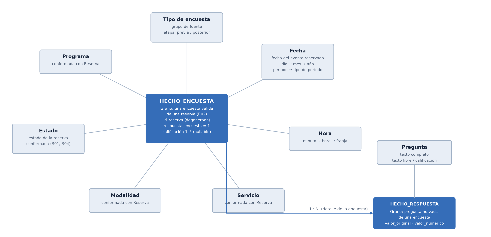
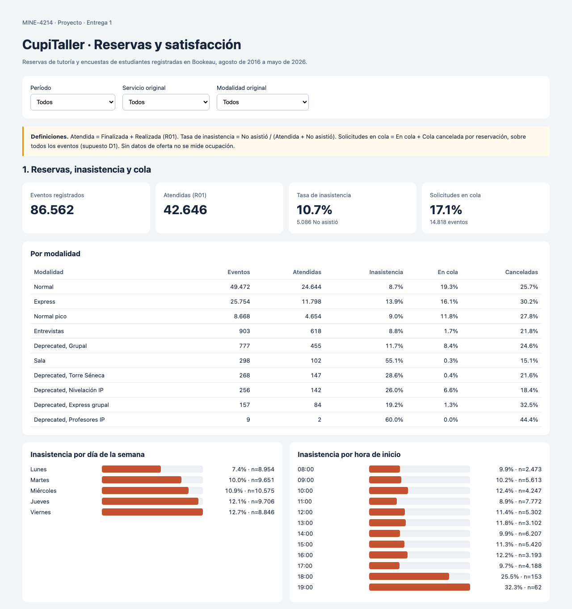
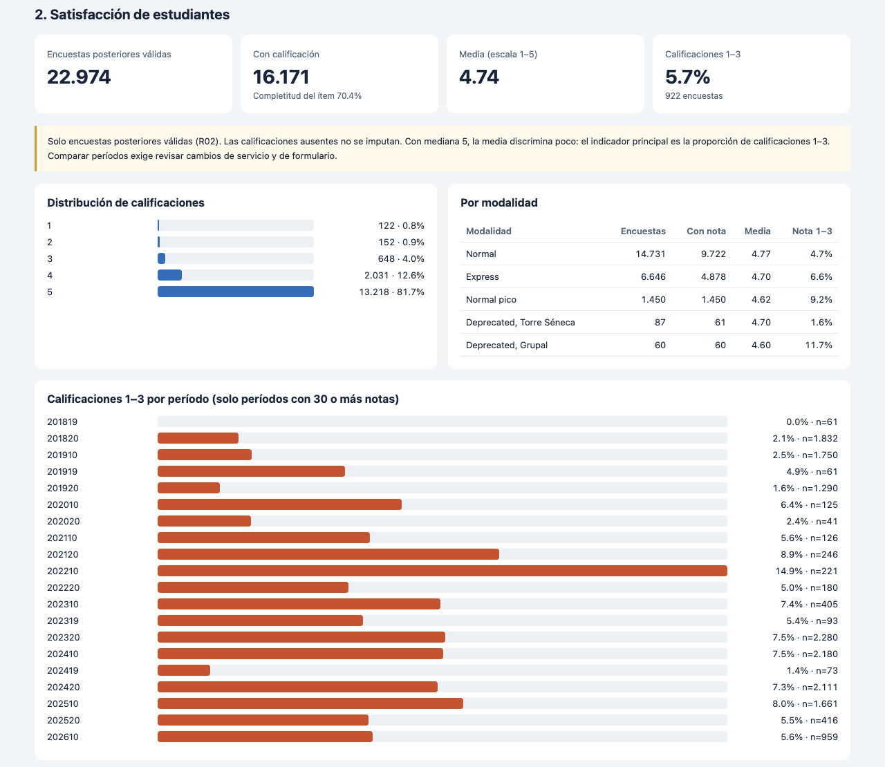

# Proyecto · Entrega 1 · Reservas y satisfacción en CupiTaller

**MINE-4214 Modelado y Diseño de Datos · Universidad de los Andes · Octubre de 2026**

**Integrantes:** _[Nombre 1]_, _[Nombre 2]_, _[Nombre 3]_, _[Nombre 4]_

---

## 0. Resumen para quien no conoce el contexto

**De qué trata este informe.** La Universidad de los Andes (Bogotá, Colombia) ofrece tutorías de programación a sus estudiantes de primeros semestres. Cada tutoría se reserva en una plataforma web y, al terminar, el estudiante califica la atención. Durante diez años esa plataforma acumuló datos de reservas y encuestas que hoy se revisan a mano, en hojas de cálculo. Este informe propone cómo organizar esos datos para responder, con un tablero de control (una pantalla con gráficos y tablas que se pueden filtrar), dos preguntas de la coordinación del servicio:

1. ¿Dónde y cuándo los estudiantes reservan una tutoría y no asisten, o se quedan sin cupo?
2. ¿Qué tan satisfechos quedan los estudiantes y en qué casos la calificación es baja?

**Qué se entrega.** Es la primera de varias entregas de un proyecto del curso *Modelado y Diseño de Datos*. Incluye la descripción del contexto, una arquitectura propuesta para manejar los datos, la revisión de su calidad, el diseño de las tablas donde se guardarán, el proceso para cargarlas, y el tablero con los resultados. El análisis de los comentarios escritos por los estudiantes queda para una entrega posterior.

**Cómo leerlo.** Cada término técnico se explica donde aparece por primera vez. Al final hay un glosario (Anexo A) con todos ellos. Las cifras del informe salen de los datos reales del servicio y se pueden reproducir con los programas del proyecto (Anexo B). El detalle completo de los datos, la calidad, la limpieza y la carga está en el Anexo C; una extensión exploratoria sobre los comentarios escritos está en el Anexo D, y las reglas pendientes de confirmar y el estado del proyecto, en el Anexo E.

## 0. Correspondencia con la guía y la rúbrica del curso

La guía del curso pide siete puntos y la rúbrica de evaluación tiene 15 criterios que suman 52 puntos. Esta tabla indica en qué sección se atiende cada criterio.

| Punto de la guía | Criterio de la rúbrica | Puntos | Sección |
|---|---|---:|---|
| 1. Objetivo y análisis | Descripción de la empresa | 2 | 1.1 |
| 1. Objetivo y análisis | Descripción de los análisis | 3 | 1.2 a 1.6 |
| 2. Ecosistema | Completitud del ecosistema | 3 | 2 |
| 2. Ecosistema | Correctitud del ecosistema | 2 | 2, 2.1 |
| 3. Exploración y calidad | Estadísticos de los datos | 2 | 3.1 |
| 3. Exploración y calidad | Calidad de datos (completitud, unicidad, consistencia, validez) | 6 | 3.2 a 3.6 |
| 4. Modelo conceptual | Completitud del modelo | 3 | 4.1 a 4.3 |
| 4. Modelo conceptual | Correctitud de tablas de hechos y dimensiones | 3 | 4.4, 4.5 |
| 4. Modelo conceptual | Historia de atributos (SCD) | 3 | 4.6 |
| 4. Modelo conceptual | Diseño del repositorio | 3 | 4.7 |
| 5. Transformación Silver a Gold | Diseño del proceso de transformación | 12 | 5 |
| 6. Respuesta a los análisis | Completitud de los análisis | 5 | 6.1, 6.2, 6.4 |
| 6. Respuesta a los análisis | Correctitud de los análisis | 3 | 6.3, 6.4 |
| 7. Gestión del proyecto | Trabajo en equipo | 1 | 7.1 |
| 7. Gestión del proyecto | Distribución adecuada | 1 | 7.1 |
| | **Total** | **52** | |

La guía exige datos tabulares (filas y columnas) y texto, entre 80.000 y 200.000 registros, y grupos de 3 a 4 personas. Este proyecto usa 86.562 registros de reservas y 17.987 comentarios escritos, estos últimos para la siguiente entrega.

---

## 1. Objetivo y análisis requeridos

### 1.1 Organización y dependencia

La **Universidad de los Andes** es una universidad privada de Bogotá, Colombia. Su **Departamento de Ingeniería de Sistemas y Computación** (DISC), dentro de la Facultad de Ingeniería, ofrece el servicio de tutorías **CupiTaller** para los cursos de programación de los primeros semestres:

- **Introducción a la Programación** (código ISIS-1221, abreviado **IP**).
- **APO 1** y **APO 2**, cursos de programación que IP reemplazó. Aparecen en los datos históricos.
- **Estructuras de Datos y Algoritmos** (**EDA**).
- **Diseño y Programación Orientada a Objetos** (**DPOO**).

En CupiTaller, **monitores** (estudiantes que actúan como tutores de sus compañeros) atienden sesiones con cita previa. Hay tres **modalidades** de tutoría:

- **Normal:** dura 50 a 60 minutos.
- **Express:** dura 20 a 30 minutos y sirve para dudas puntuales.
- **Normal pico:** es una sesión Normal en las semanas de más demanda.

Las citas se gestionan en **Bookeau**, la plataforma web de reservas. El estudiante pide una franja horaria. Si no hay cupo, queda **en cola**, es decir, en lista de espera, y no recibe cita. Cada cita termina en uno de estos **estados**:

- **Atendida:** la tutoría se dio. Bookeau la registra como «Finalizada» o «Realizada» (ver regla R01 en 3.6).
- **Cancelada:** el estudiante canceló. Puede ser a tiempo, con excusa, por sanción, o tarde y sancionada. Una **sanción** es una penalización por incumplir las reglas de reserva.
- **No asistió:** el estudiante no se presentó.

Antes de la cita, el estudiante responde una **encuesta previa** (objetivo de la sesión y aceptación de condiciones). Después, responde una **encuesta de satisfacción** con una calificación de 1 a 5 al tutor y comentarios abiertos.

Trabajamos con dos áreas del DISC. La **coordinación de CupiTaller** planea las franjas y asigna monitores cada semestre. La **coordinación académica de los cursos** se encarga de la formación de los monitores.

### 1.2 Proceso que genera los datos

Los dos análisis usan datos que nacen de un mismo proceso: el ciclo de una tutoría en Bookeau. La tabla indica, paso a paso, quién actúa, qué ocurre y qué dato queda registrado. Los nombres entre comillas son los de las columnas tal como vienen de Bookeau.

| Paso | Quién actúa | Qué ocurre | Dato que queda registrado | Fuente (archivo) |
|---:|---|---|---|---|
| 1 | Estudiante | Elige curso (servicio), modalidad y una franja horaria, y pide la cita. | Un evento de reserva con su «ID», «Fecha inicio», «Fecha fin», «Servicio», «Tipo de horario», «Categoría», «Prioritaria», y los datos del usuario («Código usuario», «Programa», «Tipo de usuario»). | Reservas |
| 2 | Estudiante | Antes de confirmar, responde la encuesta previa: para qué usará la tutoría y si acepta las condiciones (no usar el celular, tener una solución probada si trabaja en una tarea, términos de uso). | Cuatro respuestas por reserva, ligadas a su «ID». | Encuesta Reserva Express / Normal IP |
| 3 | Bookeau | Si hay cupo en la franja, la reserva queda hecha. Si no, queda **en cola**. | «Estado de la reserva»: Reservada o En cola. Existe también la etiqueta «Cola cancelada por reservación», cuyo significado exacto no está documentado; la tratamos como una solicitud en cola que se cerró. | Reservas |
| 4 | Estudiante | Puede cancelar antes de la cita. | «Estado de la reserva»: Cancelada a tiempo, con excusa, por sanción, o tarde y sancionada. | Reservas |
| 5 | Estudiante y monitor | El día de la cita, el estudiante llega (o no) y un monitor lo atiende. | «Fecha de llegada» (solo si llegó) y «Prestador del servicio», que es el monitor asignado. | Reservas |
| 6 | Monitor o sistema | La cita se cierra con un estado final: Finalizada o Realizada (atendida), o No asistió. | «Estado de la reserva» final. | Reservas |
| 7 | Estudiante | Después de la cita, responde de forma voluntaria la encuesta de satisfacción: calificación de la ayuda del tutor (1 a 5), preguntas sobre la tutoría y comentarios escritos. | Respuestas ligadas al «ID», con un «Estado» de validez (Válida o Inválida) asignado por Bookeau. | Encuesta Express / Normal |

**Cómo llegaron los datos al proyecto.** Una persona de la coordinación entra a Bookeau con el rol de *Analista*, abre la sección *Reportes*, elige el semestre, deja todos los filtros en «Todos» (categoría, tipo de horario y servicio) y descarga un archivo de Excel por semestre y por tipo de reporte. Los 114 archivos se guardaron sin modificar (capa Bronze, sección 2).

**Qué aún no sabemos del proceso.** Con lo recibido no se puede confirmar quién registra la llegada, qué diferencia exacta hay entre «Finalizada» y «Realizada», ni con qué criterio Bookeau marca una encuesta como «Inválida». El campo «Fecha de devolución» llega vacío en todos los archivos. Estos puntos se tratan como supuestos explícitos (sección 3.6) y se listan como correcciones pendientes de la fuente (sección 5.4).

### 1.3 Análisis 1 · Inasistencia y presión de cola

| Elemento | Definición |
|---|---|
| Objetivo | Identificar en qué modalidades, días, horas y períodos los estudiantes reservan y no asisten, y en cuáles se quedan sin cupo, para decidir dónde reforzar franjas (más monitores) y dónde aplicar medidas contra la inasistencia (recordatorios, política de sanciones). |
| Destinatario | **Coordinación de CupiTaller.** |
| Por qué ese rol | Planea las franjas y asigna monitores cada semestre y fija las reglas de reserva y de sanción. Las dos decisiones que este análisis apoya (cuántos monitores poner en cada franja y qué reglas ajustar) son exactamente las suyas. |
| Cómo lo usaría | Antes de cada semestre, revisa por modalidad, día y hora qué proporción de citas se pierde y dónde se acumula la cola; cambia la oferta de franjas o las reglas según lo que encuentre. |
| Preguntas | (1) ¿Cómo evolucionan las reservas y la atención por período? (2) ¿Qué modalidades, días y horas tienen mayor tasa de inasistencia? (3) ¿Qué proporción de solicitudes termina en cola y dónde? |
| Indicadores | **Evento de reserva:** una fila de Reservas. **Atención:** reserva en estado Atendida. **Tasa de inasistencia** = No asistió / (Atendida + No asistió). **Proporción en cola** = (En cola + Cola cancelada por reservación) / eventos. **Proporción de cancelaciones** = canceladas / eventos. |
| Preguntas complementarias | (4) Una vez confirmados los estados y la población elegible: ¿qué proporción de los eventos elegibles se atiende, se cancela o termina sin asistencia? |
| Viabilidad | Los datos cubren casi diez años (29 períodos) y 86.562 eventos. Todas las variables necesarias están en un solo archivo (Reservas), sin cruces con otras fuentes. |
| Estado de validación | El rol destinatario es una propuesta del equipo: no se ha confirmado el organigrama ni se ha entrevistado al responsable de la fuente. |

**Datos del Análisis 1**

- **Fuente:** archivo *Reservas*, 29 archivos de Excel (uno por período, de 201620 a 202610), con 86.562 filas y 17 variables.
- **Nivel de detalle (granularidad):** una fila es un **evento de reserva**: una solicitud de un estudiante para una franja, sin importar cómo terminó (atendida, cancelada, no asistió o en cola). El dato más fino es el minuto de inicio de la cita.
- **Período cubierto:** 19 de agosto de 2016 a 22 de mayo de 2026.

| Variable clave | Qué significa | Valores y tipo | Para qué se usa |
|---|---|---|---|
| ID | Identificador del evento de reserva | Texto, único (86.562 valores) | Contar eventos y vincular las encuestas |
| Estado de la reserva | Cómo terminó la solicitud | 12 etiquetas (Finalizada, Cancelada a tiempo, En cola, No asistió, Realizada, etc.) | Calcular atención, inasistencia, cola y cancelaciones |
| Tipo de horario | Modalidad de la tutoría | 10 etiquetas (Normal, Express, Normal pico y otras históricas) | Comparar modalidades |
| Servicio | Curso para el que se pide la tutoría | 11 etiquetas (IP, APO 1, EDA, APO 2…) | Comparar cursos |
| Fecha inicio y Fecha fin | Inicio y fin programados de la cita | Fecha y hora | Día de la semana, hora, período; duración programada (mínimo 20, mediana 50, máximo 120 minutos) |
| Fecha de llegada | Momento en que el estudiante llegó | Fecha y hora; vacía en 50,2% (cancelaciones y cola no llegan) | Revisar la coherencia del estado (3.4) |
| Prestador del servicio | Monitor asignado | Texto; vacío en 49,2% (solo las citas atendidas tienen monitor) | Apoyar la asignación de monitores por franja |
| Prioritaria | Indicador sí/no de reserva prioritaria | Categórica | Medida del modelo (4.1) |
| Programa | Programa académico del estudiante | Texto libre, 213 variantes | Segmentar por programa, ya normalizado |
| Período | Semestre de la reserva | Código de seis cifras, 29 valores; se deduce del nombre del archivo | Evolución en el tiempo |

**Indicadores del Análisis 1 y su estado.** Los cuatro primeros son calculables hoy; los demás dependen de reglas de negocio que la coordinación debe confirmar.

| Indicador | Definición | Denominador o población | Estado |
|---|---|---|---|
| Eventos de reserva | Conteo de ID distintos en el segmento | Todos los eventos de la selección, incluidos cola y cancelaciones | Calculable |
| Distribución de estados | Eventos con cada etiqueta literal | Todos los eventos del mismo segmento | Calculable, sin agrupar estados |
| Agenda por día y hora | Eventos por día ISO y hora de «Fecha inicio» | Eventos con inicio disponible | Calculable; hora tal como se exportó, sin conversión de zona horaria |
| Minutos programados | Fin programado menos inicio programado | Eventos con ambos campos coherentes | Calculable; no es atención efectiva |
| Tasa de asistencia | Finalizada o Realizada / eventos elegibles | Numerador agrupado por R01; población elegible por confirmar | Numerador definido, denominador pendiente |
| Tasa de inasistencia | No asistió / (Atendida + No asistió) | Supuesto D1: la cola no ocupa cupo | Definida por supuesto del equipo, por validar |
| Tasa de cancelación | Eventos cancelados / población definida | Falta definir si entra la cancelación de cola y la cancelación por sanción | Pendiente de definición de negocio |

La población de Reservas incluye modalidades distintas de la tutoría (entrevistas, salas y etiquetas históricas), por lo que se muestra segmentada. Para comparar Express con Normal se usan las etiquetas exactas y se documenta qué modalidades quedan fuera; «Normal pico» permanece separada hasta justificar su equivalencia. **Calidad necesaria:** ID completo y único, fechas válidas, categorías conservadas con su catálogo histórico, estados confirmados y revisión de las excepciones entre estado y llegada. Tampoco se puede medir la capacidad utilizada: no hay oferta completa de horarios ni capacidad explícita.

Otras columnas de Reservas (nombre, correo y código del usuario, tipo de usuario, categoría, códigos de servicio) identifican personas o duplican información. No se usan en el análisis, y el modelo no incluye una dimensión de personas para no exponer datos personales.

### 1.4 Análisis 2 · Satisfacción con las tutorías

| Elemento | Definición |
|---|---|
| Objetivo | Conocer cómo califican los estudiantes la ayuda del tutor y en qué servicios, modalidades y períodos se concentran las calificaciones bajas, para decidir qué priorizar en la formación y el seguimiento de los monitores. |
| Destinatario | **Coordinación académica de los cursos.** |
| Por qué ese rol | Es quien forma y evalúa a los monitores. Una calificación baja concentrada en un curso, una modalidad o un semestre le dice dónde reforzar la formación. |
| Cómo lo usaría | Cada semestre revisa la proporción de calificaciones bajas por segmento, compara con los semestres anteriores y decide dónde intervenir (capacitación, acompañamiento, ajustes a la modalidad). |
| Preguntas | (1) ¿Cómo se distribuye la calificación del tutor? (2) ¿Qué segmentos concentran calificaciones bajas (1 a 3)? (3) ¿Cómo cambian en el tiempo? |
| Indicadores | **Encuestas válidas:** las no marcadas «Inválida». **Completitud del ítem:** parte de las encuestas válidas que contestó la calificación. **Proporción de calificaciones 1 a 3** (indicador principal). **Media y distribución de 1 a 5** (apoyo). |
| Preguntas complementarias | (4) ¿Qué porcentaje de las respuestas incluidas tiene una calificación utilizable? (5) ¿Cómo se comparan Express y Normal dentro de períodos y servicios con respuestas de ambas? (6) ¿Qué percepciones y temas aparecen en los comentarios? (esta última se desarrollará en las siguientes entregas) |
| Estado de validación | El rol destinatario es una propuesta del equipo: no se ha confirmado el organigrama ni se ha entrevistado al responsable de la fuente. |
| Viabilidad | Hay 23.138 encuestas posteriores, todas vinculadas a su reserva por el ID, de modo que cada calificación se puede ubicar por curso, modalidad, período y programa. |

**Por qué el indicador principal es la proporción de 1 a 3.** La escala tiene **efecto techo**: casi todas las notas son 5 (81,7%, y la mediana es 5). El promedio apenas distingue entre grupos, mientras que la cola de notas bajas sí lo hace.

**Datos del Análisis 2**

- **Fuentes:** *Encuesta Express* (6.759 filas × 33 variables) y *Encuesta Normal* (16.379 filas × 35 variables), 29 archivos cada una. Para segmentar se cruzan por el ID con *Reservas* (fuente del Análisis 1). Todas las encuestas encuentran su reserva.
- **Nivel de detalle:** una fila es una **encuesta de satisfacción de una reserva**; en el modelo se desglosa además en una fila por pregunta contestada (384.792 respuestas contando también las encuestas previas).
- **Período cubierto:** de 201620 a 202610. Los formularios cambiaron en el tiempo, así que no todas las preguntas existen en todos los períodos.

| Variable clave | Qué significa | Valores y tipo | Cobertura |
|---|---|---|---|
| ID | Identificador de la reserva a la que corresponde | Texto; vincula con Reservas | 100% |
| Califique la ayuda que le dio su tutor | Calificación del tutor | Entero de 1 a 5 | Desde 201819; falta en 26,3% (Express) y 30,9% (Normal) |
| Estado | Validez de la encuesta según Bookeau | Válida o Inválida | 100%; 166 inválidas |
| Preguntas de aspectos del tutor (explicó, aclaró conceptos, fue receptivo, expresó con claridad…) | Valoración de la sesión | Escala de acuerdo (categorías) | Varía por pregunta y período |
| ¿El tutor usó herramientas de inteligencia artificial? | Uso de IA en la tutoría | Categórica | Desde 2021 (Normal) y 2022 (Express); falta entre 60% y 63% |
| Comprensión del tema y material del curso | Autoevaluación del estudiante | Categórica | Falta en 72% a 73% (preguntas recientes) |
| Comentario sobre aspectos positivos y negativos del tutor | Texto libre | Texto | Presente en 76% a 81%; se analizará en la siguiente entrega |
| Servicio, Tipo de horario, Estado de la reserva, Programa y período | Datos de la reserva a la que pertenece la encuesta | Igual que en Reservas | 100% |

**Indicadores del Análisis 2 y su estado**

| Indicador | Definición | Denominador o población | Estado |
|---|---|---|---|
| Calificaciones utilizables | Encuestas «Válida» con calificación entera de 1 a 5 | Encuestas «Válida» del segmento (regla R02) | Calculable |
| Distribución 1 a 5 | Cantidad de cada calificación / calificaciones utilizables | Calificaciones utilizables del segmento | Calculable; se muestran los conteos además de los porcentajes |
| Mediana y media | Resumen de la calificación utilizable | Calificaciones utilizables, con su *n* | La media supone distancias iguales entre puntos; falta confirmar la escala |
| Completitud del ítem | Calificaciones utilizables / encuestas válidas | Encuestas válidas del segmento | Calculable; no es la tasa de respuesta |
| Tasa de respuesta | Reservas elegibles con respuesta / reservas elegibles | Falta definir invitación, elegibilidad, estados y períodos del instrumento | Pendiente de definición de negocio |
| Comparación Express y Normal | Comparar dentro del mismo período y servicio original | Etiquetas exactas Express y Normal con calificación en ambas | Exploratoria; falta confirmar la equivalencia del instrumento |

Las encuestas «Inválida» se excluyen de numeradores y denominadores (regla R02) pero se cuentan en la auditoría; su reserva sigue en los análisis de demanda y atención. Las preguntas vacías no se rellenan con cero. La fecha de inicio de la reserva ubica el evento en el tiempo, pero no demuestra cuándo se contestó la encuesta. **Calidad necesaria:** vínculos completos y únicos, separación entre el estado de la reserva y el de la encuesta, calificación dentro del dominio observado, disponibilidad por período, conciliación de atributos repetidos y conocimiento de las escalas y formularios históricos. Además, un resultado de satisfacción no demuestra mejora del aprendizaje ni que una modalidad cause mejores resultados.

La encuesta incluye también preguntas sobre cómo se usó el tiempo de la tutoría y sugerencias o reclamos en texto libre, que quedan disponibles en el modelo para los análisis de texto.

**Cuidado con la interpretación.** La encuesta es voluntaria: los resultados describen a quienes respondieron, no a todos los estudiantes que recibieron una tutoría. Además, la calificación mide la percepción del estudiante, no la calidad objetiva de la tutoría.

### 1.5 Caracterización general de los datos

El paquete que entregó la coordinación contiene **114 archivos de Excel**, uno por grupo de datos y período, en cinco grupos, con **146.952 filas** en total. Un **período** es un semestre académico y se identifica con un código de seis cifras: el año seguido de 10 (primer semestre), 20 (segundo semestre) o 19 (intersemestral, el curso corto entre semestres). Por ejemplo, 202610 es el primer semestre de 2026.

| Fuente | Archivos | Filas | Variables | Una fila representa |
|---|---:|---:|---:|---|
| Reservas | 29 | 86.562 | 17 | Un evento de reserva |
| Encuesta Reserva Express (previa) | 14 | 13.815 | 22 | Encuesta previa de una reserva Express |
| Encuesta Reserva Normal IP (previa) | 13 | 23.437 | 22 | Encuesta previa de una reserva Normal de IP |
| Encuesta Express (satisfacción) | 29 | 6.759 | 33 | Encuesta posterior de una reserva Express |
| Encuesta Normal (satisfacción) | 29 | 16.379 | 35 | Encuesta posterior de una reserva Normal |
| **Total** | **114** | **146.952** | | |

Las encuestas reutilizan el ID de la reserva, así que la unidad de trabajo del proyecto es el **evento de reserva: 86.562 registros**, dentro del rango de 80.000 a 200.000 que pide la guía. Además de los datos en tablas hay texto libre: 17.987 comentarios sobre el tutor y la tutoría, que se analizarán en las siguientes entregas.

### 1.6 Información disponible y relaciones entre las fuentes

| Bloque | Información | Uso potencial |
|---|---|---|
| Evento y tiempo | ID, inicio y fin programados, llegada, estado y prioridad | Volumen, agenda, estados, duración programada y puntualidad (con límites) |
| Servicio | Categoría, tipo de horario, servicio y código | Segmentación de la demanda por modalidad y servicio |
| Participantes | Usuario, correo, código, tipo, programa y prestador | Segmentación y recurrencia, tras validar identidades y categorías |
| Encuesta previa | Objetivo declarado y aceptación de condiciones | Motivos de reserva y uso esperado |
| Encuesta posterior | Calificación, comprensión, percepción del tutor, aprendizaje y uso de IA | Satisfacción y percepción; no demuestra efecto causal sobre el aprendizaje |
| Texto libre | Comentarios sobre la tutoría, el curso, sugerencias y herramienta de IA | Material para las siguientes entregas, tras revisar su pertinencia |

Los identificadores (ID, códigos) se tratan como texto aunque Excel los exporte como números: no son medidas para promediar. Cada reserva tiene cero o una respuesta en cada una de las cuatro encuestas; las respuestas previas y posteriores pueden pertenecer a la misma reserva y se conservan como registros asociados, no como reservas nuevas. La unicidad observada en esta extracción debe volver a comprobarse cuando lleguen datos nuevos. Todas las encuestas encuentran su reserva por ID y por ID más período:

| Encuesta | Filas | ID con reserva | Sin reserva |
|---|---:|---:|---:|
| Satisfacción Express | 6.759 | 6.759 | 0 |
| Satisfacción Normal | 16.379 | 16.379 | 0 |
| Previa Express | 13.815 | 13.815 | 0 |
| Previa Normal IP | 23.437 | 23.437 | 0 |

**Cobertura temporal.** Las reservas cubren del 19 de agosto de 2016 al 22 de mayo de 2026. Las encuestas previas existen desde el 21 de octubre de 2019. La calificación numérica del tutor tiene respuestas desde el período 201819, y las preguntas de comprensión y de uso de IA aparecen en períodos distintos según la encuesta. El detalle por período está en los Anexos C.2 y C.5.

**Qué se puede analizar y qué no.** Con estos datos se pueden analizar la demanda (eventos por período, servicio y modalidad, separando cola, cancelación y atención), la asistencia (estados y llegada, cuando se confirmen las reglas), la satisfacción (calificaciones por modalidad y período, considerando validez, falta de respuesta y cambios de formulario) y los motivos y textos (objetivos de reserva y comentarios). No hay notas académicas ni medidas objetivas de aprendizaje, costos, ingresos ni capacidad disponible, así que no se puede medir impacto causal, rentabilidad ni uso de la capacidad. La lista completa de reglas por confirmar está en el Anexo E.

---

## 2. Ecosistema de analítica

Un **ecosistema de analítica** es el conjunto de herramientas y pasos que llevan los datos desde donde se generan hasta la persona que los consulta: dónde se guardan, cómo se limpian, cómo se organizan y cómo se muestran.

CupiTaller no tiene uno: hoy la coordinación descarga de Bookeau un archivo de Excel por período y lo revisa a mano. Proponemos una arquitectura **Lakehouse por capas**. Un *lakehouse* guarda los datos en archivos baratos y flexibles (como un «lago» de datos) y les añade la organización y las garantías de una base de datos. Los datos pasan por tres capas, llamadas **medallion** (medalla) por su orden de calidad creciente: **Bronze** (bronce), **Silver** (plata) y **Gold** (oro).



| Componente | Función | Por qué |
|---|---|---|
| Bookeau + exportación | Origen de los datos; la coordinación descarga un Excel por período con todos los servicios y modalidades. | Es el único mecanismo de extracción disponible; no hay acceso directo a la base de datos de Bookeau. |
| **Bronze** | Guarda los archivos originales sin modificar (un ZIP con los 114 Excel). | Permite volver a empezar desde cero y rastrear cualquier cifra hasta la celda de origen. |
| **Silver** | Un archivo CSV (texto con columnas separadas por comas) por fuente, ya limpio: nombres de columna iguales entre fuentes, fechas en formato estándar (ISO 8601, año-mes-día), tipos de dato explícitos, programa académico normalizado, reglas de negocio aplicadas y **banderas** (columnas que marcan filas sospechosas). | La limpieza se hace una sola vez y todos los análisis la reutilizan. No se borra ningún registro. |
| **Gold** | La base de datos final, organizada como **modelo dimensional** (sección 4): 3 tablas de hechos y 9 de dimensiones, en SQLite, con restricciones de integridad. | Responde los dos análisis con las mismas categorías para ambos y sin contar dos veces un mismo evento. |
| Consumo | Un tablero en HTML (un archivo que se abre en el navegador, sin servidor) y consultas en SQL (el lenguaje estándar para consultar bases de datos). | La coordinación puede abrirlo directamente, sin instalar nada. |
| Calidad y metadatos | Diccionarios (qué significa cada columna), reglas de negocio, bitácora de transformaciones y conciliación entre capas (comparar cuántos registros entran y salen). | Cada decisión queda documentada y se puede verificar. |

**Qué intervenimos.** Trabajamos sobre Bronze (carga e inventario), Silver (limpieza y reglas), Gold (modelo y carga), el consumo (tablero) y la capa de calidad. La oferta de franjas y la capacidad de monitores no se exportan de Bookeau; quedan como fuente futura (línea punteada en la figura).

Para esta entrega la implementación es local, con programas en Python, archivos CSV y la base de datos SQLite (un motor de base de datos contenido en un solo archivo). Los criterios de diseño no dependen de la plataforma, así que se pueden llevar a un lakehouse administrado en la nube (por ejemplo, con el formato Delta Lake) sin cambiar el modelo.

**Componentes que se intervienen y cómo.** Bronze contiene las 114 hojas originales. Silver conserva los 146.952 registros. Gold conserva todas las reservas y excluye solo las encuestas inválidas según R02. Las respuestas de texto se guardan con su vínculo a la pregunta y a la encuesta para las siguientes entregas. La implementación actual no está conectada a Bookeau ni desplegada en la nube, y no se declara que exista un lakehouse corporativo. Una migración a otra plataforma debe mantener las granularidades, las reglas, las restricciones y la conciliación; formatos, catálogo, acceso, orquestación y carga incremental se decidirían según esa plataforma.

**Oferta y capacidad.** Los eventos exportados no permiten reconstruir todas las franjas ofrecidas ni los cupos sin reservas. Por eso el primer análisis se limita a patrones de reservas y atención registrada, y no se publican ocupación, cupos libres, duración efectiva ni demanda insatisfecha como magnitudes observadas. Para incorporar la oferta se necesitarían registros de franjas ofrecidas, capacidad, recursos y cambios de disponibilidad, con granularidad propia.

### 2.1 Pertinencia del ecosistema

| Criterio de buena práctica | Cómo lo cumple la propuesta |
|---|---|
| Separación por capas | Bronze conserva el original, Silver limpia sin borrar y Gold sirve el modelo. Cada capa tiene un solo propósito. |
| Reproducibilidad y trazabilidad | Cada paso es un programa guardado; cada registro de Gold conserva el archivo, la hoja y la fila de Excel de donde vino. |
| Metadatos y calidad en todas las capas | Diccionarios, reglas, bitácora y conciliación acompañan los datos. |
| Proporcionalidad | Con 86.562 reservas y unas 385.000 respuestas, un motor local basta. No se propone un orquestador (programa que lanza y vigila los pasos en secuencia) ni un almacén en la nube que el volumen no justifica. |
| Capacidad de evolución | El modelo no depende de la plataforma; la oferta de franjas y el texto son extensiones previstas. |

---

## 3. Exploración y calidad de datos

Revisamos los 114 archivos completos, sin tomar muestras. Las tablas completas de este perfilamiento están en el Anexo C.

### 3.1 Estadísticas descriptivas

| Variable (Reservas) | Resultado |
|---|---|
| Rango de inicio programado | 19 de agosto de 2016 a 22 de mayo de 2026, 29 períodos |
| Duración programada | mínimo 20, mediana 50, máximo 120 minutos |
| Estados | 12 etiquetas: Finalizada 38.541 · Cancelada a tiempo 18.147 · En cola 10.215 · No asistió 5.086 · Cola cancelada por reservación 4.603 · Realizada 4.105 · otras 5.865 |
| Servicios (el curso para el que se pide la tutoría) | 11: IP 53.272 · APO 1 (histórico) 21.136 · EDA 6.127 · APO 2 3.922 · otros 2.105 |
| Modalidades (tipo de horario) | 10: Normal 49.472 · Express 25.754 · Normal pico 8.668 · otras 2.668 |
| Cantidad de valores distintos | 9.943 códigos de usuario · 742 prestadores (monitores) · 213 etiquetas de programa académico |
| Hora de inicio más frecuente | 11:00 (13.699), 14:00 (11.253), 09:00 (10.217) |

| Calificación del tutor (encuestas válidas) | 1 | 2 | 3 | 4 | 5 | Sin nota |
|---|---:|---:|---:|---:|---:|---:|
| Encuestas | 122 | 152 | 648 | 2.031 | 13.218 | 6.803 |
| % sobre calificadas | 0,8% | 0,9% | 4,0% | 12,6% | 81,7% | — |

### 3.2 Completitud

La **completitud** mide los datos faltantes: dónde están, cuántos registros son y qué porcentaje representan.

| Fuente | Variable | Faltantes | % | Interpretación |
|---|---|---:|---:|---|
| Todas | Fecha de devolución | 146.952 | 100% | El campo no se usa; no hay hora real de fin. **No se puede medir la duración efectiva de la tutoría.** |
| Reservas | Fecha de llegada | 43.422 | 50,2% | Esperado: las cancelaciones y la cola no tienen llegada. Ver 3.4. |
| Reservas | Prestador del servicio (monitor) | 42.616 | 49,2% | Esperado: solo las citas atendidas tienen monitor asignado. |
| Reservas | Programa académico | 333 | 0,4% | Faltante real; se carga como «No informado». |
| Encuesta Express | Calificación del tutor | 1.776 | 26,3% | La pregunta no existía antes del período 201819. |
| Encuesta Normal | Calificación del tutor | 5.053 | 30,9% | Igual que la anterior. |
| Encuestas de satisfacción | Comprensión del tema / material del curso | 16.786 | 72–73% | Preguntas añadidas en períodos recientes. |
| Encuestas de satisfacción | Comentario sobre tutor y tutoría | 5.151 | 19–23% | Texto opcional. |

Los faltantes de llegada y de prestador dependen del estado de la cita, así que no los tratamos como errores. Los de las encuestas se explican por **cambios del formulario en el tiempo**: la cobertura de cada pregunta por período (primer período con valores) está en el Anexo C.5.

### 3.3 Unicidad

La **unicidad** revisa que no haya registros repetidos, ni completos ni en lo que los identifica.

| Comprobación | Resultado |
|---|---|
| Filas idénticas en todas las columnas, en cada fuente | 0 |
| ID repetido dentro de cada fuente | 0 (86.562 ID únicos en Reservas) |
| ID + período repetido | 0 |
| Encuestas sin reserva correspondiente | 0 de 60.390 (todas se vinculan por ID y período) |
| Más de una encuesta del mismo tipo por reserva | 0 |
| Repeticiones de significado: variantes de escritura del programa académico | 213 etiquetas → 174 tras normalizar mayúsculas, tildes y espacios (Anexo C.11) |

La clave de negocio (el ID de la reserva) es única, lo que permite usarla para vincular reservas y encuestas.

### 3.4 Consistencia

La **consistencia** revisa que los datos sean coherentes entre sí y estén escritos de forma uniforme. El detalle por variable y encuesta está en el Anexo C.7, y el cruce entre estados y llegada en el Anexo C.4.

| Comprobación | Casos | % | Tratamiento |
|---|---:|---:|---|
| Estado cancelado con marca de llegada | 32 | 0,04% | Se marca con una bandera para revisión |
| Estado Finalizada sin marca de llegada | 8 | 0,01% | Bandera |
| No asistió con marca de llegada | 9 | 0,18% de No asistió | Bandera |
| El estado de la reserva difiere entre el archivo de reservas y el de la encuesta | 73 | 0,1% | Gold usa el valor del archivo de reservas; la diferencia queda guardada |
| El monitor difiere entre reserva y encuesta | 550 | 1,0–1,6% | Igual que la anterior |
| El programa académico difiere entre reserva y encuesta | 97 | 0,1–0,2% | Igual que la anterior |
| Encabezado escrito de dos formas («Código servicio» y «Código del servicio») | 4 fuentes | — | Se unifica el nombre de columna en Silver |
| El grupo de archivo no coincide con la modalidad registrada | 1.609 encuestas | — | El archivo *Encuesta Normal* contiene 1.461 encuestas de «Normal pico»; se segmenta por la modalidad de la reserva |
| Etiquetas marcadas `Deprecated` (obsoletas) en el origen | 6 servicios y 5 modalidades | — | Se conservan como categorías propias, sin unirlas con otras |

### 3.5 Validez

La **validez** revisa que el valor de cada dato tenga sentido en el contexto del problema. Las reglas evaluadas en cada fuente están en el Anexo C.8.

| Regla | Evaluables | Incumplen |
|---|---:|---:|
| Fin programado ≥ inicio programado | 146.952 | 0 |
| El año del inicio coincide con el año del código de período | 146.952 | 0 |
| Calificación del tutor entre 1 y 5 | 16.309 | 0 |
| Llegada más de 1 hora antes del inicio | 43.140 | 37 |
| Llegada después del fin programado | 43.140 | 45 |
| Citas pasadas que siguen en estado no terminal («En ejecución» o «Reservada») | 508 | 508 |
| Encuestas marcadas «Inválida» por Bookeau | 60.390 | 166 |

Las 508 citas que siguen «En ejecución» o «Reservada» después de su fecha nunca se cerraron. No se pueden clasificar como atendidas ni como no asistidas, así que quedan fuera de la tasa de inasistencia.

### 3.6 Transformaciones que se derivan del análisis de calidad

El análisis anterior define qué debe corregirse al pasar los datos de una capa a otra:

1. Unificar nombres de columna, escribir las fechas en formato ISO 8601 y fijar los tipos de dato, tratando los identificadores como texto.
2. Normalizar la escritura del programa académico en una columna adicional, conservando el original.
3. **Regla R01** (aportada por la coordinación): los estados «Finalizada» y «Realizada» se tratan como un solo estado analítico, *Atendida*, y se conserva el estado original.
4. **Regla R02** (decisión del equipo): excluir de los análisis las 166 encuestas «Inválida» (marcadas así por Bookeau), pero mantenerlas en Silver para auditoría.
5. **Supuesto D1** (del equipo, por validar con la coordinación): una solicitud en cola no ocupa cupo, así que la inasistencia se mide solo sobre citas que llegaron a su hora (Atendida + No asistió). Se guarda como el atributo `grupo_estado` de la dimensión Estado (ver 4.4).
6. Marcar con banderas los casos inconsistentes, sin corregirlos ni borrarlos.
7. No inventar valores: no se rellenan la fecha de devolución, la llegada ni las calificaciones faltantes.

---

## 4. Modelo de datos conceptual

Para organizar los datos usamos el **modelo dimensional** de Ralph Kimball, una forma estándar de diseñar bases de datos pensadas para analizar. Se basa en dos tipos de tablas:

- **Tabla de hechos:** registra un evento que se quiere contar o medir. Aquí, una reserva o una encuesta respondida.
- **Tabla de dimensión:** describe el contexto del evento y sirve para filtrar y agrupar. Aquí, la fecha, el servicio, la modalidad, el estado y el programa.

La **granularidad** (en inglés, *grain*) dice qué representa exactamente una fila de una tabla de hechos. Definirla primero evita contar dos veces. Kimball propone cuatro pasos de diseño: elegir el proceso de negocio, definir la granularidad, identificar las dimensiones e identificar los hechos.

### 4.1 Procesos de negocio y granularidad

| Paso | Proceso 1 · Reserva de tutoría | Proceso 2 · Encuesta de la tutoría |
|---|---|---|
| 1. Proceso de negocio | Solicitud y cierre de una cita en Bookeau | Respuesta del estudiante a la encuesta previa o posterior |
| 2. Granularidad | **Un evento de reserva** (identificado por el ID de Bookeau) | **Una encuesta válida de una reserva**; en el detalle, **una respuesta no vacía a una pregunta** |
| 3. Dimensiones | Fecha (de inicio, de fin y de llegada), Hora, Período, Servicio, Modalidad, Estado, Programa | Las mismas, compartidas con la reserva, más Tipo de encuesta; el detalle añade Pregunta |
| 4. Hechos (medidas) | `evento_reserva` (siempre 1, para poder sumar), `minutos_programados`, `es_prioritaria` | `respuesta_encuesta` (siempre 1), `calificacion_ayuda_tutor` (1 a 5, puede estar vacía); el detalle tiene `valor_original` y `valor_numerico` |

### 4.2 Modelos dimensionales propuestos

Cada figura muestra una tabla de hechos al centro y las dimensiones alrededor. Esta disposición se llama *esquema en estrella*.

**Modelo 1 · Reservas** (responde al Análisis 1)



**Modelo 2 · Encuestas y respuestas** (responde al Análisis 2 y prepara el análisis de texto)



**Dimensiones del modelo.**

| Dimensión | Granularidad y atributos | Motivo |
|---|---|---|
| Fecha | Un día del calendario completo; año, mes, día ISO, nombre del día y del mes, indicador de fin de semana | Permite series y mostrar fechas sin eventos; cumple tres roles (inicio, fin, llegada) |
| Hora | Un minuto del día (1.440 miembros) | Segmenta el inicio programado sin confundirlo con los segundos de la llegada |
| Período | Código original, año del código y terminación sin reinterpretar, tipo de período | Separa el período académico exportado de la fecha del calendario |
| Servicio | Código y etiqueta original | Conserva los catálogos históricos sin fusionar los `Deprecated` |
| Modalidad | Tipo de horario y categoría originales | Evita confundir la modalidad con el recurso, y los grupos de archivo con modalidades |
| Estado | Etiqueta original, estado analítico (R01) y grupo (D1) | Conserva la evidencia y permite contar atenciones sin perder el detalle |
| Programa | Etiqueta normalizada; miembro 0 «No informado» | Agrupa variantes de escritura y mantiene explícitos los faltantes |
| Tipo de encuesta | Grupo de fuente y etapa (previa o posterior) | Define el proceso de encuesta; por sí solo no identifica la modalidad real |
| Pregunta | Texto completo, columna de origen y marcas de texto libre y de calificación | Admite preguntas largas sin un hecho distinto por pregunta |

Los atributos de segmentación de la encuesta se toman de la reserva vinculada, como referencia de trabajo acordada; las diferencias del registro de la encuesta permanecen en Silver y en la auditoría de Gold. No se reconstruyen cambios históricos de atributos que las fuentes no traen. Tampoco se crea una dimensión de personas basada solo en nombres. Usuario y prestador permanecen en Silver. Los programas son etiquetas registradas, no una certificación del programa oficial del estudiante.

El hecho de encuesta incluye las etapas previa y posterior; para la satisfacción se filtra la etapa posterior, y las respuestas previas no se mezclan con las calificaciones del tutor. Una pregunta vacía no genera un hecho de respuesta, pero la encuesta permanece, lo que permite calcular la completitud de cada ítem. Las referencias de fecha de la encuesta describen la reserva asociada, no el momento de contestación.

### 4.3 Matriz de bus

La **matriz de bus** indica qué dimensiones usa cada tabla de hechos. Una dimensión que usan varias tablas se llama *conformada*: significa lo mismo en todas, y por eso un filtro del tablero sirve para ambos análisis.

| Dimensión | Reserva | Encuesta | Respuesta |
|---|:---:|:---:|:---:|
| Fecha (con tres roles) | ✔ inicio · fin · llegada | ✔ inicio de la reserva | vía encuesta |
| Hora | ✔ | ✔ | vía encuesta |
| Período | ✔ | ✔ | vía encuesta |
| Servicio | ✔ | ✔ | vía encuesta |
| Modalidad | ✔ | ✔ | vía encuesta |
| Estado (de la reserva) | ✔ | ✔ | vía encuesta |
| Programa | ✔ | ✔ | vía encuesta |
| Tipo de encuesta | | ✔ | vía encuesta |
| Pregunta | | | ✔ |

**Medidas y aditividad.** Los conteos unitarios son aditivos dentro de su granularidad. Los minutos programados son aditivos como tiempo reservado, pero pueden superponerse entre recursos o usuarios y no equivalen a horas trabajadas ni a ocupación. La calificación no se suma: se calcula su media y mediana con las respuestas no vacías, mostrando el tamaño del grupo. Los porcentajes se recalculan a partir del numerador y el denominador, nunca se suman ni se promedian sin ponderar. Para comparar hechos se agrega primero por las dimensiones compartidas, sin unir filas de preguntas a reservas, para evitar multiplicar conteos.

### 4.4 Decisiones de diseño y su justificación

| Decisión | Justificación |
|---|---|
| **Dos procesos, tres tablas de hechos** | Reserva y encuesta tienen granularidades distintas. Mezclarlas en una sola tabla repetiría la reserva por cada encuesta, y contar filas daría más eventos de los reales (146.952 en vez de 86.562). |
| `hecho_reserva` es una **tabla de hechos sin medidas numéricas propias** (*factless*) | El proceso solo registra que un evento ocurrió; las preguntas se responden contando filas por estado. La columna `evento_reserva = 1` hace explícita esa cuenta. |
| `hecho_respuesta` es un **detalle con dimensión Pregunta** | Hay 22 preguntas que cambian según el período y el grupo. Una columna por pregunta dejaría la tabla llena de vacíos y obligaría a cambiar la estructura con cada formulario nuevo. Con la dimensión Pregunta, un formulario nuevo solo agrega filas. Los textos libres quedan listos para la Entrega 2. |
| `id_reserva` como **dimensión degenerada** | Es un identificador que no tiene atributos propios, así que no necesita tabla de dimensión: se guarda en la tabla de hechos. Permite rastrear y vincular reserva y encuesta. En Gold se protege con una clave foránea (ver 4.5). |
| **Fecha con roles** (inicio, fin, llegada) | Una sola tabla de calendario sirve tres significados y permite mostrar días sin eventos. |
| **Dimensiones conformadas** entre reserva y encuesta | La encuesta toma servicio, modalidad, estado y programa de su reserva. Así un mismo filtro del tablero se aplica a ambos análisis. |
| **Modalidad** = tipo de horario + categoría | Es una dimensión pequeña (24 combinaciones) que evita tener dos dimensiones casi vacías. |
| **Estado** con jerarquía: original → analítico → grupo | Las reglas de negocio viven en la dimensión, no en cada consulta: `estado_analitico` aplica la regla R01 y `grupo_estado` aplica el supuesto D1 (Atendida, No asistió, Cola, Cancelada, Abierta). Si la coordinación cambia una regla, se modifica una fila de la dimensión y ninguna consulta. |
| **Manejo de cambios en el tiempo (SCD)** | Servicio, Modalidad y Estado son tipo 0; Programa es tipo 1. La justificación completa está en 4.6. |
| Sin dimensión de oferta | La fuente no exporta las franjas ofrecidas ni la capacidad; el modelo no las inventa. |
| Sin dimensión de personas | Los análisis no la necesitan, y así se evita exponer datos personales de estudiantes y monitores. |

**Jerarquías y atributos de agrupación.** Una **jerarquía** es una cadena de niveles que permite pasar del detalle al resumen y viceversa (en inglés, *drill-down*). Todas están guardadas en Gold:

| Dimensión | Jerarquía | Atributos descriptivos |
|---|---|---|
| Fecha | día → mes → año | `nombre_dia`, `nombre_mes`, `dia_semana_iso`, `es_fin_de_semana` |
| Hora | minuto → hora → franja (Madrugada, Mañana, Tarde, Noche) | `etiqueta` (HH:MM) |
| Período | código → tipo de período (Semestre 1 = terminación 10, Semestre 2 = 20, Intersemestral = 19) → año | `sufijo_original` |
| Estado | estado original (12) → estado analítico (11) → grupo (5) | — |
| Servicio, Modalidad, Programa | sin jerarquía (listas planas) | código, etiqueta original, categoría |

### 4.5 Criterios de calidad del modelo

Para decidir si el modelo es bueno usamos los siguientes criterios, cada uno con una forma concreta de comprobarlo.

| Criterio | Cómo se verifica | Resultado |
|---|---|---|
| **Granularidad declarada y única** | **Clave primaria** (PK, el identificador único de cada fila) en cada hecho, y restricción de unicidad `UNIQUE(id_reserva, tipo_encuesta)` | 0 violaciones |
| **Integridad referencial** (ninguna fila apunta a algo que no existe) | **Claves foráneas** (FK, referencias de una tabla a otra) activas en SQLite y la verificación `PRAGMA foreign_key_check` | 0 filas huérfanas |
| **Conservación** (no se pierde ni se inventa nada) | Los registros de Silver son iguales a los de Gold más las exclusiones documentadas, por fuente | 86.562 = 86.562; las encuestas concilian (sección 5.3) |
| **Suma correcta de medidas** | Las medidas sumables son conteos por fila; las calificaciones solo se promedian; los porcentajes se recalculan a partir de numerador y denominador, nunca se promedian porcentajes | Revisado en las consultas del tablero |
| **Sin vacíos en las claves de dimensión** | Categoría «No informado» (clave 0) en Programa | 333 reservas apuntan a la clave 0 |
| **Valores permitidos en los atributos de agrupación** | Restricciones `CHECK` (la base rechaza valores fuera de una lista o rango) sobre `grupo_estado`, `franja` y `es_fin_de_semana` | 0 violaciones |
| **Aptitud para las preguntas** | Cada pregunta de 1.3 y 1.4 se responde con una agrupación (`GROUP BY`) sobre una sola tabla de hechos y sus dimensiones | Ver las consultas en el Anexo C.13 |
| **Trazabilidad** | Cada hecho conserva el archivo, la hoja y la fila de Excel de origen | 100% de las filas |

Estos criterios sirven para comprobar la estructura y la conservación de los datos en esta entrega, pero no sustituyen la confirmación de formularios históricos, de la identidad de los participantes ni de los estados operativos desconocidos. Bastan para esta entrega porque cubren los tres fallos típicos de un modelo dimensional: granularidad mal definida (se cuentan eventos de más), integridad rota (filas que desaparecen al cruzar tablas) y medidas mal agregadas (promedios de promedios). Además, cada criterio se verifica automáticamente en cada carga. La validez de los significados de los estados depende de reglas de negocio, y las que faltan se listan en 5.4.

### 4.6 Historia de atributos (SCD)

Los atributos de una dimensión pueden cambiar con el tiempo (por ejemplo, un servicio cambia de nombre). Las **dimensiones de cambio lento** (SCD, por *slowly changing dimensions*) son las estrategias para decidir qué se hace con ese cambio:

- **Tipo 0:** el valor no cambia nunca; se guarda tal como se registró.
- **Tipo 1:** se sobrescribe el valor viejo; no queda historia.
- **Tipo 2:** se agrega una fila nueva con fechas de vigencia; se conserva la historia completa.

| Dimensión | Tipo | Justificación frente al análisis |
|---|---|---|
| Servicio | **Tipo 0** | El Análisis 2 compara períodos y la transición de APO a IP es un hallazgo en sí. Sobrescribir o unir etiquetas ocultaría ese cambio. Las etiquetas `Deprecated` se conservan como categorías propias. |
| Modalidad | **Tipo 0** | Igual que Servicio: Normal, Express y Normal pico son políticas distintas y su historia se lee en cada reserva. |
| Estado | **Tipo 0** (con reglas versionadas) | El estado de una reserva es un hecho ocurrido, no un atributo que cambie. Las reglas R01 y D1 viven como atributos de la dimensión; si cambian, se documenta la versión y se vuelve a cargar. |
| Programa | **Tipo 1** | Las variantes de escritura son errores, no cambios reales (213 etiquetas pasan a 174 al normalizar). Corregir sobrescribiendo es lo correcto. |
| Período, Fecha, Hora | Estáticas | Son calendarios; no cambian. |
| Persona (no modelada) | Tipo 2, si se agregara | Solo un cambio real de programa del estudiante justificaría una fila nueva con vigencia. Hoy no se modela porque ningún análisis lo requiere. |

Se elige tipo 0 en lugar de tipo 2 porque la fuente no registra cuándo cambió un catálogo: no hay fechas de vigencia que sustenten un tipo 2. Como cada reserva ya trae la etiqueta vigente al momento del evento, el tipo 0 conserva la historia sin inventarla. Si la coordinación exportara una tabla de equivalencias con fechas (ver 5.4), Servicio y Modalidad pasarían a tipo 2.

### 4.7 Diseño del repositorio

El **repositorio** es el lugar y la forma en que se guardan los datos de Gold. Se compararon cuatro alternativas con los criterios de la primera columna. La evaluación (Alta, Media, Baja) es cualitativa y se basa en el volumen y el uso reales: 86.562 reservas, 60.224 encuestas y 384.792 respuestas, consultadas por una coordinación sin equipo técnico.

- **Relacional (SQLite, esquema en estrella):** tablas con filas y columnas, relacionadas por claves, consultadas con SQL.
- **Columnar (Parquet y DuckDB):** guarda cada columna por separado, lo que acelera los cálculos sobre muchas filas. Parquet es el formato de archivo y DuckDB el motor de consulta.
- **Tabla ancha desnormalizada (CSV):** un solo archivo grande donde cada fila repite todos los atributos de contexto.
- **Documental (JSON):** cada registro es un documento con campos anidados.

| Criterio | Relacional (SQLite, en estrella) | Columnar (Parquet y DuckDB) | Tabla ancha (CSV) | Documental (JSON) |
|---|---|---|---|---|
| Rendimiento analítico con este volumen | Alta: con índices, cientos de miles de filas se agrupan sin problema | Alta: lectura por columna, la mejor a gran escala | Media: hay que recorrer todo el archivo | Baja: agregar exige recorrer documentos |
| Escalabilidad | Media: un solo archivo y un solo escritor a la vez | Alta: crece por archivos y particiones | Baja | Media |
| Integridad (PK, FK, CHECK) | Alta: se declara y se verifica al cargar | Baja: sin restricciones declarativas | Baja | Baja |
| Facilidad de consulta | Alta: SQL estándar y cruces entre dimensiones compartidas | Alta: SQL, pero con herramientas menos conocidas | Media: sin dimensiones, los atributos se repiten | Baja |
| Almacenamiento | Media: guarda filas completas | Alta: comprime por columna | Baja: repite atributos en cada fila | Baja |
| Compatibilidad con herramientas de BI (software de tableros) | Alta: se conecta con las herramientas habituales | Media: requiere conector o motor | Media: se importa, pero sin modelo | Baja |
| Costo y operación | Alta: sin servidor ni licencia | Alta: sin servidor | Alta | Media |
| Soporte del modelo dimensional | Alta: un hecho por tabla y dimensiones compartidas | Alta: igual, con tablas en archivos | Baja: no distingue hechos de dimensiones | Baja |

**Recomendación.** Para esta entrega, **relacional con esquema en estrella en SQLite**. Es el único con integridad referencial declarativa, que es el criterio central de calidad del modelo (4.5), y con este volumen su rendimiento sobra. Además, un archivo único se entrega sin infraestructura.

**Cuándo cambiar.** Si el volumen crece unas cien veces (por ejemplo, al incorporar la oferta de franjas por hora) o si se conecta una herramienta de BI con varios usuarios, conviene migrar a almacenamiento columnar (Parquet con DuckDB, o un almacén administrado). El modelo dimensional no cambia, solo el motor.

---

## 5. Transformación Silver → Gold

**Silver** contiene los datos limpios, tal como salen de la fuente pero con formato uniforme. **Gold** contiene los mismos datos reorganizados en el modelo dimensional de la sección 4. Esta sección describe el proceso que convierte uno en otro.

### 5.0 Entradas y reglas de la transformación

Se leen los cinco archivos CSV de Silver, producto de la limpieza descrita en el Anexo C.11 (nombres comunes, fechas ISO, identificadores como texto, programa normalizado, banderas y trazabilidad). Todas las reservas se conservan. De las encuestas solo entran las que tienen `incluir_encuesta_en_analisis = true` (regla R02); las marcadas falsas se excluyen de Gold y permanecen en Silver, y un indicador desconocido requiere revisión y se concilia aparte. La regla R01 llega a `dim_estado` como etiqueta original y etiqueta analítica. No se infiere encuesta completa ni duración efectiva. Los servicios y modalidades históricos se mantienen separados, y la segmentación de la encuesta usa la reserva vinculada, sin afirmar que se reconstruyó la verdad histórica.

### 5.1 Diseño del proceso

| Paso | Entrada (Silver) | Acción | Salida (Gold) |
|---:|---|---|---|
| 1 | 5 archivos CSV | Validar que el ID sea único y que cada encuesta se vincule a una reserva y a un período | — (el proceso falla si no se cumple) |
| 2 | Fechas de todas las fuentes | Crear un calendario continuo y los 1.440 minutos del día | `dim_fecha`, `dim_hora` |
| 3 | Archivo de reservas | Extraer las listas de valores distintos, sin equivalencias inventadas, y calcular los atributos de jerarquía (tipo de período, grupo de estado, franja, nombres de día y mes) | `dim_periodo`, `dim_servicio`, `dim_modalidad`, `dim_estado`, `dim_programa` |
| 4 | Encabezados de las encuestas | Identificar el tipo y la etapa de cada encuesta y el texto completo de cada pregunta | `dim_tipo_encuesta`, `dim_pregunta` |
| 5 | Archivo de reservas | Cargar todas las reservas, con claves sustitutas (números internos que identifican cada fila de una dimensión) y trazabilidad al origen | `hecho_reserva` |
| 6 | 4 archivos CSV de encuestas | Cargar solo las encuestas incluidas por la regla R02; las claves de segmentación se toman de su reserva | `hecho_encuesta` |
| 7 | 4 archivos CSV de encuestas | Generar una fila por cada pregunta contestada | `hecho_respuesta` |
| 8 | Base de datos temporal | Aplicar restricciones (PK, FK, CHECK), conciliar y publicar | Base de datos SQLite y archivos CSV de Gold |

La carga produce 86.562 reservas, 60.224 encuestas incluidas y 384.792 respuestas no vacías; las 166 encuestas inválidas quedan fuera de Gold y dentro de Silver. No se exige igualdad entre el número de respuestas y el de encuestas porque sus granularidades son distintas. La carga reconstruye todo en una base de datos temporal, y solo reemplaza la versión publicada si pasan todos los controles.

### 5.2 Decisiones importantes

| Decisión | Alternativa descartada | Motivo |
|---|---|---|
| Todas las reservas pasan a Gold, incluidas cola y cancelaciones | Cargar solo las atendidas | El Análisis 1 necesita los estados no atendidos para calcular inasistencia y cola. |
| Las encuestas «Inválida» no pasan a Gold (regla R02) | Cargarlas con un indicador | Ningún análisis las usa. Siguen en Silver para auditoría. |
| La encuesta hereda servicio, modalidad, estado y programa de la reserva | Usar los atributos de la propia encuesta | Garantiza dimensiones compartidas; las diferencias (0,1% a 1,6%) se guardan en el campo `diferencias_con_reserva_json`. |
| Las respuestas vacías no generan fila | Fila con valor vacío | Así la completitud de cada pregunta se calcula exacta: respuestas / encuestas. |
| Solo la calificación de 1 a 5 recibe valor numérico | Convertir las escalas de acuerdo («totalmente de acuerdo»…) a números | Esas escalas cambian entre formularios; convertirlas inventaría una métrica. |
| Etiquetas `Deprecated` sin unir con otras | Unir APO 1 con IP | No hay un catálogo oficial de equivalencias; unirlas mezclaría cursos distintos. |

### 5.3 Mecanismo de validación y resultados

El programa de carga aplica en cada ejecución las validaciones siguientes y guarda sus resultados (detalle en el Anexo C.12):

1. **Conciliación de conteos por fuente:** filas de Silver = filas de Gold + exclusiones por R02 + pendientes.
2. **Restricciones declarativas:** PK, UNIQUE, CHECK (valores 0/1, calificación de 1 a 5, duración mayor o igual a cero) y FK, aplicadas al insertar cada fila.
3. **Verificación posterior:** `PRAGMA foreign_key_check` y comprobación de que cada granularidad es única.
4. **Conciliación de medidas:** las atenciones (R01) y las exclusiones (R02) se recalculan en Gold y se comparan con Silver.

| Fuente | Filas Silver | Encuestas Gold | Excluidas por R02 | Respuestas no vacías | Resultado |
|---|---:|---:|---:|---:|:---:|
| Reservas | 86.562 | 86.562 (reservas) | — | — | OK |
| Encuesta Express | 6.759 | 6.706 | 53 | 55.720 | OK |
| Encuesta Normal | 16.379 | 16.268 | 111 | 180.072 | OK |
| Encuesta Reserva Express | 13.815 | 13.815 | 0 | 55.260 | OK |
| Encuesta Reserva Normal IP | 23.437 | 23.435 | 2 | 93.740 | OK |
| **Total encuestas** | **60.390** | **60.224** | **166** | **384.792** | **OK** |

Controles adicionales: las atenciones por R01 son 42.646 tanto en Silver como en Gold; las claves foráneas huérfanas son 0; las granularidades duplicadas son 0.

### 5.4 Correcciones que debería hacer el responsable de la fuente

Algunos problemas no se pueden arreglar en el análisis; los debe corregir quien administra Bookeau antes de exportar los datos.

| Problema | Casos | Corrección sugerida en Bookeau |
|---|---:|---|
| La fecha de devolución nunca se registra | 100% | Registrar la hora real de cierre de la sesión, o quitar el campo de la exportación. |
| Citas pasadas sin cerrar («En ejecución», «Reservada») | 508 | Cierre automático de estados al terminar el día. |
| Estado contradictorio con la llegada | 49 | Validar el estado contra la marca de llegada al cerrar la cita. |
| Llegada fuera de la ventana de la cita | 82 | Revisar el reloj o el proceso de registro de llegada. |
| «Finalizada» y «Realizada» sin definición | 42.646 | Documentar la diferencia o unificar los estados. |
| Criterio de encuesta «Inválida» no documentado | 166 | Exportar el motivo de invalidez. |
| Etiquetas `Deprecated` sin catálogo histórico | 11 etiquetas | Publicar la tabla de equivalencias entre servicios y modalidades. |
| Programa académico en texto libre | 213 variantes | Usar una lista cerrada de programas. |
| Preguntas sin identificador ni versión | 22 | Exportar un ID de pregunta y la versión del formulario. |
| Oferta de franjas y capacidad | — | Exportar las franjas ofrecidas, para medir la ocupación. |

---

## 6. Respuesta a los análisis

El tablero (un archivo HTML) funciona sin conexión a internet y permite filtrar por período, servicio y modalidad. Los filtros se aplican a las dos secciones.

### 6.1 Análisis 1 · Inasistencia y presión de cola



La **tasa de inasistencia** es la parte de las citas en que el estudiante llegó a su hora, o debía haber llegado, y no se presentó. Se calcula como No asistió / (Atendida + No asistió).

| Modalidad | Eventos | Atendidas | Inasistencia | En cola | Canceladas |
|---|---:|---:|---:|---:|---:|
| Normal | 49.472 | 24.644 | 8,7% | 19,3% | 25,7% |
| Express | 25.754 | 11.798 | **13,9%** | 16,1% | 30,2% |
| Normal pico | 8.668 | 4.654 | 9,0% | 11,8% | 27,8% |
| **Total (todas)** | **86.562** | **42.646** | **10,7%** | **17,1%** | — |

**Hallazgos:**

- **Express tiene una inasistencia 60% mayor que Normal** (13,9% frente a 8,7%). Como la cita es corta y fácil de reservar, el estudiante pierde poco si no llega. Es el primer candidato para recordatorios automáticos o para que la sanción también cuente en Express.
- **La inasistencia crece a lo largo de la semana:** lunes 7,4%, martes 10,0%, miércoles 10,9%, jueves 12,1%, viernes 12,7%. Por hora, las franjas de 10:00, 13:00 y 16:00 superan el 11,5%. Las de 18:00 a 19:00 llegan al 25–32%, pero tienen pocos eventos.
- **Una de cada seis solicitudes (17,1%) termina en cola** sin llegar a una cita. Es una señal directa de demanda no atendida, y la más alta es en Normal (19,3%). La proporción en cola bajó de entre 14% y 20% (2020 a 2024) a 6,9% en 202610, a la vez que el volumen de reservas cayó de unas 5.000 a 1.970 por semestre. La coordinación debería averiguar la causa de esa caída.

### 6.2 Análisis 2 · Satisfacción



| Segmento | Calificadas | Media | Calificaciones 1 a 3 |
|---|---:|---:|---:|
| Normal | 9.722 | 4,77 | 4,7% |
| Express | 4.878 | 4,70 | 6,6% |
| Normal pico | 1.450 | 4,62 | **9,2%** |
| IP | 8.908 | 4,68 | 7,2% |
| EDA | 2.146 | 4,68 | 7,9% |
| APO 1 (histórico) | 4.332 | 4,85 | 2,1% |
| **Total** | **16.171** | **4,74** | **5,7%** |

**Hallazgos:**

- La satisfacción es alta (media 4,74; 81,7% de cincos). La señal útil está en el 5,7% de calificaciones de 1 a 3.
- **Normal pico tiene casi el doble de calificaciones bajas que Normal** (9,2% frente a 4,7%). Es coherente con una sesión en semana de alta demanda: más carga para el monitor y menos tiempo por estudiante.
- **Las calificaciones bajas pasaron de cerca del 2% (2018 y 2019, APO) a cerca del 7,5% (2023 a 2025, IP y EDA)**, con un máximo de 14,9% en 202210. El cambio coincide con la transición de APO a IP y con cambios en el formulario. No lo atribuimos solo al servicio, pero es el período que la coordinación académica debería revisar primero.
- La completitud de la pregunta de calificación es del 70,4%. Como la encuesta es voluntaria, los resultados describen a quienes respondieron.

### 6.3 Por qué el modelo es adecuado para estos análisis

| Criterio | Cómo lo cumple el modelo |
|---|---|
| Cada indicador se calcula sobre una sola tabla de hechos, a la granularidad correcta | Inasistencia y cola: un conteo (`COUNT`) sobre `hecho_reserva` agrupado por `dim_estado`. Calificaciones: `hecho_encuesta` filtrado a la encuesta posterior. Ningún indicador cruza dos tablas de hechos fila a fila. |
| Los filtros son coherentes entre los dos análisis | Período, servicio y modalidad son dimensiones compartidas, así que el mismo filtro significa lo mismo en ambas secciones. |
| Los denominadores son explícitos | La regla R01 y el supuesto D1 son atributos de la dimensión Estado (`estado_analitico`, `grupo_estado`) y R02 es un filtro de carga; las consultas solo agrupan por esos atributos. El tablero muestra el número de casos (*n*) junto a cada porcentaje. |
| Se puede pasar del resumen al detalle | Las jerarquías permiten ir de tipo de período a período, de franja a hora y de grupo de estado a estado original. Por ejemplo, la proporción en cola es 12,2% en intersemestrales frente a 16,9–17,5% en semestres. |
| El tablero no tiene que corregir problemas de calidad | Las exclusiones e inconsistencias se resuelven en Silver y Gold; el tablero solo suma y agrupa. |
| El modelo puede crecer | La oferta de franjas se incorporaría como una nueva tabla de hechos con las mismas dimensiones (Fecha, Hora, Servicio, Modalidad); el texto ya está en `hecho_respuesta`. |

### 6.4 Usuarios y funcionalidad del tablero

| Usuario | Análisis | Interacción | Cómo lo soporta el modelo |
|---|---|---|---|
| Coordinación de CupiTaller | 1. Inasistencia y cola | Filtra por período, servicio y modalidad; lee las tasas con su número de casos; compara por día de la semana y hora | `hecho_reserva` con `dim_estado` (grupo de estado), `dim_fecha` y `dim_hora`; un conteo por estado |
| Coordinación académica de los cursos | 2. Satisfacción | Filtra por los mismos criterios; revisa la proporción de calificaciones de 1 a 3 y su evolución por período | `hecho_encuesta` filtrado a la encuesta posterior, con dimensiones compartidas |
| Ambos | Exploración | Pasan de tipo de período a período, de franja a hora y de grupo de estado a estado original | Jerarquías guardadas en las dimensiones (4.4) |

El tablero es un archivo HTML que no necesita servidor, porque la coordinación no tiene infraestructura de BI. Las decisiones de modelo que lo hacen posible (dimensiones compartidas, reglas guardadas en `dim_estado`, una sola granularidad por tabla de hechos) están justificadas en 4.4 y 6.3.

---

## 7. Gestión del proyecto

### 7.1 Contribuciones y distribución de puntos

> **Sección por completar por el equipo.** No se puede redactar a partir del repositorio: debe reflejar el trabajo real de cada persona.

| Integrante | Trabajo realizado | Puntos (de 100) | Justificación |
|---|---|---:|---|
| _[Nombre 1]_ | _[p. ej., perfilamiento y calidad, punto 3]_ | _[ ]_ | _[compromiso, calidad, cumplimiento, participación]_ |
| _[Nombre 2]_ | _[ ]_ | _[ ]_ | _[ ]_ |
| _[Nombre 3]_ | _[ ]_ | _[ ]_ | _[ ]_ |
| _[Nombre 4]_ | _[ ]_ | _[ ]_ | _[ ]_ |

**Problemas identificados en el equipo:** _[p. ej., carga concentrada en una persona, reglas de negocio confirmadas tarde]_

**Estrategias para la Entrega 2:** _[p. ej., responsables por punto desde el inicio, revisión cruzada antes de entregar, reunión con la coordinación en la primera semana]_

### 7.2 Uso de inteligencia artificial generativa

**Uso dado.** Usamos un asistente de programación con inteligencia artificial para: escribir los programas que leen los archivos de Excel, perfilan los datos (calculan sus estadísticas), los limpian y cargan Gold; proponer y discutir el modelo dimensional; generar el tablero, las figuras y los borradores de documentación y de este informe; y hacer una clasificación exploratoria de comentarios (fuera del alcance de esta entrega). Las reglas de negocio R01 y R02 y el supuesto D1 son decisiones humanas. Cada cifra del informe se contrastó con las salidas de los programas y de las consultas SQL.

**Ventajas para la organización:** procesos reproducibles en lugar de revisión manual de Excel; documentación y diccionarios generados junto con el código; capacidad de explorar alternativas de modelo rápidamente.

**Riesgos para la organización:**

- **Privacidad:** las fuentes contienen nombres, correos y códigos de estudiantes y monitores, y comentarios sobre personas. Pasar estos datos a un servicio de IA externo requiere autorización y anonimización previa.
- **Significados inventados:** la IA puede proponer interpretaciones plausibles pero falsas de estados o campos. Lo mitigamos con reglas confirmadas por personas (R01, R02) y con banderas en lugar de correcciones automáticas.
- **Exceso de confianza en métricas automáticas:** por ejemplo, un clasificador automático de comentarios que coincide solo en 62% con una revisión hecha por otra IA no sirve para evaluar a monitores. Por eso lo dejamos fuera del entregable.
- **Dependencia:** el equipo debe entender y poder mantener el código generado.

---

## Anexo A · Glosario

| Término | Significado |
|---|---|
| **Bookeau** | Plataforma web donde los estudiantes reservan las tutorías. |
| **Monitor** | Estudiante que da tutorías a sus compañeros. En los datos aparece como «prestador del servicio». |
| **Modalidad** | Tipo de tutoría: Normal, Express o Normal pico (ver 1.1). |
| **Servicio** | Curso para el cual se pide la tutoría (IP, EDA, APO 1, etc.). |
| **Período** | Semestre académico, con código de seis cifras (por ejemplo, 202610 es el primer semestre de 2026; terminación 19 es el intersemestral). |
| **En cola** | Solicitud que no consiguió cupo y quedó en lista de espera. |
| **Sanción** | Penalización por incumplir las reglas de reserva. |
| **Variable** | Una columna de una tabla de datos. |
| **Tablero de control** | Pantalla con gráficos y tablas filtrables para responder preguntas con los datos. |
| **Ecosistema de analítica** | Conjunto de herramientas y pasos que llevan los datos desde su origen hasta el tablero. |
| **Lakehouse** | Forma de guardar datos en archivos flexibles, con la organización y las garantías de una base de datos. |
| **Bronze, Silver, Gold** | Las tres capas del lakehouse. Bronze: datos originales sin tocar. Silver: datos limpios y con formato uniforme. Gold: datos organizados para analizar. |
| **CSV** | Archivo de texto donde cada línea es una fila y las columnas se separan con comas. |
| **ISO 8601** | Formato internacional de fechas: año-mes-día. |
| **SQL** | Lenguaje estándar para consultar bases de datos. |
| **SQLite** | Motor de base de datos que cabe en un solo archivo y no necesita servidor. |
| **Orquestador** | Programa que lanza y vigila en orden los pasos de un proceso de datos. |
| **BI** | Del inglés *business intelligence*: software para construir tableros y reportes. |
| **Perfilamiento** | Calcular estadísticas de los datos (cantidades, vacíos, valores distintos) para conocerlos antes de usarlos. |
| **Bandera** | Columna que marca una fila sospechosa para revisarla, sin modificarla ni borrarla. |
| **Completitud, unicidad, consistencia, validez** | Cuatro dimensiones de calidad de datos: que no falten datos, que no haya repetidos, que los datos sean coherentes y estén escritos de forma uniforme, y que los valores tengan sentido. |
| **Regla R01** | La coordinación indicó que «Finalizada» y «Realizada» se tratan como un solo estado analítico, *Atendida*. |
| **Regla R02** | Decisión del equipo: las encuestas marcadas «Inválida» se excluyen de los análisis. |
| **Regla R03** | Decisión del equipo: para los análisis de Gold solo se incluyen las reservas de tutorías (tipo de horario Normal, Express o Normal pico), no las entrevistas, salas ni etiquetas históricas. |
| **Regla R04** | Confirmada por la coordinación: la cola no ocupa cupo, y la inasistencia se mide solo entre citas atendidas o no asistidas. |
| **Efecto techo** | Cuando casi todas las respuestas están en el valor máximo de la escala, y las diferencias entre grupos casi no se ven en el promedio. |
| **Mediana** | Valor central de una lista ordenada de datos. |
| **Modelo dimensional (Kimball)** | Diseño de base de datos para analizar, con tablas de hechos al centro y tablas de dimensiones alrededor. |
| **Tabla de hechos** | Tabla que registra eventos que se cuentan o miden (reservas, encuestas). |
| **Tabla de dimensión** | Tabla que describe el contexto de los eventos y permite filtrar y agrupar (fecha, servicio, modalidad…). |
| **Granularidad** | Qué representa exactamente una fila de una tabla de hechos. |
| **Dimensión conformada** | Dimensión compartida por varias tablas de hechos, con el mismo significado en todas. |
| **Dimensión degenerada** | Identificador que vive en la tabla de hechos porque no tiene atributos propios. |
| **Tabla de hechos sin medidas (*factless*)** | Tabla de hechos que solo registra que algo ocurrió; se usa contando filas. |
| **Esquema en estrella** | Disposición con una tabla de hechos al centro y sus dimensiones alrededor. |
| **Matriz de bus** | Tabla que muestra qué dimensiones usa cada tabla de hechos. |
| **Jerarquía (*drill-down*)** | Niveles encadenados (día, mes, año) que permiten ir del detalle al resumen. |
| **SCD (tipos 0, 1, 2)** | Estrategias para manejar atributos que cambian con el tiempo (ver 4.6). |
| **PK, FK, CHECK, UNIQUE** | Restricciones de la base de datos. PK: identificador único de cada fila. FK: referencia que debe apuntar a una fila existente. CHECK: valor dentro de un rango o lista permitidos. UNIQUE: no se repite. |
| **Clave sustituta** | Número interno que identifica cada fila de una dimensión, independiente de los datos de origen. |
| **Integridad referencial** | Garantía de que ninguna referencia apunta a algo que no existe. |
| **Conciliación** | Comparar cuántos registros entran y salen de un proceso para comprobar que no se pierde ni se inventa nada. |
| **Trazabilidad** | Poder seguir un dato hasta su origen (archivo, hoja y fila). |
| **Parquet, DuckDB** | Formato de archivo que guarda los datos por columnas (Parquet) y motor que lo consulta con SQL (DuckDB). |
| **Delta Lake** | Formato de almacenamiento para lakehouse en la nube. |

## Anexo B · Reproducibilidad

Todo el proceso se puede volver a ejecutar desde los archivos originales con programas en Python que usan solo la biblioteca estándar (las figuras y el PDF requieren paquetes adicionales). Los pasos, en orden, son:

1. **Perfilamiento de Bronze:** lee los 114 archivos de Excel sin modificarlos y calcula estadísticas, vínculos y reglas de validez.
2. **Limpieza (Bronze a Silver):** genera los cinco archivos CSV con las reglas de la sección 3.6 y las banderas de calidad.
3. **Carga (Silver a Gold):** reconstruye la base de datos SQLite con el modelo dimensional y ejecuta los controles de la sección 5.3.
4. **Tablero:** genera el archivo HTML a partir de la base Gold.
5. **Figuras e informe:** generan los diagramas y este documento.

Cada paso reemplaza sus resultados solo cuando termina sin errores. Los resultados describen esta extracción completa de datos, no la calidad garantizada de futuras cargas ni un diccionario confirmado por el responsable de los datos. Si cambian las fuentes o las reglas de negocio, hay que volver a ejecutar los pasos y revisar las definiciones de los análisis.

## Anexo C · Datos de apoyo detallados

Este anexo reúne el detalle completo de la caracterización, la calidad, la limpieza y la carga. El informe usa un resumen de estas tablas. Las cifras describen todos los datos recibidos, antes de aplicar la regla R03 (solo reservas de tutorías), y deben recalcularse con esa población.

### C.1 Resumen de las cinco fuentes

| Fuente | Archivos | Filas | Variables | Variantes de encabezado | ID distintos | Primer inicio | Último inicio | Duración mín. (min) | Mediana | Máx. |
|---|---:|---:|---:|---:|---:|---|---|---:|---:|---:|
| Encuesta de satisfacción Express | 29 | 6.759 | 33 | 1 | 6.759 | 2017-02-02 | 2026-05-22 | 20 | 30 | 50 |
| Encuesta de satisfacción Normal | 29 | 16.379 | 35 | 1 | 16.379 | 2016-08-19 | 2026-05-22 | 50 | 55 | 120 |
| Encuesta previa Express | 14 | 13.815 | 22 | 1 | 13.815 | 2019-10-21 | 2026-05-22 | 30 | 30 | 30 |
| Encuesta previa Normal IP | 13 | 23.437 | 22 | 1 | 23.437 | 2019-10-21 | 2026-05-22 | 50 | 60 | 60 |
| Reservas | 29 | 86.562 | 17 | 1 | 86.562 | 2016-08-19 | 2026-05-22 | 20 | 50 | 120 |

Dentro de cada fuente todos los archivos tienen los mismos encabezados (una sola variante), lo que no demuestra que el cuestionario ni el significado de las etiquetas hayan sido estables en el tiempo. Hay cero filas excedentes por ID repetido, por ID y período repetido, y por duplicado exacto en las cinco fuentes. Las duraciones programadas de las encuestas de satisfacción tienen mediana de 30 minutos (Express) y 55 (Normal); no debe suponerse que toda reserva Normal dura 60 minutos.

**Estructura de las variables.** Reservas tiene 17 atributos. Las cuatro encuestas repiten esos atributos (el código de servicio se llama «Código servicio» en Reservas y «Código del servicio» en las encuestas), agregan la variable Estado (validez de la encuesta) y añaden preguntas: 4 en las encuestas previas, 15 en la de satisfacción Express y 17 en la de satisfacción Normal.

**Cobertura de las encuestas previas.** Tienen registros desde el 21 de octubre de 2019 y no cubren todos los períodos de Reservas. Archivos sin registros: Encuesta Express de satisfacción en 201620, 202219, 202319, 202419 y 202519; Encuesta Normal de satisfacción en 202219. Un archivo ausente o vacío no demuestra falta de demanda.

### C.2 Filas por período y fuente

| Período | Reservas | Encuesta previa Express | Encuesta previa Normal IP | Encuesta de satisfacción Express | Encuesta de satisfacción Normal |
|---|---:|---:|---:|---:|---:|
| 201620 | 2.846 | — | — | — | 1.309 |
| 201710 | 3.930 | — | — | 781 | 1.320 |
| 201719 | 80 | — | — | 10 | 38 |
| 201720 | 3.372 | — | — | 487 | 1.118 |
| 201810 | 3.821 | — | — | 498 | 1.268 |
| 201819 | 132 | — | — | 17 | 44 |
| 201820 | 4.002 | — | — | 594 | 1.251 |
| 201910 | 4.495 | — | — | 614 | 1.175 |
| 201919 | 106 | — | — | 21 | 40 |
| 201920 | 3.471 | 106 | 157 | 381 | 917 |
| 202010 | 4.287 | 1.056 | 1.691 | 22 | 103 |
| 202019 | 240 | — | — | 6 | 21 |
| 202020 | 5.248 | 1.048 | 1.955 | 10 | 31 |
| 202110 | 6.077 | 1.157 | 2.274 | 30 | 96 |
| 202119 | 110 | — | — | 2 | 12 |
| 202120 | 4.596 | 1.065 | 1.693 | 76 | 170 |
| 202210 | 5.163 | 837 | 2.220 | 35 | 186 |
| 202219 | 102 | — | — | — | — |
| 202220 | 5.563 | 1.041 | 2.170 | 26 | 155 |
| 202310 | 5.487 | 1.312 | 2.212 | 131 | 277 |
| 202319 | 219 | — | — | — | 93 |
| 202320 | 5.430 | 1.517 | 2.010 | 780 | 1.520 |
| 202410 | 4.990 | 1.340 | 2.228 | 698 | 1.505 |
| 202419 | 147 | — | — | — | 73 |
| 202420 | 4.870 | 1.359 | 2.302 | 696 | 1.433 |
| 202510 | 3.452 | 862 | — | 461 | 1.203 |
| 202519 | 38 | — | — | — | 19 |
| 202520 | 2.318 | 570 | 1.402 | 102 | 318 |
| 202610 | 1.970 | 545 | 1.123 | 281 | 684 |
| **Total** | **86.562** | **13.815** | **23.437** | **6.759** | **16.379** |

Los códigos de período tienen seis cifras (año y terminación). Las terminaciones observadas son 10, 19 y 20. El proyecto las interpreta como primer semestre, intersemestral y segundo semestre, interpretación que requiere confirmación del calendario académico; los códigos no se convierten a meses.

### C.3 Valores de las variables categóricas de Reservas

**Estado de la reserva** (12 valores)

| Valor | Filas | % de Reservas |
|---|---:|---:|
| Finalizada | 38.541 | 44,52% |
| Cancelada a tiempo | 18.147 | 20,96% |
| En cola | 10.215 | 11,80% |
| No asistió | 5.086 | 5,88% |
| Cola cancelada por reservación | 4.603 | 5,32% |
| Realizada | 4.105 | 4,74% |
| Cancelada por sanción | 2.523 | 2,91% |
| Cancelada | 1.764 | 2,04% |
| Cancelada con excusa | 784 | 0,91% |
| En ejecución | 307 | 0,35% |
| Cancelada y sancionada | 286 | 0,33% |
| Reservada | 201 | 0,23% |

**Categoría** (11 valores)

| Valor | Filas | % de Reservas |
|---|---:|---:|
| Tutor Presencial | 55.883 | 64,56% |
| Deprecated, ID 20 | 17.309 | 20,00% |
| Deprecated, ID 35 | 4.963 | 5,73% |
| Deprecated, ID 274 | 3.886 | 4,49% |
| Monitor Remoto | 2.870 | 3,32% |
| Candidatos | 903 | 1,04% |
| Monitor Presencial | 427 | 0,49% |
| Sala | 298 | 0,34% |
| Deprecated, ID 216 | 15 | 0,02% |
| Monitor Honores | 7 | 0,01% |
| Deprecated, ID 276 | 1 | 0,00% |

**Tipo de horario** (10 valores)

| Valor | Filas | % de Reservas |
|---|---:|---:|
| Normal | 49.472 | 57,15% |
| Express | 25.754 | 29,75% |
| Normal pico | 8.668 | 10,01% |
| Entrevistas | 903 | 1,04% |
| Deprecated, Grupal | 777 | 0,90% |
| Sala | 298 | 0,34% |
| Deprecated, Torre Séneca | 268 | 0,31% |
| Deprecated, Nivelación IP | 256 | 0,30% |
| Deprecated, Express grupal | 157 | 0,18% |
| Deprecated, Profesores IP | 9 | 0,01% |

**Servicio** (11 valores)

| Valor | Filas | % de Reservas |
|---|---:|---:|
| IP | 53.272 | 61,54% |
| Deprecated, APO 1 | 21.136 | 24,42% |
| EDA | 6.127 | 7,08% |
| Deprecated, APO 2 | 3.922 | 4,53% |
| Entrevista | 903 | 1,04% |
| Deprecated, Apoyo | 361 | 0,42% |
| Sala | 298 | 0,34% |
| Deprecated, IP Nivelación | 275 | 0,32% |
| Deprecated, DPOO | 252 | 0,29% |
| Deprecated, Profesores | 9 | 0,01% |
| IP Honores | 7 | 0,01% |

**Código servicio** (11 valores)

| Valor | Filas | % de Reservas |
|---|---:|---:|
| ISIS-1221 | 53.272 | 61,54% |
| ISIS 1204 | 21.136 | 24,42% |
| ISIS-1225 | 6.127 | 7,08% |
| ISIS 1205 | 3.922 | 4,53% |
| Entrevista | 903 | 1,04% |
| ISIS F | 361 | 0,42% |
| Sala | 298 | 0,34% |
| ISIS 1221N | 275 | 0,32% |
| ISIS 1226 | 252 | 0,29% |
| Profesor | 9 | 0,01% |
| ISIS-1222 | 7 | 0,01% |

**Tipo de usuario** (6 valores)

| Valor | Filas | % de Reservas |
|---|---:|---:|
| Normal | 82.013 | 94,74% |
| Deprecated, Séneca | 1.967 | 2,27% |
| Deprecated, Nivelación | 1.758 | 2,03% |
| Aspirante | 736 | 0,85% |
| Profesor IP | 81 | 0,09% |
| Estudiante Honores | 7 | 0,01% |

**Prioritaria** (2 valores)

| Valor | Filas | % de Reservas |
|---|---:|---:|
| no | 80.548 | 93,05% |
| sí | 6.014 | 6,95% |

Las etiquetas que empiezan con «Deprecated» son categorías obsoletas del origen. Se conservan sin unirlas a categorías actuales porque no hay un catálogo histórico que las relacione. Reservas tiene además 213 etiquetas de programa (174 tras normalizar la escritura), 9.943 códigos de usuario distintos, 9.932 correos distintos y 742 nombres de prestador no vacíos. Son cardinalidades de valores exportados, no conteos certificados de personas, monitores o programas.

**Tipo de horario dentro de las encuestas de satisfacción.** El grupo de archivo no determina la modalidad:

| Archivo | Tipo de horario de la reserva | Encuestas |
|---|---|---:|
| Encuesta de satisfacción Express | Express | 6.698 |
| Encuesta de satisfacción Express | Deprecated, Grupal | 61 |
| Encuesta de satisfacción Normal | Normal | 14.831 |
| Encuesta de satisfacción Normal | Deprecated, Torre Séneca | 87 |
| Encuesta de satisfacción Normal | Normal pico | 1.461 |

Por eso las encuestas se segmentan por la modalidad de su reserva y no por el archivo en que vienen.

### C.4 Estado de la reserva y marca de llegada

| Estado de la reserva | Filas | Con llegada | Sin llegada | % con llegada |
|---|---:|---:|---:|---:|
| Cancelada | 1.764 | 0 | 1.764 | 0,00% |
| Cancelada a tiempo | 18.147 | 4 | 18.143 | 0,02% |
| Cancelada con excusa | 784 | 16 | 768 | 2,04% |
| Cancelada por sanción | 2.523 | 8 | 2.515 | 0,32% |
| Cancelada y sancionada | 286 | 0 | 286 | 0,00% |
| Cola cancelada por reservación | 4.603 | 4 | 4.599 | 0,09% |
| En cola | 10.215 | 0 | 10.215 | 0,00% |
| En ejecución | 307 | 307 | 0 | 100,00% |
| Finalizada | 38.541 | 38.533 | 8 | 99,98% |
| No asistió | 5.086 | 9 | 5.077 | 0,18% |
| Realizada | 4.105 | 4.105 | 0 | 100,00% |
| Reservada | 201 | 154 | 47 | 76,62% |

Casos para revisión (no son errores confirmados ni se descartan): 32 estados de cancelación con marca de llegada, 8 «Finalizada» sin llegada y 9 «No asistió» con llegada, en total 49. Los faltantes de llegada y de prestador dependen del estado de la cita. Una marca de llegada no define por sí sola que la sesión se completó, y la falta de llegada no se convierte en inasistencia de manera automática. Para ninguno de los 12 estados existe una definición oficial de si es terminal ni de si pertenece al denominador de asistencia o cancelación; salvo la agrupación R01, todos conservan su etiqueta original.

### C.5 Diccionario de variables

**Variables comunes** (están en Reservas y se repiten en las cuatro encuestas, salvo indicación):

| Variable | Descripción inicial |
|---|---|
| ID | Identificador del evento de reserva. Único en cada grupo; todas las encuestas lo comparten con Reservas. |
| Fecha inicio | Inicio programado del evento, interpretado a partir del encabezado y del formato Excel. |
| Fecha fin | Fin programado del evento. No equivale a una salida real registrada. |
| Fecha de llegada | Marca temporal de llegada según el encabezado; confirmar procedimiento de captura y excepciones. |
| Fecha de devolución | Campo temporal sin valores en todos los archivos; su significado operativo debe confirmarse. |
| Estado de la reserva | Estado del evento de reserva, con 12 etiquetas en la fuente principal. No confundir con Estado de la encuesta. |
| Prioritaria | Indicador sí/no de prioridad de la reserva; confirmar regla de asignación. |
| Categoría | Categoría de recurso o prestación, como Tutor Presencial; incluye identificadores históricos Deprecated. |
| Tipo de horario | Modalidad o tipo de agenda: Normal, Express, Normal pico y otras modalidades históricas. |
| Servicio | Servicio o curso asociado: IP, EDA y etiquetas históricas, entre otros. |
| Código servicio | Código de servicio en Reservas; corresponde al campo Código del servicio en encuestas. |
| Código del servicio | Código de servicio en encuestas; homologar el nombre con Código servicio sin modificar el original. |
| Usuario | Nombre del usuario que reserva; no utilizar como clave única de persona. |
| Correo usuario | Correo del usuario; conservar como atributo, sujeto a validación de identidad. |
| Código usuario | Identificador de usuario exportado como texto. Sus 9.943 valores distintos en Reservas no demuestran 9.943 estudiantes únicos. |
| Tipo de usuario | Clasificación del usuario en Bookeau; no corresponde al programa académico. |
| Programa | Programa reportado para el usuario. Presenta variantes de escritura; no equivale a una lista homologada de programas. |
| Prestador del servicio | Prestador o tutor asociado según el encabezado. Frecuentemente vacío en eventos sin atención; confirmar lógica de asignación. |
| Estado | Estado de validez de la respuesta de encuesta: Válida o Inválida. No es el estado de asistencia. |

Los significados se infieren de los encabezados y del instructivo de la fuente, salvo los vínculos por ID, que sí se verificaron. Deben confirmarse con el responsable de CupiTaller.

**Preguntas de la Encuesta de satisfacción Express**

| Pregunta | Tipo | Respuestas no vacías | % faltantes | Primer período con valores |
|---|---|---:|---:|---|
| ¿El tiempo fue adecuado para resolver su problema o duda puntual? | categoría o respuesta | 6.759 | 0,0% | 201710 |
| La mayor parte del tiempo de la tutoría lo dediqué a | categoría o respuesta | 3.529 | 47,8% | 201920 |
| Califique la ayuda que le dio su tutor | categoría o respuesta | 4.983 | 26,3% | 201819 |
| El tutor me explicó cómo solucionar mi duda/problema/proyecto | categoría o respuesta | 4.983 | 26,3% | 201819 |
| El tutor aclaró y reforzó conceptos | categoría o respuesta | 4.983 | 26,3% | 201819 |
| El tutor me brindó herramientas adicionales para trabajar por mi cuenta | categoría o respuesta | 4.983 | 26,3% | 201819 |
| El tutor fue receptivo frente a mis inquietudes durante la tutoría | categoría o respuesta | 5.448 | 19,4% | 201810 |
| El tutor es capaz de expresar claramente su conocimiento sobre el tema o temas trabajados | categoría o respuesta | 6.263 | 7,3% | 201710 |
| Durante la tutoría, el tutor hizo uso de alguna herramienta de inteligencia artificial, tal como pero no limitándose a ChatGPT, Bard/Gemini o Bing AI. | categoría o respuesta | 2.703 | 60,0% | 202210 |
| Indique cuál fue la herramienta usada durante la tutoría (si sabe cuál es) y el uso que tuvo la misma en la tutoría. | texto libre | 4 | 99,9% | 202520 |
| ¿Cuál considera que es su comprensión del tema actual del curso? | categoría o respuesta | 1.910 | 71,7% | 202210 |
| ¿Considera que el material del curso permite un buen proceso de aprendizaje? | categoría o respuesta | 1.910 | 71,7% | 202210 |
| Comente aspectos positivos y negativos del tutor y la tutoría. Recuerde que las respuestas van a ser anónimas. | texto libre | 5.453 | 19,3% | 201720 |
| Escriba en este recuadro cualquier observación o comentario relacionado al curso y sus contenidos. | texto libre | 564 | 91,7% | 202320 |
| Sugerencias, reclamos y observaciones | texto libre | 1.730 | 74,4% | 201710 |

**Preguntas de la Encuesta de satisfacción Normal**

| Pregunta | Tipo | Respuestas no vacías | % faltantes | Primer período con valores |
|---|---|---:|---:|---|
| La tutoría a la que asistí me permitió entender que la solución de un problema usando herramientas de programación es un proceso que implica leer el problema, entender los requerimientos, planear un algoritmo, escribir el código y probar lo implementado | categoría o respuesta | 16.347 | 0,2% | 201620 |
| La tutoría a la que asistí se enfocó en el desarrollo de mis habilidades de análisis y no solo en la corrección de mi código | categoría o respuesta | 16.359 | 0,1% | 201620 |
| La mayor parte del tiempo de la tutoría lo dediqué a | categoría o respuesta | 16.366 | 0,1% | 201620 |
| Aproveché el tiempo de la tutoría haciendo preguntas puntuales al tutor y participando de manera proactiva en el desarrollo de las mismas | categoría o respuesta | 16.364 | 0,1% | 201620 |
| Califique la ayuda que le dio su tutor | categoría o respuesta | 11.326 | 30,9% | 201819 |
| El tutor me explicó cómo solucionar mi duda/problema/proyecto | categoría o respuesta | 11.326 | 30,9% | 201819 |
| El tutor aclaró y reforzó conceptos | categoría o respuesta | 11.326 | 30,9% | 201819 |
| El tutor me brindó herramientas adicionales para trabajar por mi cuenta | categoría o respuesta | 16.355 | 0,1% | 201620 |
| El tutor fue receptivo frente a mis inquietudes durante la tutoría | categoría o respuesta | 16.360 | 0,1% | 201620 |
| El tutor es capaz de expresar claramente su conocimiento sobre el tema o temas trabajados | categoría o respuesta | 16.366 | 0,1% | 201620 |
| Durante la tutoría, el tutor hizo uso de alguna herramienta de inteligencia artificial, tal como pero no limitándose a ChatGPT, Bard/Gemini o Bing AI. | categoría o respuesta | 6.074 | 62,9% | 202120 |
| Indique cuál fue la herramienta usada durante la tutoría (si sabe cuál es) y el uso que tuvo la misma en la tutoría. | texto libre | 22 | 99,9% | 202510 |
| ¿Cuál considera que es su comprensión del tema actual del curso? | categoría o respuesta | 4.442 | 72,9% | 202120 |
| ¿Considera que el material del curso permite un buen proceso de aprendizaje? | categoría o respuesta | 4.442 | 72,9% | 202120 |
| Comente aspectos positivos y negativos del tutor y la tutoría. Recuerde que las respuestas van a ser anónimas. | texto libre | 12.534 | 23,5% | 201720 |
| Escriba en este recuadro cualquier observación o comentario relacionado al curso y sus contenidos. | texto libre | 1.329 | 91,9% | 202120 |
| Sugerencias, reclamos y observaciones | texto libre | 4.053 | 75,3% | 201620 |

**Preguntas de la Encuesta previa Express**

| Pregunta | Tipo | Respuestas no vacías | % faltantes | Primer período con valores |
|---|---|---:|---:|---|
| La mayoría del tiempo de la tutoría que estoy reservando lo usaré para | categoría o respuesta | 13.815 | 0,0% | 201920 |
| Entiendo que durante la tutoría no debo usar mi celular | categoría o respuesta | 13.815 | 0,0% | 201920 |
| Acepto que si quiero trabajar en una tarea en senecode debo tener una solución probada y que pueda explicar, en caso de no cumplir estas condiciones se configurará un comportamiento inadecuado | categoría o respuesta | 13.815 | 0,0% | 201920 |
| Acepto que he leído los términos de uso de CupiTaller que están disponibles en la URL https://cupitaller.uniandes.edu.co/terminos-de-uso/ | categoría o respuesta | 13.815 | 0,0% | 201920 |

**Preguntas de la Encuesta previa Normal IP**

| Pregunta | Tipo | Respuestas no vacías | % faltantes | Primer período con valores |
|---|---|---:|---:|---|
| La mayoría del tiempo de la tutoría que estoy reservando lo usaré para | categoría o respuesta | 23.437 | 0,0% | 201920 |
| Entiendo que durante la tutoría no debo usar mi celular | categoría o respuesta | 23.437 | 0,0% | 201920 |
| Acepto que si quiero trabajar en una tarea en senecode debo tener una solución probada y que pueda explicar, en caso de no cumplir estas condiciones se configurará un comportamiento inadecuado | categoría o respuesta | 23.437 | 0,0% | 201920 |
| Acepto que he leído los términos de uso de CupiTaller que están disponibles en la URL https://cupitaller.uniandes.edu.co/terminos-de-uso/ | categoría o respuesta | 23.437 | 0,0% | 201920 |

El primer período con valores no prueba cuándo se creó una pregunta: puede reflejar cambios del formulario, de las etiquetas o de la exportación. Las encuestas previas piden el uso previsto del tiempo de la tutoría y la aceptación de tres condiciones: no usar el celular, tener una solución probada que se pueda explicar si se trabaja una tarea, y haber leído los términos de uso.

### C.6 Campos de texto libre

| Encuesta | Campo | No vacías | Cobertura | Textos distintos | Largo mín. | Largo mediana | Largo máx. |
|---|---|---:|---:|---:|---:|---:|---:|
| Encuesta de satisfacción Express | Indique cuál fue la herramienta usada durante la tutoría (si sabe cuál es) y el uso que tuvo la misma en la tutoría. | 4 | 0,06% | 3 | 6 | 16,0 | 238 |
| Encuesta de satisfacción Express | Comente aspectos positivos y negativos del tutor y la tutoría. Recuerde que las respuestas van a ser anónimas. | 5.453 | 80,68% | 3.878 | 1 | 26,0 | 550 |
| Encuesta de satisfacción Express | Escriba en este recuadro cualquier observación o comentario relacionado al curso y sus contenidos. | 564 | 8,34% | 265 | 1 | 7,0 | 339 |
| Encuesta de satisfacción Express | Sugerencias, reclamos y observaciones | 1.730 | 25,60% | 655 | 1 | 7,0 | 450 |
| Encuesta de satisfacción Normal | Indique cuál fue la herramienta usada durante la tutoría (si sabe cuál es) y el uso que tuvo la misma en la tutoría. | 22 | 0,13% | 20 | 1 | 14,5 | 90 |
| Encuesta de satisfacción Normal | Comente aspectos positivos y negativos del tutor y la tutoría. Recuerde que las respuestas van a ser anónimas. | 12.534 | 76,52% | 8.526 | 1 | 29,0 | 1912 |
| Encuesta de satisfacción Normal | Escriba en este recuadro cualquier observación o comentario relacionado al curso y sus contenidos. | 1.329 | 8,11% | 580 | 1 | 7,0 | 878 |
| Encuesta de satisfacción Normal | Sugerencias, reclamos y observaciones | 4.053 | 24,75% | 1.411 | 1 | 7,0 | 2281 |

Hay 17.987 respuestas no vacías al comentario sobre tutor y tutoría entre las dos encuestas de satisfacción (largo mediano de 26 y 29 caracteres). Tener texto no garantiza un comentario sustantivo: los conteos excluyen vacíos y espacios, pero no clasifican respuestas como «no aplica», signos o frases genéricas. Tras excluir las encuestas inválidas (regla R02) quedan 17.829 comentarios con contenido.

### C.7 Consistencia entre Reservas y encuestas

Diferencias entre el valor de la encuesta y el de su reserva (por ID y período), solo en pares no vacíos; se tolera un segundo de diferencia en fechas.

| Variable | Encuesta previa Express | Encuesta previa Normal IP | Encuesta de satisfacción Express | Encuesta de satisfacción Normal |
|---|---|---|---|---|
| ID | 0 (0,00%) | 0 (0,00%) | 0 (0,00%) | 0 (0,00%) |
| Fecha inicio | 0 (0,00%) | 0 (0,00%) | 0 (0,00%) | 0 (0,00%) |
| Fecha fin | 0 (0,00%) | 0 (0,00%) | 0 (0,00%) | 0 (0,00%) |
| Fecha de llegada | 0 (0,00%) | 0 (0,00%) | 0 (0,00%) | 0 (0,00%) |
| Estado de la reserva | 15 (0,11%) | 36 (0,15%) | 5 (0,07%) | 17 (0,10%) |
| Prioritaria | 0 (0,00%) | 0 (0,00%) | 0 (0,00%) | 0 (0,00%) |
| Categoría | 0 (0,00%) | 0 (0,00%) | 0 (0,00%) | 0 (0,00%) |
| Tipo de horario | 0 (0,00%) | 0 (0,00%) | 0 (0,00%) | 0 (0,00%) |
| Servicio | 0 (0,00%) | 0 (0,00%) | 0 (0,00%) | 0 (0,00%) |
| Código servicio | 0 (0,00%) | 0 (0,00%) | 0 (0,00%) | 0 (0,00%) |
| Usuario | 8 (0,06%) | 23 (0,10%) | 1 (0,01%) | 3 (0,02%) |
| Correo usuario | 0 (0,00%) | 0 (0,00%) | 0 (0,00%) | 0 (0,00%) |
| Código usuario | 15 (0,11%) | 10 (0,04%) | 5 (0,07%) | 10 (0,06%) |
| Tipo de usuario | 0 (0,00%) | 0 (0,00%) | 0 (0,00%) | 0 (0,00%) |
| Programa | 30 (0,22%) | 20 (0,09%) | 12 (0,18%) | 35 (0,21%) |
| Prestador del servicio | 82 (1,07%) | 144 (0,96%) | 67 (0,99%) | 257 (1,57%) |

Las fechas, la categoría, el tipo de horario, el servicio y el código de servicio no tienen diferencias. Las diferencias en estado, usuario, programa y prestador no demuestran errores por sí solas: podrían deberse a actualizaciones posteriores o a variantes de representación. Falta definir con el responsable una fuente de referencia y una regla de conciliación antes de sobrescribir atributos.

**Pares de estados que difieren entre la reserva y la encuesta**

| Encuesta | Estado en Reservas | Estado en la encuesta | Filas |
|---|---|---|---:|
| Encuesta de satisfacción Express | En ejecución | Realizada | 1 |
| Encuesta de satisfacción Express | Finalizada | Realizada | 1 |
| Encuesta de satisfacción Express | Realizada | Finalizada | 3 |
| Encuesta de satisfacción Normal | En ejecución | Realizada | 1 |
| Encuesta de satisfacción Normal | Finalizada | Realizada | 9 |
| Encuesta de satisfacción Normal | Realizada | Finalizada | 7 |
| Encuesta previa Express | En ejecución | Realizada | 5 |
| Encuesta previa Express | Realizada | Finalizada | 10 |
| Encuesta previa Normal IP | En ejecución | Finalizada | 2 |
| Encuesta previa Normal IP | En ejecución | Realizada | 10 |
| Encuesta previa Normal IP | Realizada | Finalizada | 24 |

### C.8 Reglas de fechas y de respuestas

| Regla | Reservas | Encuesta previa Express | Encuesta previa Normal IP | Encuesta de satisfacción Express | Encuesta de satisfacción Normal |
|---|---|---|---|---|---|
| Fecha fin anterior al inicio | 86.562 evaluables / 0 incumplen | 13.815 evaluables / 0 incumplen | 23.437 evaluables / 0 incumplen | 6.759 evaluables / 0 incumplen | 16.379 evaluables / 0 incumplen |
| Devolución anterior a la llegada | 0 evaluables / 0 incumplen | 0 evaluables / 0 incumplen | 0 evaluables / 0 incumplen | 0 evaluables / 0 incumplen | 0 evaluables / 0 incumplen |
| Año del inicio distinto del año del código de período | 86.562 evaluables / 0 incumplen | 13.815 evaluables / 0 incumplen | 23.437 evaluables / 0 incumplen | 6.759 evaluables / 0 incumplen | 16.379 evaluables / 0 incumplen |

La coherencia entre llegada y devolución no es evaluable porque la fecha de devolución está vacía en todas las filas de las cinco fuentes. Estas comprobaciones son parciales: no validan todas las reglas del negocio.

| Encuesta | Variable | Regla | No vacíos evaluados | Fuera de dominio | Faltantes |
|---|---|---|---:|---:|---:|
| Encuesta de satisfacción Express | Califique la ayuda que le dio su tutor | valor entero entre 1 y 5 (dominio candidato observado) | 4.983 | 0 | 1.776 |
| Encuesta de satisfacción Normal | Califique la ayuda que le dio su tutor | valor entero entre 1 y 5 (dominio candidato observado) | 11.326 | 0 | 5.053 |

El dominio 1 a 5 de la calificación se deriva de lo observado; hay que confirmar el cuestionario y sus anclajes antes de interpretar promedios.

### C.9 Estados de reserva y encuestas

La coordinación indicó que «Finalizada» y «Realizada» se tratan igual y sugirió que la diferencia podría ser una encuesta incompleta. Se comprobó cruzando por ID los estados de Reservas con las encuestas.

| Estado en Reservas | Eventos | Con encuesta posterior | % posterior | Con encuesta previa | % previa |
|---|---:|---:|---:|---:|---:|
| Cancelada | 1.764 | 0 | 0,00% | 0 | 0,00% |
| Cancelada a tiempo | 18.147 | 0 | 0,00% | 11.496 | 63,35% |
| Cancelada con excusa | 784 | 5 | 0,64% | 372 | 47,45% |
| Cancelada por sanción | 2.523 | 0 | 0,00% | 277 | 10,98% |
| Cancelada y sancionada | 286 | 0 | 0,00% | 0 | 0,00% |
| Cola cancelada por reservación | 4.603 | 0 | 0,00% | 0 | 0,00% |
| En cola | 10.215 | 0 | 0,00% | 0 | 0,00% |
| En ejecución | 307 | 2 | 0,65% | 190 | 61,89% |
| Finalizada | 38.541 | 21.507 | 55,80% | 19.427 | 50,41% |
| No asistió | 5.086 | 0 | 0,00% | 2.540 | 49,94% |
| Realizada | 4.105 | 1.620 | 39,46% | 2.897 | 70,57% |
| Reservada | 201 | 4 | 1,99% | 53 | 26,37% |

Los porcentajes usan como denominador todos los eventos de cada estado, con todas las modalidades y períodos. Son cobertura en los archivos compartidos, no tasas de respuesta de personas invitadas: una encuesta no exportada podría no haber sido requerida, existir fuera del paquete o no haber sido respondida.

**Validez y presencia de respuestas en las encuestas de satisfacción, por estado de la reserva**

| Encuesta | Estado en Reservas | Registros | Válidas | Inválidas | Sin ninguna respuesta | Con alguna respuesta | Con calificación |
|---|---|---:|---:|---:|---:|---:|---:|
| Encuesta de satisfacción Express | En ejecución | 1 | 1 | 0 | 0 | 1 | 1 |
| Encuesta de satisfacción Express | Finalizada | 6.299 | 6.248 | 51 | 0 | 6.299 | 4.525 |
| Encuesta de satisfacción Express | Realizada | 457 | 455 | 2 | 0 | 457 | 455 |
| Encuesta de satisfacción Express | Reservada | 2 | 2 | 0 | 0 | 2 | 2 |
| Encuesta de satisfacción Normal | Cancelada con excusa | 5 | 2 | 3 | 1 | 4 | 3 |
| Encuesta de satisfacción Normal | En ejecución | 1 | 1 | 0 | 0 | 1 | 1 |
| Encuesta de satisfacción Normal | Finalizada | 15.208 | 15.101 | 107 | 12 | 15.196 | 10.164 |
| Encuesta de satisfacción Normal | Realizada | 1.163 | 1.162 | 1 | 0 | 1.163 | 1.156 |
| Encuesta de satisfacción Normal | Reservada | 2 | 2 | 0 | 0 | 2 | 2 |

**Conclusión de la comprobación.** La extracción no confirma que «Finalizada» o «Realizada» identifique si una encuesta fue completada: hay reservas con y sin encuesta en ambos estados, y las etiquetas de invalidez aparecen en ambos. En la encuesta Normal hay 12 registros de «Finalizada» sin ninguna respuesta no vacía; se revisan como casos de cobertura y no se descartan. Tampoco hay una fuente separada de encuestas de tutores, así que esa parte de la explicación no se puede comprobar. Dentro de período, modalidad y servicio se encontraron 103 estratos con ambos estados: en 55 la cobertura de encuesta posterior es mayor en «Finalizada», en 3 mayor en «Realizada» y en 45 igual; entre las modalidades Express y Normal hay 78 estratos con ambos estados. Estos conteos no son una prueba estadística. «Todas las preguntas no vacías» tampoco es un criterio de encuesta completa, porque hay preguntas opcionales, condicionales e históricas cuya obligatoriedad se desconoce.

### C.10 Comparación Express y Normal por período y servicio

Hay 37 combinaciones de período y servicio con calificaciones en las dos modalidades exactas, después de excluir las encuestas inválidas. La coincidencia de pregunta, período y servicio es necesaria para comparar, pero no demuestra que los formularios fueran equivalentes ni elimina sesgos.

| Período | Servicio | n Express | n Normal | Media Express | Media Normal | Completitud Express | Completitud Normal |
|---|---|---:|---:|---:|---:|---:|---:|
| 201819 | Deprecated, APO 1 | 10 | 31 | 4,80 | 4,94 | 100,0% | 100,0% |
| 201819 | Deprecated, APO 2 | 7 | 13 | 5,00 | 4,92 | 100,0% | 100,0% |
| 201820 | Deprecated, APO 1 | 490 | 1086 | 4,86 | 4,88 | 100,0% | 100,0% |
| 201820 | Deprecated, APO 2 | 50 | 108 | 4,90 | 4,81 | 100,0% | 100,0% |
| 201820 | Deprecated, Apoyo | 14 | 22 | 4,93 | 4,95 | 100,0% | 100,0% |
| 201820 | Deprecated, IP Nivelación | 1 | 1 | 5,00 | 5,00 | 100,0% | 100,0% |
| 201910 | Deprecated, APO 1 | 507 | 1022 | 4,81 | 4,85 | 100,0% | 100,0% |
| 201910 | Deprecated, APO 2 | 48 | 94 | 4,77 | 4,80 | 100,0% | 100,0% |
| 201910 | Deprecated, Apoyo | 10 | 3 | 5,00 | 4,67 | 100,0% | 100,0% |
| 201910 | Deprecated, IP Nivelación | 11 | 14 | 5,00 | 4,79 | 100,0% | 100,0% |
| 201919 | Deprecated, APO 1 | 16 | 31 | 4,81 | 4,90 | 100,0% | 100,0% |
| 201919 | Deprecated, APO 2 | 5 | 9 | 5,00 | 4,67 | 100,0% | 100,0% |
| 201920 | Deprecated, APO 1 | 329 | 698 | 4,88 | 4,86 | 100,0% | 100,0% |
| 201920 | Deprecated, APO 2 | 49 | 130 | 4,92 | 4,86 | 100,0% | 100,0% |
| 202010 | Deprecated, APO 2 | 22 | 100 | 4,86 | 4,64 | 100,0% | 100,0% |
| 202019 | Deprecated, APO 2 | 6 | 21 | 4,83 | 4,95 | 100,0% | 100,0% |
| 202020 | Deprecated, APO 2 | 10 | 31 | 4,70 | 4,90 | 100,0% | 100,0% |
| 202110 | EDA | 30 | 96 | 4,37 | 4,76 | 100,0% | 100,0% |
| 202119 | EDA | 2 | 12 | 5,00 | 5,00 | 100,0% | 100,0% |
| 202120 | EDA | 76 | 169 | 4,64 | 4,68 | 100,0% | 100,0% |
| 202210 | EDA | 34 | 186 | 4,53 | 4,40 | 100,0% | 100,0% |
| 202220 | EDA | 24 | 148 | 4,67 | 4,74 | 100,0% | 100,0% |
| 202220 | IP | 1 | 7 | 5,00 | 4,86 | 100,0% | 100,0% |
| 202310 | EDA | 124 | 250 | 4,65 | 4,78 | 100,0% | 100,0% |
| 202310 | IP | 7 | 18 | 5,00 | 4,89 | 100,0% | 100,0% |
| 202320 | EDA | 138 | 300 | 4,67 | 4,70 | 100,0% | 100,0% |
| 202320 | IP | 632 | 823 | 4,62 | 4,76 | 100,0% | 100,0% |
| 202410 | EDA | 37 | 202 | 4,81 | 4,71 | 100,0% | 100,0% |
| 202410 | IP | 659 | 822 | 4,62 | 4,71 | 100,0% | 100,0% |
| 202420 | EDA | 12 | 83 | 4,50 | 4,55 | 100,0% | 100,0% |
| 202420 | IP | 675 | 1002 | 4,60 | 4,75 | 100,0% | 100,0% |
| 202510 | EDA | 31 | 75 | 4,77 | 4,84 | 100,0% | 100,0% |
| 202510 | IP | 430 | 923 | 4,61 | 4,70 | 100,0% | 100,0% |
| 202520 | EDA | 4 | 17 | 5,00 | 4,47 | 100,0% | 100,0% |
| 202520 | IP | 95 | 267 | 4,61 | 4,79 | 100,0% | 100,0% |
| 202610 | EDA | 14 | 28 | 4,79 | 4,82 | 100,0% | 100,0% |
| 202610 | IP | 267 | 627 | 4,69 | 4,73 | 100,0% | 100,0% |

### C.11 Capa Silver: reglas, controles y resultados de la limpieza

Se generaron cinco archivos CSV con las 146.952 filas de origen, sin eliminar ninguna.

**Reglas aplicadas**

| Regla | Resultado |
|---|---|
| Nombres de columnas | Nombres comunes para los atributos, incluido `codigo_servicio` para ambos encabezados de origen. Las preguntas reciben nombres estables derivados de su texto completo. |
| Nulos | Las celdas ausentes, vacías o con solo espacios se guardan vacías. «No aplica» y otras respuestas de texto se mantienen como valores. |
| Fechas | Se leen con los estilos y el sistema de fechas de Excel y se guardan en ISO 8601 con microsegundos, sin inventar zona horaria. |
| Identificadores | El ID de reserva y los códigos se guardan como texto. No se corrigen ni se fusionan identidades. |
| Programas | Columna adicional `programa_normalizado`: mayúsculas, sin tildes y con espacios compactados (incluidos los no separables). `programa` conserva el valor original. No se fusionan carreras por significado. |
| Prioridad | `es_prioritaria` toma true o false a partir de sí o no; `prioritaria_original` conserva el valor exportado. |
| Calificación | Campo numérico adicional para valores enteros de 1 a 5; el original se conserva; no se imputan las respuestas ausentes. |
| Trazabilidad | Cada fila conserva archivo, hoja, fila física de Excel y período de origen. |
| Calidad | Banderas por fila para casos que requieren revisión; las encuestas conservan sus propios atributos aunque difieran de Reservas. |

El cambio de formato de una fecha no crea información nueva. El programa normalizado solo homologa la escritura; no es un catálogo académico certificado. Los textos libres, correos, nombres, estados originales y categorías históricas no se reescriben.

**Controles por fuente**

| Fuente | Filas Bronze | Filas Silver | Eliminadas | ID distintos | Encuestas sin reserva | Con alguna bandera | Incluidas R02 | Excluidas R02 | Atendida (R01) | Conciliación |
|---|---:|---:|---:|---:|---:|---:|---:|---:|---:|---|
| Encuesta de satisfacción Express | 6.759 | 6.759 | 0 | 6.759 | 0 | 143 | 6.706 | 53 | 6.757 | OK |
| Encuesta de satisfacción Normal | 16.379 | 16.379 | 0 | 16.379 | 0 | 427 | 16.268 | 111 | 16.372 | OK |
| Encuesta previa Express | 13.815 | 13.815 | 0 | 13.815 | 0 | 144 | 13.815 | 0 | 7.559 | OK |
| Encuesta previa Normal IP | 23.437 | 23.437 | 0 | 23.437 | 0 | 220 | 23.435 | 2 | 14.782 | OK |
| Reservas | 86.562 | 86.562 | 0 | 86.562 | 0 | 49 | — | — | 42.646 | OK |

**Programas antes y después de normalizar la escritura**

| Fuente | Etiquetas originales | Etiquetas normalizadas |
|---|---:|---:|
| Encuesta de satisfacción Express | 131 | 109 |
| Encuesta de satisfacción Normal | 140 | 119 |
| Encuesta previa Express | 143 | 115 |
| Encuesta previa Normal IP | 122 | 91 |
| Reservas | 213 | 174 |

La reducción de etiquetas no representa una reducción de personas ni certifica equivalencias entre titulaciones. Ejemplo: «INGENIERIA ELECTRONICA», «Ingeniería Electrónica» e «INGENIERÍA ELECTRONICA» pasan a la misma etiqueta normalizada.

**Banderas de calidad**

| Fuente | Bandera | Registros |
|---|---|---:|
| Encuesta de satisfacción Express | `atributos_difieren_de_reserva` | 88 |
| Encuesta de satisfacción Express | `encuesta_marcada_invalida_en_origen` | 53 |
| Encuesta de satisfacción Express | `revisar_finalizada_sin_llegada` | 2 |
| Encuesta de satisfacción Normal | `atributos_difieren_de_reserva` | 311 |
| Encuesta de satisfacción Normal | `encuesta_marcada_invalida_en_origen` | 111 |
| Encuesta de satisfacción Normal | `revisar_cancelacion_con_llegada` | 2 |
| Encuesta de satisfacción Normal | `revisar_finalizada_sin_llegada` | 4 |
| Encuesta previa Express | `atributos_difieren_de_reserva` | 144 |
| Encuesta previa Normal IP | `atributos_difieren_de_reserva` | 218 |
| Encuesta previa Normal IP | `encuesta_marcada_invalida_en_origen` | 2 |
| Reservas | `revisar_cancelacion_con_llegada` | 32 |
| Reservas | `revisar_finalizada_sin_llegada` | 8 |
| Reservas | `revisar_no_asistio_con_llegada` | 9 |

Un registro puede activar varias banderas, así que las frecuencias no se suman como registros únicos. Las 166 encuestas inválidas se conservan en Silver con `incluir_encuesta_en_analisis = false`. La ausencia total de fecha de devolución no se imputa con la fecha fin, y los faltantes de llegada no se convierten en «No asistió». El resultado «OK» de la conciliación estructural confirma filas y vínculos; no significa que todos los estados o valores sean correctos para el negocio.

**Campos que agrega Silver**

| Campo | Tipo | Significado |
|---|---|---|
| `periodo_origen` | texto | Código de período derivado del nombre del archivo; no se convierte en mes o fecha. |
| `archivo_origen` | texto | Ruta relativa del Excel original. |
| `hoja_origen` | texto | Nombre de la hoja del libro. |
| `fila_excel` | entero | Número de fila física Excel; las celdas ausentes no desplazan columnas. |
| `programa_normalizado` | texto | Etiqueta adicional en mayúsculas, sin tildes y con espacios compactados; programa conserva el original no vacío. |
| `es_prioritaria` | booleano nullable | true/false a partir de sí/no; vacío si el indicador no se reconoce. |
| `duracion_programada_minutos` | decimal nullable | Diferencia no negativa entre fecha_fin y fecha_inicio; no representa duración efectiva. |
| `banderas_calidad_json` | array JSON | Motivos para revisar; [] indica que no se activó una regla de esta etapa, no calidad garantizada. |
| `marcada_valida_en_origen` | booleano nullable | Solo en encuestas; copia de la etiqueta Válida/Inválida como indicador, sin redefinir su significado. |
| `reserva_encontrada` | booleano | Solo en encuestas; existencia de id_reserva en la fuente Reservas. |
| `diferencias_con_reserva_json` | array JSON | Solo en encuestas; campos no vacíos que difieren de la reserva asociada, tolerando un segundo en fechas. |
| `calificacion_ayuda_tutor` | entero nullable | Solo en satisfacción; copia numérica utilizable del valor observado 1–5; original conservado en calificacion_ayuda_tutor_original. |
| `calificacion_en_dominio` | booleano nullable | Solo en satisfacción; true si el valor es 1–5, false si es otro valor no vacío, vacío si no hay respuesta. |
| `estado_reserva_analitico` | texto | R01: Finalizada y Realizada → Atendida, según regla de trabajo aportada por María Alejandra Pérez. Otros estados mantienen su etiqueta; estado_reserva conserva siempre el original. No determina encuesta completada. |
| `incluir_encuesta_en_analisis` | booleano nullable | R02: true para Válida, false para Inválida; vacío si estado desconocido. Aplicar a métricas y análisis de respuestas, no a conteos de auditoría. |
| `motivo_exclusion_encuesta` | texto nullable | Motivo explícito de exclusión según R02 o estado desconocido; vacío cuando se incluye la encuesta. |

**Celdas modificadas por regla (suma de las cinco fuentes)**

| Regla | Celdas afectadas |
|---|---:|
| Celda vacía o con espacios convertida a nulo | 404.949 |
| Fecha de Excel convertida a ISO 8601 | 382.738 |
| R01: Finalizada y Realizada a Atendida | 88.116 |
| Programa normalizado en columna adicional | 13.393 |
| R02: encuesta inválida excluida del análisis | 166 |

### C.12 Capa Gold: tablas, controles y conciliación

| Tabla | Filas | Contenido |
|---|---:|---|
| `dim_fecha` | 3.565 | Calendario diario continuo del rango observado (inicio, fin y llegada), con el período académico como atributo |
| `dim_hora` | 1.440 | Un miembro por minuto del día |
| `dim_servicio` | 11 | Código y etiqueta original del servicio |
| `dim_modalidad` | 24 | Combinación de tipo de horario y categoría |
| `dim_estado` | 12 | Estado original, estado analítico (R01) y grupo de estado (R04) |
| `dim_programa` | 175 | Programa normalizado, con el miembro «No informado» |
| `dim_tipo_encuesta` | 4 | Cuatro tipos: grupo de fuente y etapa (previa o posterior) |
| `dim_pregunta` | 22 | Texto completo de cada pregunta, con marcas de texto libre y de calificación del tutor |
| `hecho_reserva` | 86.562 | Un evento de reserva |
| `hecho_encuesta` | 60.224 | Una encuesta incluida (R02) |
| `hecho_respuesta` | 384.792 | Una respuesta no vacía a una pregunta |

**Conciliación entre Silver y Gold**

| Fuente | Filas Silver | Encuestas Gold | Excluidas R02 | Estado desconocido pendiente | Respuestas no vacías | Resultado |
|---|---:|---:|---:|---:|---:|---|
| Encuesta de satisfacción Express | 6.759 | 6.706 | 53 | 0 | 55.720 | OK |
| Encuesta de satisfacción Normal | 16.379 | 16.268 | 111 | 0 | 180.072 | OK |
| Encuesta previa Express | 13.815 | 13.815 | 0 | 0 | 55.260 | OK |
| Encuesta previa Normal IP | 23.437 | 23.435 | 2 | 0 | 93.740 | OK |

Esta tabla y los controles siguientes corresponden a la carga anterior a la regla R03. Con R03, el programa de carga también excluye las reservas que no son de tutorías y las encuestas de esas reservas, agrega la columna `excluidas_R03` a la conciliación y los controles `reservas_excluidas_R03` y `encuestas_excluidas_R03`, de modo que las filas de Silver igualan las de Gold más las exclusiones R02 y R03. Controles de la carga anterior: reservas Silver 86.562 y Gold 86.562; atenciones R01 42.646; encuestas excluidas por R02 166; claves foráneas OK; unicidad de granularidades OK; conciliación OK. No se exige igualdad entre el número de respuestas y el de encuestas porque sus granularidades son distintas. Las encuestas con campos vacíos se conservan a nivel de encuesta pero no generan respuestas inventadas.

**Atributos de las tablas de hechos**

| Tabla | Clave primaria | Claves foráneas | Medidas y atributos |
|---|---|---|---|
| `hecho_reserva` | `id_reserva` | fecha de inicio, fin y llegada; hora de inicio; servicio; modalidad; estado; programa | `evento_reserva` (siempre 1), `duracion_programada_minutos` (≥ 0), `es_prioritaria`, fechas originales, archivo, hoja y fila de origen, banderas de calidad |
| `hecho_encuesta` | `id_encuesta` | `id_reserva`, tipo de encuesta, fecha y hora de inicio de la reserva, servicio, modalidad, estado, programa | `respuesta_encuesta` (siempre 1), `calificacion_ayuda_tutor` (1 a 5, puede estar vacía), origen, banderas, diferencias con la reserva; restricción única (`id_reserva`, tipo de encuesta) |
| `hecho_respuesta` | `id_encuesta` y `sk_pregunta` | encuesta, pregunta | `valor_original` (no vacío), `valor_numerico` (solo la calificación 1 a 5), `respuesta_item` (siempre 1) |

Las referencias de fecha en las encuestas describen la reserva asociada, no el momento en que se contestó. Los conteos son aditivos dentro de su granularidad. Los minutos programados son aditivos como tiempo reservado, pero pueden superponerse entre recursos o usuarios y no equivalen a horas trabajadas ni a ocupación. La calificación no se suma: se calcula su media y mediana con las respuestas no vacías mostrando el tamaño del grupo. Los porcentajes se recalculan desde numerador y denominador. Las claves sustitutas son secuenciales y pueden cambiar si cambia el conjunto de miembros; no deben usarse como identidad estable fuera de una reconstrucción completa.

### C.13 Consultas SQL de los análisis

Se ejecutan sobre la base SQLite de la capa Gold. Gold solo contiene reservas de tutorías (R03) y encuestas válidas (R02). El período académico es un atributo de `dim_fecha`, y se une por la fecha de inicio de la reserva.

```sql
-- Ejecutar sobre data/oro/bookeau.sqlite3. Gold solo tiene reservas de tutorías (R03) y encuestas válidas (R02).
-- El período académico es un atributo de dim_fecha (se une por la fecha de inicio de la reserva).
-- Análisis 1: eventos registrados y atención R01, sin asumir capacidad disponible.
SELECT p.periodo_original, s.servicio_original, m.tipo_horario_original,
       COUNT(*) AS eventos_registrados,
       SUM(CASE WHEN e.estado_analitico='Atendida' THEN 1 ELSE 0 END) AS atenciones_registradas,
       SUM(CASE WHEN e.estado_original='No asistió' THEN 1 ELSE 0 END) AS inasistencias_registradas
FROM hecho_reserva h
JOIN dim_fecha p ON p.sk_fecha=h.sk_fecha_inicio
JOIN dim_servicio s USING(sk_servicio)
JOIN dim_modalidad m USING(sk_modalidad)
JOIN dim_estado e USING(sk_estado)
GROUP BY p.periodo_original,s.servicio_original,m.tipo_horario_original;

-- Análisis 2: calificación de encuestas posteriores incluidas, con denominador del ítem.
SELECT p.periodo_original, s.servicio_original, m.tipo_horario_original,
       COUNT(*) AS encuestas_posteriores_incluidas,
       COUNT(h.calificacion_ayuda_tutor) AS n_calificaciones,
       AVG(h.calificacion_ayuda_tutor) AS media_descriptiva,
       100.0*COUNT(h.calificacion_ayuda_tutor)/COUNT(*) AS completitud_item_pct
FROM hecho_encuesta h
JOIN dim_tipo_encuesta t USING(sk_tipo_encuesta)
JOIN dim_fecha p ON p.sk_fecha=h.sk_fecha_inicio
JOIN dim_servicio s USING(sk_servicio)
JOIN dim_modalidad m USING(sk_modalidad)
WHERE t.etapa='posterior'
GROUP BY p.periodo_original,s.servicio_original,m.tipo_horario_original;

-- Texto válido disponible para etapas futuras; no mezclar su grano con reservas.
SELECT q.texto_pregunta,t.grupo_fuente,COUNT(*) AS respuestas_textuales
FROM hecho_respuesta r
JOIN dim_pregunta q USING(sk_pregunta)
JOIN hecho_encuesta e USING(id_encuesta)
JOIN dim_tipo_encuesta t USING(sk_tipo_encuesta)
WHERE q.es_texto_libre=1
GROUP BY q.texto_pregunta,t.grupo_fuente;

-- Análisis 1 (R04): tasa de inasistencia y proporción en cola por modalidad.
-- dim_estado.grupo_estado materializa R04: inasistencia = No asistió / (Atendida + No asistió).
SELECT m.tipo_horario_original AS modalidad,
       COUNT(*) AS eventos,
       ROUND(100.0*SUM(e.grupo_estado='No asistió')
             /SUM(e.grupo_estado IN ('Atendida','No asistió')),1) AS inasistencia_pct,
       ROUND(100.0*SUM(e.grupo_estado='Cola')/COUNT(*),1) AS cola_pct
FROM hecho_reserva h
JOIN dim_modalidad m USING(sk_modalidad)
JOIN dim_estado e USING(sk_estado)
GROUP BY m.tipo_horario_original
ORDER BY eventos DESC;

-- Análisis 1 (R04): inasistencia por día de la semana y franja horaria (jerarquías de Fecha y Hora).
SELECT d.dia_semana_iso, d.nombre_dia, t.franja,
       SUM(e.grupo_estado IN ('Atendida','No asistió')) AS citas_programadas,
       ROUND(100.0*SUM(e.grupo_estado='No asistió')
             /SUM(e.grupo_estado IN ('Atendida','No asistió')),1) AS inasistencia_pct
FROM hecho_reserva h
JOIN dim_fecha d ON d.sk_fecha=h.sk_fecha_inicio
JOIN dim_hora t ON t.sk_hora=h.sk_hora_inicio
JOIN dim_estado e USING(sk_estado)
GROUP BY d.dia_semana_iso, d.nombre_dia, t.franja
ORDER BY d.dia_semana_iso, t.franja;

-- Análisis 1: eventos y cola por tipo de período (atributos de período en dim_fecha).
SELECT p.tipo_periodo, COUNT(*) AS eventos,
       ROUND(100.0*SUM(e.grupo_estado='Cola')/COUNT(*),1) AS cola_pct
FROM hecho_reserva h
JOIN dim_fecha p ON p.sk_fecha=h.sk_fecha_inicio
JOIN dim_estado e USING(sk_estado)
GROUP BY p.tipo_periodo;

-- Análisis 2: proporción de calificaciones 1–3 por período (encuestas posteriores válidas).
SELECT p.periodo_original,
       COUNT(h.calificacion_ayuda_tutor) AS n_calificaciones,
       ROUND(100.0*SUM(h.calificacion_ayuda_tutor<=3)/COUNT(h.calificacion_ayuda_tutor),1) AS bajas_pct
FROM hecho_encuesta h
JOIN dim_tipo_encuesta t USING(sk_tipo_encuesta)
JOIN dim_fecha p ON p.sk_fecha=h.sk_fecha_inicio
WHERE t.etapa='posterior'
GROUP BY p.periodo_original
HAVING COUNT(h.calificacion_ayuda_tutor)>=30;
```

**Definición de las tablas (DDL).**

```sql
PRAGMA foreign_keys = ON;
CREATE TABLE dim_fecha(sk_fecha INTEGER PRIMARY KEY, fecha TEXT UNIQUE NOT NULL, anio INTEGER, mes INTEGER, dia INTEGER, dia_semana_iso INTEGER CHECK(dia_semana_iso BETWEEN 1 AND 7), nombre_dia TEXT NOT NULL, nombre_mes TEXT NOT NULL, es_fin_de_semana INTEGER CHECK(es_fin_de_semana IN (0,1)), periodo_original TEXT NOT NULL, anio_periodo INTEGER, sufijo_periodo TEXT, tipo_periodo TEXT NOT NULL);
CREATE TABLE dim_hora(sk_hora INTEGER PRIMARY KEY, hora INTEGER, minuto INTEGER, etiqueta TEXT, franja TEXT NOT NULL CHECK(franja IN ('Madrugada','Mañana','Tarde','Noche')));
CREATE TABLE dim_servicio(sk_servicio INTEGER PRIMARY KEY, codigo_servicio TEXT, servicio_original TEXT, UNIQUE(codigo_servicio, servicio_original));
CREATE TABLE dim_modalidad(sk_modalidad INTEGER PRIMARY KEY, tipo_horario_original TEXT, categoria_original TEXT, UNIQUE(tipo_horario_original,categoria_original));
CREATE TABLE dim_estado(sk_estado INTEGER PRIMARY KEY, estado_original TEXT UNIQUE NOT NULL, estado_analitico TEXT NOT NULL, grupo_estado TEXT NOT NULL CHECK(grupo_estado IN ('Atendida','No asistió','Cola','Cancelada','Abierta')));
CREATE TABLE dim_programa(sk_programa INTEGER PRIMARY KEY, programa_normalizado TEXT UNIQUE NOT NULL);
CREATE TABLE dim_tipo_encuesta(sk_tipo_encuesta INTEGER PRIMARY KEY, grupo_fuente TEXT UNIQUE NOT NULL, etapa TEXT NOT NULL);
CREATE TABLE dim_pregunta(sk_pregunta INTEGER PRIMARY KEY, columna_plata TEXT UNIQUE NOT NULL, texto_pregunta TEXT NOT NULL, es_texto_libre INTEGER CHECK(es_texto_libre IN (0,1)), es_calificacion_tutor INTEGER CHECK(es_calificacion_tutor IN (0,1)));
CREATE TABLE hecho_reserva(
 id_reserva TEXT PRIMARY KEY, sk_fecha_inicio INTEGER REFERENCES dim_fecha, sk_fecha_fin INTEGER REFERENCES dim_fecha,
 sk_fecha_llegada INTEGER REFERENCES dim_fecha, sk_hora_inicio INTEGER NOT NULL REFERENCES dim_hora,
 sk_servicio INTEGER NOT NULL REFERENCES dim_servicio,
 sk_modalidad INTEGER NOT NULL REFERENCES dim_modalidad, sk_estado INTEGER NOT NULL REFERENCES dim_estado,
 sk_programa INTEGER NOT NULL REFERENCES dim_programa,
 fecha_inicio TEXT NOT NULL, fecha_fin TEXT NOT NULL, fecha_llegada TEXT,
 duracion_programada_minutos REAL CHECK(duracion_programada_minutos>=0), es_prioritaria INTEGER CHECK(es_prioritaria IN (0,1)),
 evento_reserva INTEGER NOT NULL DEFAULT 1 CHECK(evento_reserva=1),
 archivo_origen TEXT NOT NULL, hoja_origen TEXT NOT NULL, fila_excel INTEGER NOT NULL, banderas_calidad_json TEXT NOT NULL);
CREATE TABLE hecho_encuesta(
 id_encuesta TEXT PRIMARY KEY, id_reserva TEXT NOT NULL REFERENCES hecho_reserva,
 sk_tipo_encuesta INTEGER NOT NULL REFERENCES dim_tipo_encuesta,
 sk_fecha_inicio INTEGER REFERENCES dim_fecha, sk_hora_inicio INTEGER NOT NULL REFERENCES dim_hora,
 sk_servicio INTEGER NOT NULL REFERENCES dim_servicio,
 sk_modalidad INTEGER NOT NULL REFERENCES dim_modalidad, sk_estado INTEGER NOT NULL REFERENCES dim_estado,
 sk_programa INTEGER NOT NULL REFERENCES dim_programa,
 calificacion_ayuda_tutor INTEGER CHECK(calificacion_ayuda_tutor BETWEEN 1 AND 5),
 respuesta_encuesta INTEGER NOT NULL DEFAULT 1 CHECK(respuesta_encuesta=1),
 archivo_origen TEXT NOT NULL, hoja_origen TEXT NOT NULL, fila_excel INTEGER NOT NULL,
 banderas_calidad_json TEXT NOT NULL, diferencias_con_reserva_json TEXT NOT NULL,
 UNIQUE(id_reserva,sk_tipo_encuesta));
CREATE TABLE hecho_respuesta(
 id_encuesta TEXT NOT NULL REFERENCES hecho_encuesta,
 sk_pregunta INTEGER NOT NULL REFERENCES dim_pregunta,
 valor_original TEXT NOT NULL CHECK(length(trim(valor_original))>0),
 valor_numerico REAL, respuesta_item INTEGER NOT NULL DEFAULT 1 CHECK(respuesta_item=1),
 PRIMARY KEY(id_encuesta,sk_pregunta));
```

### C.14 Resultados adicionales de los análisis

**Indicadores globales**

| Indicador | Valor |
|---|---:|
| Eventos de reserva | 86.562 |
| Atenciones (R01) | 42.646 |
| Eventos «No asistió» | 5.086 |
| Encuestas posteriores incluidas (R02) | 22.974 |
| Calificaciones utilizables | 16.171 |
| Media descriptiva de la calificación | 4,74 |
| Tasa de inasistencia (R04) | 10,7% |
| Proporción en cola (R04) | 17,1% |
| Proporción de calificaciones 1 a 3 | 5,7% |

**Satisfacción por modalidad original** (todas las modalidades presentes, incluidas las obsoletas)

| Modalidad original | Encuestas incluidas | Con calificación | Media descriptiva |
|---|---:|---:|---:|
| Express | 6.646 | 4.878 | 4,6982 |
| Normal | 14.731 | 9.722 | 4,7725 |
| Normal pico | 1.450 | 1.450 | 4,6241 |
| Deprecated, Grupal | 60 | 60 | 4,6000 |
| Deprecated, Torre Séneca | 87 | 61 | 4,7049 |

Faltan 6.803 calificaciones y no se les asigna cero; la completitud del ítem entre las encuestas incluidas es de 70,39%. La mediana global es 5. Las medias agregadas no demuestran superioridad de una modalidad: hay que comparar por período, servicio, muestra y formulario, y la media supone distancias iguales entre los puntos de la escala. La ausencia de respuestas y los cambios históricos pueden sesgar la comparación, y no se infiere una mejora causal del aprendizaje.

**Servicios y modalidades con más eventos (etiquetas originales).** Servicios: IP 53.272, Deprecated APO 1 21.136, EDA 6.127. Modalidades: Normal 49.472, Express 25.754, Normal pico 8.668. Hora de inicio programado con más eventos: 11:00 a 11:59 (13.699), 14:00 a 14:59 (11.253) y 09:00 a 09:59 (10.217). Estos conteos reflejan agenda reservada y no demuestran insuficiencia de oferta. Los totales incluyen modalidades históricas, salas y entrevistas, que el tablero permite separar.

**Texto disponible en Gold** (respuestas textuales de encuestas incluidas)

| Pregunta | Encuesta | Respuestas |
|---|---|---:|
| Comente aspectos positivos y negativos del tutor y la tutoría. Recuerde que las respuestas van a ser anónimas. | Encuesta de satisfacción Express | 5.403 |
| Comente aspectos positivos y negativos del tutor y la tutoría. Recuerde que las respuestas van a ser anónimas. | Encuesta de satisfacción Normal | 12.426 |
| Escriba en este recuadro cualquier observación o comentario relacionado al curso y sus contenidos. | Encuesta de satisfacción Express | 561 |
| Escriba en este recuadro cualquier observación o comentario relacionado al curso y sus contenidos. | Encuesta de satisfacción Normal | 1.317 |
| Indique cuál fue la herramienta usada durante la tutoría (si sabe cuál es) y el uso que tuvo la misma en la tutoría. | Encuesta de satisfacción Express | 4 |
| Indique cuál fue la herramienta usada durante la tutoría (si sabe cuál es) y el uso que tuvo la misma en la tutoría. | Encuesta de satisfacción Normal | 22 |
| Sugerencias, reclamos y observaciones | Encuesta de satisfacción Express | 1.703 |
| Sugerencias, reclamos y observaciones | Encuesta de satisfacción Normal | 4.005 |

**Archivos que consume el tablero.** Agregados por período, servicio, modalidad, estado, día y hora, y distribución de calificaciones. Contienen solo información de grupos, sin nombres ni correos.

## Anexo D · Extensión exploratoria: comentarios por monitor

Esta extensión no es un requisito de la primera entrega: la guía reserva el uso del texto para las siguientes. Se incluye como avance. Parte de `hecho_respuesta` y de la encuesta de Gold, y toma el prestador de Silver.

**Objetivo.** Explorar qué aspectos se valoran o cuestionan en los comentarios sobre tutor y tutoría, y cómo se distribuyen por monitor, período, servicio y modalidad. Se usa solo la pregunta que pide aspectos positivos y negativos del tutor y de la tutoría; los comentarios sobre el curso no se atribuyen al monitor.

**Corpus e identificación.** Hay 17.829 comentarios con contenido de encuestas posteriores incluidas por R02. En 17.534 coincide el nombre del prestador entre la encuesta y la reserva, después de normalizar mayúsculas, Unicode y espacios. Resultan 424 etiquetas de monitor con comentarios atribuidos; son etiquetas normalizadas, no 424 identidades certificadas. Los 295 comentarios restantes quedan sin monitor confirmado: 291 con nombres distintos entre las fuentes y 4 sin monitor en ninguna. La pregunta habla de anonimato, pero el paquete permite vincular ID y prestador; este análisis usa esa vinculación solo en el entorno local del equipo.

| Categoría | Interpretación de la regla |
|---|---|
| Positivo | Hay señales favorables reconocidas y ninguna desfavorable |
| Negativo | Hay señales desfavorables reconocidas y ninguna favorable |
| Mixto | Se reconocen señales de ambos tipos |
| Sin información suficiente | Solo símbolos o respuestas genéricas (nada, ninguno, N/A) |
| Por revisar | Texto con contenido pero sin señal reconocida por las reglas |

Cada registro conserva el texto original, las reglas activadas, la etiqueta automática, la etiqueta final, el origen de la etiqueta y los temas. Las negaciones se revisan en una ventana corta y el contexto se limita por signos de puntuación; el método no resuelve ironía, errores de escritura ni negaciones complejas. Temas detectados por menciones léxicas, que pueden solaparse: claridad, resolución de dudas, trato, tiempo, conocimiento, puntualidad, aprendizaje y conectividad o modalidad.

**Distribución automática actual (versión 2)**

| Etiqueta | Comentarios |
|---|---:|
| Positivo | 12.299 |
| Sin información suficiente | 2.569 |
| Por revisar | 2.273 |
| Mixto | 361 |
| Negativo | 327 |

Son predicciones provisionales. Las 17.579 etiquetas sin revisión individual no justifican un ranking ni tasas de desempeño por monitor.

**Evaluación del clasificador.** La revisión de referencia la hizo una IA y no personas; el mismo asistente desarrolló las reglas y produjo la referencia, de modo que no hay independencia entre desarrollador y evaluador. Procedimiento: se conservaron las predicciones originales; se revisaron 150 comentarios de desarrollo (30 por categoría automática) leídos sin predicciones ni nombres de monitor; se ajustaron las reglas; se congelaron las predicciones v2; se seleccionaron otros 100 comentarios (20 por categoría) sin textos vistos en desarrollo; y no se ajustó nada después de leer esa evaluación reservada.

| Versión | Desarrollo (150) | Evaluación reservada (100) |
|---|---|---|
| v1 original | 88/150 (58,7%) | 57/100 (57%) |
| v2 corregida | 150/150 (100%) | 62/100 (62%) |

El 100% de desarrollo no demuestra generalización. Resultados de v2 por categoría en la evaluación reservada:

| Categoría | Referencias IA | Predicciones | Precisión | Recobrado | F1 |
|---|---:|---:|---:|---:|---:|
| Positivo | 46 | 31 | 80,6% | 54,3% | 0,649 |
| Negativo | 21 | 15 | 73,3% | 52,4% | 0,611 |
| Mixto | 13 | 16 | 43,8% | 53,8% | 0,483 |
| Sin información suficiente | 18 | 20 | 90,0% | 100% | 0,947 |
| Por revisar | 2 | 18 | 5,6% | 50,0% | 0,100 |

El F1 macro de las cinco categorías es 0,558. La precisión es el número de coincidencias de una categoría dividido por sus predicciones; el recobrado es ese número dividido por las referencias IA de la categoría. «Por revisar» es una abstención operativa y no una polaridad. El 62% no estima la exactitud sobre los 17.829 comentarios, ni los porcentajes de la muestra estiman la prevalencia por monitor. Conclusión: **el clasificador de reglas todavía no es suficientemente fiable para evaluar o comparar monitores.**

**Errores observados**

| Comentario de evaluación | Predicción v2 | Revisión IA | Problema |
|---|---|---|---|
| Todo perfecto | Por revisar | Positivo | Falta vocabulario favorable |
| El tutor fue un poco grosero y agresivo hacia mi persona | Por revisar | Negativo | «poco» suprime indebidamente una crítica |
| A pesar del poco tiempo fue capaz de aclararme dudas | Negativo | Positivo | La restricción de tiempo domina el beneficio expresado |
| Me permitió ver los errores que tenía y como corregirlos. | Por revisar | Positivo | No reconoce una valoración favorable implícita |

Otros desacuerdos mezclan elogios con problemas de conexión, sugerencias de mejora o críticas al trato, y requieren decidir si el comentario critica al tutor, a la sesión o a una restricción externa. Si se usa esta evaluación para desarrollar otra versión, deja de ser reservada y hará falta otro conjunto de evaluación.

**Tablero por monitor y revisión humana.** El explorador local permite filtrar por monitor, período, servicio, modalidad y clasificación, buscar dentro del comentario, consultar temas y corregir etiquetas durante la sesión. Muestra por defecto los comentarios revisados y expone conteos, no porcentajes, porque la muestra revisada es estratificada. Se preparó una muestra de 150 comentarios (30 por categoría automática, con semilla fija) para etiquetado humano; sus etiquetas siguen vacías. La coincidencia de esa muestra no equivaldría a precisión poblacional.

## Anexo E · Reglas pendientes de confirmar y estado del proyecto

**Reglas que requieren confirmación de la fuente**

1. La diferencia técnica entre «Finalizada» y «Realizada» y la clasificación de los demás estados. Hoy solo se adopta R01 como equivalencia de trabajo aportada por la coordinación.
2. La población elegible para las tasas de asistencia y cancelación, el tratamiento de la cola y el momento en que se registra la llegada.
3. El criterio de encuesta «Inválida», la población invitada y si la encuesta es obligatoria.
4. Los catálogos históricos de servicios y modalidades, el significado de los períodos y la zona horaria de las marcas de tiempo.
5. Los cuestionarios y escalas por período, y si la exportación usa etiquetas actuales para respuestas históricas.
6. La fuente de referencia y el momento de actualización de los atributos de reserva repetidos en las encuestas.

Mientras se confirman, pueden presentarse el volumen de eventos, la agenda programada, las distribuciones de etiquetas y las calificaciones del subconjunto documentado. Los roles destinatarios de los análisis son propuestos: no se ha confirmado el organigrama ni se ha entrevistado al responsable de la fuente.

**Limitaciones de los datos.** No hay oferta ni capacidad general de franjas, fin efectivo de la sesión, respuestas del tutor como fuente separada, ni versiones certificadas del cuestionario. No se publican ocupación, cupos libres ni demanda insatisfecha. Tampoco hay notas académicas ni medidas objetivas de aprendizaje, costos o ingresos, de modo que los datos no permiten medir impacto causal en el aprendizaje, rentabilidad ni uso de capacidad. Para incorporar la oferta harían falta registros de franjas ofrecidas, capacidad, recursos y cambios de disponibilidad, con fechas y claves compatibles; su granularidad sería distinta de la de reserva y el modelo no fabrica esos eventos.

**Estado de las tareas de la entrega**

| Tarea | Estado |
|---|---|
| Espacio de trabajo, PDF del enunciado y ZIP original de Bookeau | Hecho |
| Extracción de las fuentes e inventario por archivo, hoja, período y encabezados | Hecho |
| Caracterización completa, perfilamiento y verificación de ID y vínculos | Hecho |
| Definición de los dos análisis con objetivos, medidas, preguntas y denominadores | Hecho |
| Evidencia de calidad y agregados descriptivos | Hecho |
| Limpieza Bronze a Silver con trazabilidad, banderas y conciliación | Hecho |
| Ecosistema propuesto y justificado | Hecho |
| Modelo: granularidad, hechos, dimensiones y criterios de calidad | Hecho |
| Transformación Silver a Gold con conciliación | Hecho |
| Tablero local revisado visualmente y respuestas documentadas | Hecho |
| Cuadernos ejecutados e informe con tablas, diagramas y capturas | Hecho |
| Confirmar integrantes, contexto organizacional y roles destinatarios | Pendiente |
| Revisar los casos marcados y completar reglas operativas de limpieza | Pendiente |
| Confirmar con la fuente reglas operativas, catálogos y formularios históricos | Pendiente |
| Validar con la coordinación la interpretación de los resultados | Pendiente |
| Completar integrantes, contribuciones y distribución de los 100 puntos, y revisión final | Pendiente |
