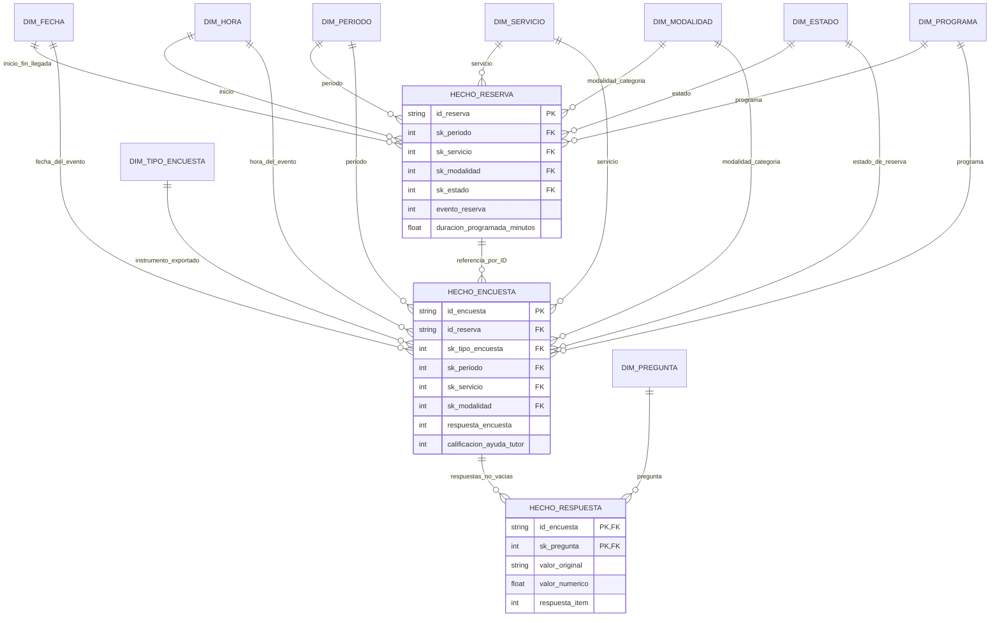

# Modelo dimensional · Reservas y satisfacción de CupiTaller

## Objetivos

Responder patrones de reservas y atención registrada, y describir satisfacción de estudiantes. R01 agrupa Finalizada y Realizada como Atendida; R02 excluye encuestas Inválida de los análisis. La falta de oferta disponible limita las preguntas: el modelo no mide ocupación ni capacidad libre.

## Grano de cada hecho

| Tabla | Una fila representa | Clave / medidas |
|---|---|---|
| `hecho_reserva` | Un evento de reserva exportado | ID de reserva; evento_reserva=1 y minutos programados |
| `hecho_encuesta` | Una encuesta incluida, de un grupo de fuente, para una reserva | ID compuesto de grupo e ID de reserva; respuesta_encuesta=1 y calificación nullable |
| `hecho_respuesta` | Una respuesta no vacía a una pregunta exportada de una encuesta incluida | ID de encuesta + pregunta; respuesta_item=1, texto original y calificación numérica cuando aplica |

El hecho de encuesta incluye las etapas previa y posterior. Para satisfacción se filtra `dim_tipo_encuesta.etapa = posterior`. No se mezclan respuestas previas con las calificaciones del tutor. Una pregunta vacía no genera un hecho de respuesta, pero la encuesta sí permanece: esto permite calcular completitud contando encuestas y respuestas de un ítem por separado.

## Modelo conceptual en notación Entidad/Relación

Las referencias de fecha en encuestas describen la reserva asociada, no la fecha de contestación. La relación entre hechos permite trazabilidad; las agregaciones comparadas se realizan primero al grano necesario para evitar multiplicación de medidas por uniones de uno a muchos.

## Dimensiones y justificación

| Dimensión | Grano / atributos | Motivo |
|---|---|---|
| Fecha | Día del calendario completo, año, mes, día ISO | Permite series y fechas sin eventos; juega roles inicio, fin y llegada |
| Hora | Un minuto del día, 1.440 miembros | Segmenta inicio programado sin confundir segundos de llegada |
| Período | Código original de período, año del código y sufijo sin reinterpretar | Separa período académico exportado de fecha calendario |
| Servicio | Código + etiqueta original | Conserva catálogos históricos sin fusionar Deprecated |
| Modalidad | Tipo de horario + categoría original | Evita confundir modalidad con recurso y grupos de archivo con modalidades |
| Estado | Etiqueta original + agrupación analítica R01 | Conserva evidencia y permite contar atención sin perder el detalle original |
| Programa | Etiqueta normalizada; miembro 0 No informado | Soporta agrupación de escritura y mantiene explícitos los faltantes |
| Tipo de encuesta | Grupo de fuente + etapa previa/posterior | Define proceso de encuesta; no identifica por sí solo la modalidad real |
| Pregunta | Texto completo y columna Silver; marcas texto libre/calificación | Permite respuestas largas sin un hecho distinto para cada pregunta |

Se mantienen dimensiones conformadas entre reserva y encuesta. Los atributos de segmentación de la encuesta proceden de la reserva vinculada, según la referencia de trabajo acordada; las diferencias del registro de encuesta permanecen en Silver y en la auditoría Gold. No se reconstruyen cambios históricos de atributos que no vienen en las fuentes.

No se crean dimensiones de personas basadas solo en nombres ni una dimensión de oferta inexistente. El usuario y prestador originales permanecen en Silver; estos dos análisis no necesitan exponer sus identidades. Los programas son etiquetas registradas, no una certificación del programa oficial del estudiante.

## Matriz de bus

| Dimensión | Reserva | Encuesta | Respuesta |
|---|---|---|---|
| Fecha, hora, período | Directa | Directa, relativa al evento | Mediante encuesta |
| Servicio, modalidad, estado, programa | Directa | Directa y conformada | Mediante encuesta |
| Tipo de encuesta | — | Directa | Mediante encuesta |
| Pregunta | — | — | Directa |

El hecho de respuestas es una extensión de detalle del proceso de encuesta. Para cruzar respuestas y contexto se usa su encuesta; no se interpreta el conteo de respuestas como número de eventos atendidos.

## Medidas y aditividad

Los conteos unitarios son aditivos dentro de su grano. Minutos programados son aditivos como tiempo reservado, pero pueden superponerse entre recursos o usuarios y no equivalen a horas trabajadas ni ocupación. Una calificación no se suma como resultado de negocio; su media y mediana se calculan con respuestas no nulas y mostrando el tamaño del grupo. Porcentajes se recalculan a partir de numeradores y denominadores, nunca se suman ni se promedian sin ponderación.

## Criterios de calidad del modelo

1. **Grano:** unicidad de ID de reserva, encuesta y par encuesta/pregunta, aplicada mediante claves primarias y restricción de grupo-reserva.
2. **Integridad:** ninguna clave dimensional o referencia entre hechos queda sin miembro; claves foráneas SQLite activas y comprobadas durante la carga.
3. **Conservación:** todas las reservas Silver llegan a Gold; encuestas Gold + exclusiones R02 + estados pendientes reconcilian con Silver por fuente.
4. **Completitud explícita:** llegada y calificación son nullable; no se fabrican fechas, ceros de respuesta ni oferta.
5. **Semántica:** estados y modalidades originales visibles, reglas R01/R02 trazadas, etapas de encuesta separadas y atributos conformados.
6. **Aptitud analítica:** las preguntas seleccionadas se expresan con agregaciones al grano correcto; denominadores y `n` visibles.
7. **Reproducibilidad:** claves consistentes dentro de cada reconstrucción completa, archivos de origen trazables y controles publicados.

Los criterios son suficientes para comprobar estructura y conservación de esta entrega. No sustituyen confirmación de formularios históricos, identidad de participantes ni estados operativos desconocidos. La carga es una reconstrucción completa: las claves dimensionales secuenciales pueden cambiar si cambia el conjunto de miembros; no usarlas como identidad estable externa en una estrategia incremental.

## DDL y materialización

El DDL ejecutable está en `sql/00_crear_modelo.sql`. CSV dimensionales y hechos están en `data/oro/`; la misma estructura se carga en `data/oro/bookeau.sqlite3`. El proceso Silver → Gold y sus controles están en `docs/transformacion/`.

## Clasificación Kimball (resumen)

- `hecho_reserva`: hecho transaccional sin medidas (*factless*); `id_reserva` es dimensión degenerada.
- `hecho_encuesta`: hecho transaccional; `hecho_respuesta` es su detalle, con la dimensión Pregunta para absorber cambios de formulario.
- Fecha es una dimensión con roles (inicio, fin, llegada). Modalidad es una dimensión de combinaciones (tipo de horario × categoría).
- SCD: Servicio, Modalidad y Estado tipo 0 (las etiquetas `Deprecated` son miembros propios); Programa tipo 1.
- Diagramas en estrella: `img/modelo_reserva.png` e `img/modelo_encuesta.png`. Justificación completa en la sección 4 del informe.
- Jerarquías materializadas en Gold: Fecha (día → mes → año; `nombre_dia`, `nombre_mes`, `es_fin_de_semana`), Hora (minuto → hora → `franja`), Período (código → `tipo_periodo` → año), Estado (original → `estado_analitico` R01 → `grupo_estado` D1). Las reglas de negocio quedan en las dimensiones y no en las consultas.
