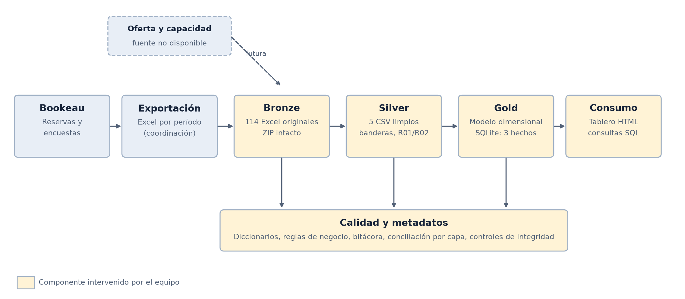
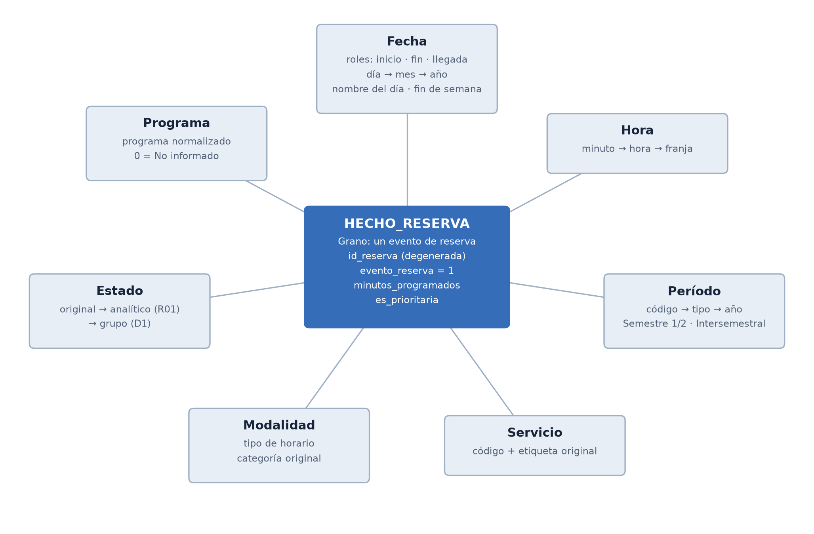
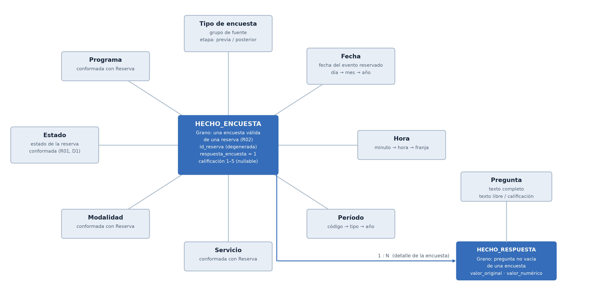
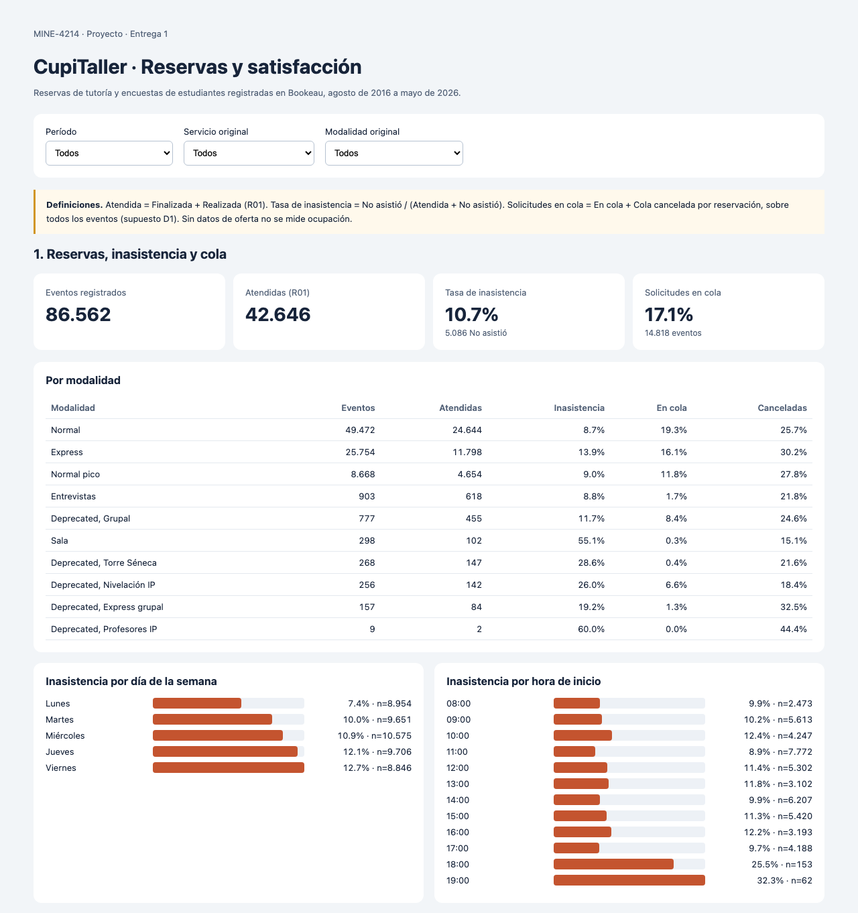
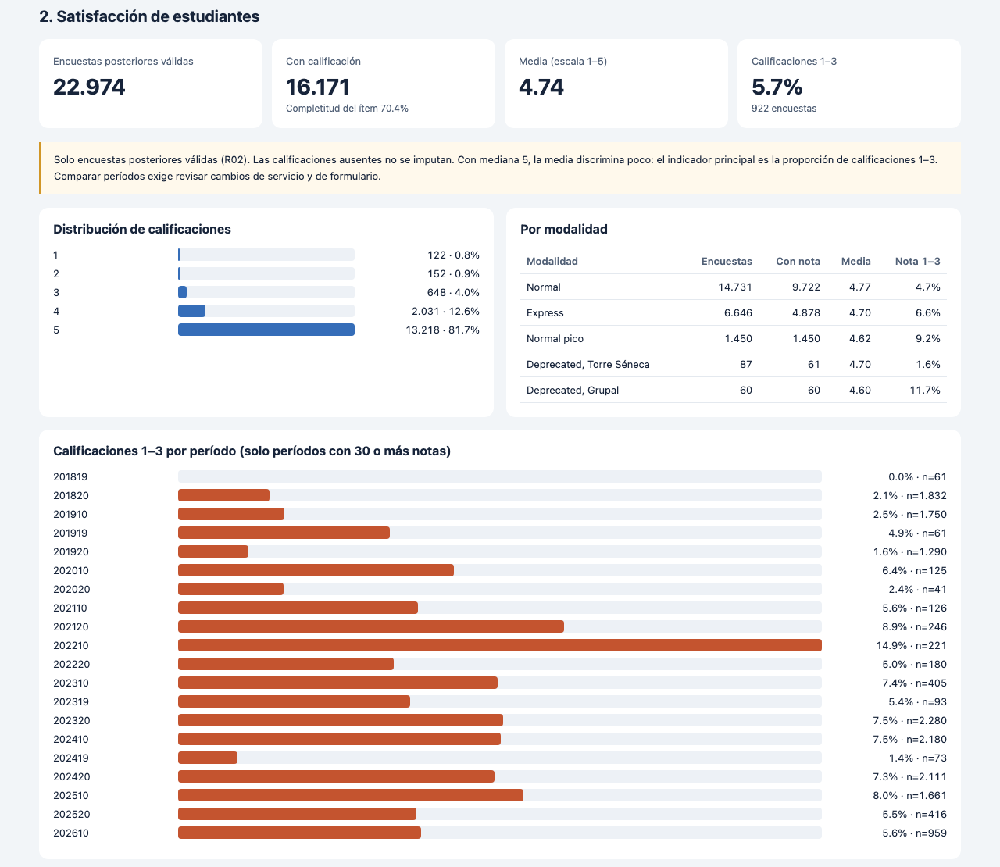

# Proyecto · Entrega 1 · Reservas y satisfacción en CupiTaller

**MINE-4214 Modelado y Diseño de Datos · Universidad de los Andes · Octubre de 2026**

**Integrantes:** _[Nombre 1]_, _[Nombre 2]_, _[Nombre 3]_, _[Nombre 4]_

---

## 1. Objetivo y análisis requeridos

### 1.1 Organización y dependencia

La Universidad de los Andes ofrece, desde el Departamento de Ingeniería de Sistemas y Computación (DISC), el servicio de tutorías **CupiTaller** para los cursos de programación de primeros semestres: Introducción a la Programación (IP, ISIS-1221), sus antecesores APO 1 y APO 2, Estructuras de Datos y Algoritmos (EDA) y Diseño y Programación Orientada a Objetos (DPOO). Monitores estudiantes atienden sesiones con cita previa. Hay tres modalidades vigentes: **Normal** (50–60 minutos), **Express** (20–30 minutos, para dudas puntuales) y **Normal pico** (franjas en semanas de alta demanda).

Las citas se gestionan en **Bookeau**. El estudiante solicita una franja y, si no hay cupo, entra **en cola**. La cita termina en un estado: atendida, cancelada (a tiempo, con excusa, por sanción o tardía y sancionada) o no asistida. Antes de la cita, el estudiante responde una encuesta previa (objetivo y aceptación de condiciones). Después, responde una encuesta de satisfacción con una calificación de 1 a 5 y comentarios abiertos.

Trabajamos con la **coordinación de CupiTaller**, que planea las franjas y asigna monitores cada semestre, y con la **coordinación académica de los cursos**, que se encarga de la formación de los monitores.

### 1.2 Análisis 1 · Inasistencia y presión de cola

| Elemento | Definición |
|---|---|
| Decisión que apoya | Dónde reforzar franjas (más monitores) y dónde aplicar medidas contra la inasistencia (recordatorios, política de sanciones). |
| Destinatario | Coordinación de CupiTaller. |
| Preguntas | (1) ¿Cómo evolucionan las reservas y la atención por período? (2) ¿Qué modalidades, días y horas tienen mayor tasa de inasistencia? (3) ¿Qué proporción de solicitudes termina en cola, y dónde? |
| Indicadores | Eventos de reserva; atenciones (R01); **tasa de inasistencia** = No asistió / (Atendida + No asistió); **proporción en cola** = (En cola + Cola cancelada por reservación) / eventos; proporción de cancelaciones. |
| Datos | Exportación *Reservas*: 86.562 filas × 17 variables, una por evento de reserva (agosto 2016 – mayo 2026). |
| Proceso que los genera | Solicitud de cita en Bookeau → asignación o cola → registro de llegada → cierre de estado por el monitor o el sistema. |

### 1.3 Análisis 2 · Satisfacción con las tutorías

| Elemento | Definición |
|---|---|
| Decisión que apoya | Qué servicios, modalidades y períodos priorizar en la formación y el seguimiento de monitores. |
| Destinatario | Coordinación académica de los cursos. |
| Preguntas | (1) ¿Cómo se distribuye la calificación del tutor? (2) ¿Qué segmentos concentran calificaciones bajas (1–3)? (3) ¿Cómo cambian en el tiempo? |
| Indicadores | Encuestas válidas; completitud del ítem; **proporción de calificaciones 1–3**; media y distribución 1–5 como apoyo. |
| Datos | *Encuesta Express* (6.759 × 33) y *Encuesta Normal* (16.379 × 35), vinculadas por ID a la reserva. |
| Proceso que los genera | Bookeau envía la encuesta al cerrar la cita; el estudiante responde de forma voluntaria. |

Usamos la proporción de calificaciones 1–3 como indicador principal porque la escala tiene **efecto techo**: el 81,7% de las notas es 5 y la mediana es 5. Por eso la media apenas distingue entre segmentos, mientras que la cola baja sí lo hace.

### 1.4 Caracterización general de los datos

El paquete contiene **114 archivos Excel** (uno por grupo y período) en cinco grupos, con **146.952 filas** en total.

| Fuente | Archivos | Filas | Variables | Una fila representa |
|---|---:|---:|---:|---|
| Reservas | 29 | 86.562 | 17 | Un evento de reserva |
| Encuesta Reserva Express (previa) | 14 | 13.815 | 22 | Encuesta previa de una reserva Express |
| Encuesta Reserva Normal IP (previa) | 13 | 23.437 | 22 | Encuesta previa de una reserva Normal de IP |
| Encuesta Express (satisfacción) | 29 | 6.759 | 33 | Encuesta posterior de una reserva Express |
| Encuesta Normal (satisfacción) | 29 | 16.379 | 35 | Encuesta posterior de una reserva Normal |
| **Total** | **114** | **146.952** | | |

Las encuestas reutilizan el ID de la reserva, así que la unidad del proyecto es el **evento de reserva: 86.562 registros**, dentro del rango de 80.000–200.000 que pide el enunciado. Además de los datos tabulares hay texto libre: 17.987 comentarios sobre el tutor y la tutoría, que se usarán en las siguientes entregas.

---

## 2. Ecosistema de analítica

CupiTaller no tiene un ecosistema analítico: hoy la coordinación exporta Excel por período desde Bookeau y los revisa a mano. Proponemos una arquitectura **Lakehouse por capas (medallion)**.



| Componente | Función | Por qué |
|---|---|---|
| Bookeau + exportación | Origen operativo; Excel por período con todos los servicios y modalidades | Es el único mecanismo de extracción disponible; no hay acceso directo a la base. |
| **Bronze** | Archivos originales sin modificar (ZIP y 114 Excel) | Permite reprocesar desde cero y auditar cualquier cifra hasta la celda de origen. |
| **Silver** | Un CSV por fuente: nombres de columna comunes, fechas ISO, tipos explícitos, programa normalizado, reglas R01/R02 y banderas de calidad por fila | La limpieza se hace una vez y todos los análisis la reutilizan; no se borra ningún registro. |
| **Gold** | Modelo dimensional (3 hechos, 9 dimensiones) en SQLite, con PK, FK y CHECK | Responde los dos análisis con dimensiones conformadas y sin sobreconteo. |
| Consumo | Tablero HTML interactivo y consultas SQL | El tablero funciona sin servidor y la coordinación lo puede abrir directamente. |
| Calidad y metadatos | Diccionarios, reglas de negocio, bitácora de transformaciones, conciliación entre capas | Cada decisión queda documentada y verificable. |

**Componentes que intervenimos:** Bronze (carga e inventario), Silver (limpieza y reglas), Gold (modelo y carga), consumo (tablero) y la capa transversal de calidad. La oferta de franjas y la capacidad de monitores no se exportan; quedan como fuente futura (línea punteada).

Para esta entrega, la implementación es local (Python, CSV y SQLite). Los granos, las reglas y los controles no dependen de la plataforma, así que se pueden migrar a un Lakehouse administrado (por ejemplo, Delta Lake sobre almacenamiento en la nube) sin cambiar el modelo.

---

## 3. Exploración y calidad de datos

Perfilamos los 114 archivos completos, sin muestreo. Los resultados detallados están en `docs/caracterizacion/` y `docs/calidad/`.

### 3.1 Estadísticas descriptivas

| Variable (Reservas) | Resultado |
|---|---|
| Rango de inicio programado | 19-ago-2016 a 22-may-2026, 29 períodos |
| Duración programada | mín. 20, mediana 50, máx. 120 minutos |
| Estados | 12 etiquetas: Finalizada 38.541 · Cancelada a tiempo 18.147 · En cola 10.215 · No asistió 5.086 · Cola cancelada por reservación 4.603 · Realizada 4.105 · otras 5.865 |
| Servicios | 11: IP 53.272 · APO 1 (histórico) 21.136 · EDA 6.127 · APO 2 3.922 · otros 2.105 |
| Modalidades (tipo de horario) | 10: Normal 49.472 · Express 25.754 · Normal pico 8.668 · otras 2.668 |
| Cardinalidades | 9.943 códigos de usuario · 742 prestadores · 213 etiquetas de programa |
| Hora de inicio más frecuente | 11:00 (13.699), 14:00 (11.253), 09:00 (10.217) |

| Calificación del tutor (encuestas válidas) | 1 | 2 | 3 | 4 | 5 | Sin nota |
|---|---:|---:|---:|---:|---:|---:|
| Encuestas | 122 | 152 | 648 | 2.031 | 13.218 | 6.803 |
| % sobre calificadas | 0,8% | 0,9% | 4,0% | 12,6% | 81,7% | — |

### 3.2 Completitud

| Fuente | Variable | Faltantes | % | Interpretación |
|---|---|---:|---:|---|
| Todas | Fecha de devolución | 146.952 | 100% | El campo no se usa; no hay hora real de fin. **No se puede medir duración efectiva.** |
| Reservas | Fecha de llegada | 43.422 | 50,2% | Esperado: cancelaciones y cola no tienen llegada. Ver 3.4. |
| Reservas | Prestador del servicio | 42.616 | 49,2% | Esperado: solo las citas atendidas tienen monitor asignado. |
| Reservas | Programa | 333 | 0,4% | Faltante real; se carga como «No informado». |
| Encuesta Express | Calificación del tutor | 1.776 | 26,3% | La pregunta no existía antes de 201819. |
| Encuesta Normal | Calificación del tutor | 5.053 | 30,9% | Igual que la anterior. |
| Encuestas de satisfacción | Comprensión del tema / material del curso | 16.786 | 72–73% | Preguntas añadidas en períodos recientes. |
| Encuestas de satisfacción | Comentario sobre tutor y tutoría | 5.151 | 19–23% | Texto opcional. |

Los faltantes de llegada y prestador dependen del estado de la cita, así que no los tratamos como errores. Los de las encuestas se explican por **cambios del formulario en el tiempo**: la cobertura de cada pregunta por período está en `docs/caracterizacion/cobertura_variables_periodo.csv`.

### 3.3 Unicidad

| Comprobación | Resultado |
|---|---|
| Duplicados exactos (todas las columnas) en cada fuente | 0 |
| ID repetido dentro de cada fuente | 0 (86.562 ID únicos en Reservas) |
| ID + período repetido | 0 |
| Encuestas sin reserva correspondiente | 0 de 60.390 (100% vinculadas por ID y período) |
| Más de una encuesta del mismo tipo por reserva | 0 |
| Duplicados semánticos: variantes de escritura del programa | 213 etiquetas → 174 tras normalizar mayúsculas, tildes y espacios (`mapa_programas.csv`) |

La unicidad de la clave de negocio es completa, lo que permite usar el ID como clave degenerada y como vínculo entre reservas y encuestas.

### 3.4 Consistencia

| Comprobación | Casos | % | Tratamiento |
|---|---:|---:|---|
| Estado cancelado con marca de llegada | 32 | 0,04% | Bandera `revisar_cancelacion_con_llegada` |
| Finalizada sin marca de llegada | 8 | 0,01% | Bandera `revisar_finalizada_sin_llegada` |
| No asistió con marca de llegada | 9 | 0,18% de No asistió | Bandera `revisar_no_asistio_con_llegada` |
| Estado de la reserva distinto entre reserva y encuesta | 73 | 0,1% | Gold usa el valor de Reservas; la diferencia queda en `diferencias_con_reserva_json` |
| Prestador distinto entre reserva y encuesta | 550 | 1,0–1,6% | Igual que la anterior |
| Programa distinto entre reserva y encuesta | 97 | 0,1–0,2% | Igual que la anterior |
| Encabezado `Código servicio` vs. `Código del servicio` | 4 fuentes | — | Se homologa el nombre de columna en Silver |
| Grupo de archivo ≠ modalidad registrada | 1.609 encuestas | — | *Encuesta Normal* contiene 1.461 «Normal pico»; se segmenta por la modalidad de la reserva |
| Etiquetas `Deprecated` | 6 servicios y 5 modalidades | — | Se conservan como miembros propios, sin homologar |

### 3.5 Validez

| Regla | Evaluables | Incumplen |
|---|---:|---:|
| Fin programado ≥ inicio programado | 146.952 | 0 |
| Año del inicio = año del código de período | 146.952 | 0 |
| Calificación del tutor ∈ {1,…,5} | 16.309 | 0 |
| Llegada más de 1 hora antes del inicio | 43.140 | 37 |
| Llegada después del fin programado | 43.140 | 45 |
| Citas pasadas en estado no terminal («En ejecución» o «Reservada») | 508 | 508 |
| Encuestas marcadas «Inválida» por Bookeau | 60.390 | 166 |

Las 508 citas que siguen «En ejecución» o «Reservada» después de su fecha nunca se cerraron. No se pueden clasificar como atendidas ni como no asistidas, así que quedan fuera de la tasa de inasistencia.

### 3.6 Transformaciones que se derivan del análisis de calidad

1. Homologar nombres de columna, fechas a ISO 8601 y tipos, con los identificadores como texto.
2. Normalizar la escritura del programa en una columna adicional, conservando el original.
3. **R01** (aportada por la coordinación): Finalizada y Realizada → *Atendida*, conservando el estado original.
4. **R02** (decisión del equipo): excluir de los análisis las 166 encuestas «Inválida», manteniéndolas en Silver para auditoría.
5. **D1** (supuesto del equipo, por validar con la coordinación): la cola no ocupa cupo; la inasistencia se mide solo sobre citas que llegaron a la hora programada (Atendida + No asistió). Se materializa como el atributo `grupo_estado` de la dimensión Estado.
6. Marcar con banderas los casos inconsistentes, sin corregirlos ni borrarlos.
7. No imputar la fecha de devolución, la llegada ni las calificaciones faltantes.

---

## 4. Modelo de datos conceptual

Seguimos los cuatro pasos de diseño dimensional de Kimball.

### 4.1 Procesos de negocio y grano

| Paso | Proceso 1 · Reserva de tutoría | Proceso 2 · Encuesta de la tutoría |
|---|---|---|
| 1. Proceso de negocio | Solicitud y cierre de una cita en Bookeau | Respuesta del estudiante a la encuesta previa o posterior |
| 2. Grano | **Un evento de reserva** (ID de Bookeau) | **Una encuesta válida de una reserva**; como detalle, **una respuesta no vacía a una pregunta** |
| 3. Dimensiones | Fecha (inicio, fin, llegada), Hora, Período, Servicio, Modalidad, Estado, Programa | Las mismas, conformadas, más Tipo de encuesta; el detalle añade Pregunta |
| 4. Hechos | `evento_reserva` (=1), `minutos_programados`, `es_prioritaria` | `respuesta_encuesta` (=1), `calificacion_ayuda_tutor` (1–5, nullable); el detalle tiene `valor_original` y `valor_numerico` |

### 4.2 Modelos dimensionales propuestos

**Modelo 1 · Reservas** (responde al Análisis 1)



**Modelo 2 · Encuestas y respuestas** (responde al Análisis 2 y prepara el análisis de texto)



### 4.3 Matriz de bus

| Dimensión | Reserva | Encuesta | Respuesta |
|---|:---:|:---:|:---:|
| Fecha (rol) | ✔ inicio · fin · llegada | ✔ inicio de la reserva | vía encuesta |
| Hora | ✔ | ✔ | vía encuesta |
| Período | ✔ | ✔ | vía encuesta |
| Servicio | ✔ | ✔ | vía encuesta |
| Modalidad | ✔ | ✔ | vía encuesta |
| Estado (de la reserva) | ✔ | ✔ | vía encuesta |
| Programa | ✔ | ✔ | vía encuesta |
| Tipo de encuesta | | ✔ | vía encuesta |
| Pregunta | | | ✔ |

### 4.4 Decisiones de diseño y su justificación

| Decisión | Justificación |
|---|---|
| **Dos procesos, tres tablas de hechos** | Reserva y encuesta tienen granos distintos. Mezclarlas en una tabla repetiría la reserva por cada encuesta y sumar filas sobrecontaría eventos (146.952 en vez de 86.562). |
| `hecho_reserva` es **transaccional sin medidas** (*factless*) | El proceso registra que un evento ocurrió; las preguntas se responden contando filas por estado. `evento_reserva = 1` hace explícita la medida aditiva. |
| `hecho_respuesta` como **detalle con dimensión Pregunta** | Hay 22 preguntas que cambian según el período y el grupo. Una columna por pregunta dejaría la tabla llena de nulos y obligaría a cambiar el esquema con cada formulario nuevo. Con la dimensión Pregunta, los formularios nuevos son filas nuevas. Los textos libres quedan listos para la Entrega 2. |
| `id_reserva` como **dimensión degenerada** | No tiene atributos propios: es la clave de negocio que permite trazar y vincular reserva y encuesta. En Gold se refuerza con una FK para garantizar la integridad. |
| **Fecha con roles** (inicio, fin, llegada) | Una sola tabla de calendario sirve tres significados y permite mostrar días sin eventos. |
| **Dimensiones conformadas** entre reserva y encuesta | La encuesta toma servicio, modalidad, estado y programa de su reserva. Así un mismo filtro del tablero se aplica a ambos análisis. |
| **Modalidad** = tipo de horario + categoría | Es una dimensión de combinaciones pequeña (24 miembros) que evita dos dimensiones casi vacías. |
| **Estado** con jerarquía original → analítico → grupo | Las reglas de negocio viven en la dimensión, no en las consultas: `estado_analitico` aplica R01 y `grupo_estado` aplica D1 (Atendida, No asistió, Cola, Cancelada, Abierta). Si la coordinación cambia una regla, se modifica una fila de la dimensión y ninguna consulta. |
| **Manejo de cambios (SCD)** | Servicio, Modalidad y Estado son **tipo 0**: se guarda la etiqueta tal como se registró y las `Deprecated` son miembros propios. Programa es **tipo 1**: las correcciones de escritura sobrescriben. No hay dimensión de personas porque los análisis no la requieren, y así se evita exponer datos personales. |
| Sin dimensión de oferta | La fuente no exporta franjas ofrecidas ni capacidad; el modelo no las inventa. |

**Jerarquías y atributos de agrupación** (todos materializados en Gold):

| Dimensión | Jerarquía | Atributos descriptivos |
|---|---|---|
| Fecha | día → mes → año | `nombre_dia`, `nombre_mes`, `dia_semana_iso`, `es_fin_de_semana` |
| Hora | minuto → hora → franja (Madrugada, Mañana, Tarde, Noche) | `etiqueta` (HH:MM) |
| Período | código → tipo de período (Semestre 1 = sufijo 10, Semestre 2 = 20, Intersemestral = 19) → año | `sufijo_original` |
| Estado | estado original (12) → estado analítico R01 (11) → grupo D1 (5) | — |
| Servicio, Modalidad, Programa | sin jerarquía (catálogos planos) | código, etiqueta original, categoría |

### 4.5 Criterios de calidad del modelo

| Criterio | Cómo se verifica | Resultado |
|---|---|---|
| **Grano declarado y único** | PK en cada hecho; `UNIQUE(id_reserva, tipo_encuesta)` | 0 violaciones |
| **Integridad referencial** | FK activas en SQLite y `PRAGMA foreign_key_check` | 0 huérfanos |
| **Conservación (completitud del modelo)** | Silver = Gold + exclusiones documentadas, por fuente | 86.562 = 86.562; encuestas concilian (tabla 5.3) |
| **Aditividad correcta** | Las medidas sumables son conteos al grano; las calificaciones solo se promedian; los porcentajes se recalculan a partir de numerador y denominador | Revisado en las consultas del tablero |
| **Sin nulos en claves dimensionales** | Miembro «No informado» (sk = 0) en Programa | 333 reservas apuntan a sk = 0 |
| **Dominios de atributos de agrupación** | CHECK sobre `grupo_estado`, `franja`, `es_fin_de_semana` | 0 violaciones |
| **Aptitud para las preguntas** | Cada pregunta de 1.2–1.3 se responde con un `GROUP BY` sobre un solo hecho y sus dimensiones | Ver SQL en `sql/01_consultas_analisis.sql` |
| **Trazabilidad** | Cada hecho conserva archivo, hoja y fila de Excel | 100% de las filas |

Estos criterios bastan para esta entrega porque cubren los tres modos de falla de un modelo dimensional: grano mal definido (sobreconteo), integridad rota (filas que desaparecen al hacer *join*) y medidas mal agregadas (promedios de promedios). Además, cada uno se verifica automáticamente en cada carga. La validez semántica de los estados depende de reglas de negocio, y las que faltan se listan en 5.4.

---

## 5. Transformación Silver → Gold

### 5.1 Diseño del proceso

| Paso | Entrada (Silver) | Acción | Salida (Gold) |
|---:|---|---|---|
| 1 | 5 CSV | Validar unicidad de ID y vínculo encuesta–reserva–período | — (falla si no cumple) |
| 2 | Fechas de todas las fuentes | Calendario continuo y 1.440 minutos del día | `dim_fecha`, `dim_hora` |
| 3 | `reservas.csv` | Catálogos distintos, sin equivalencias inventadas; atributos de jerarquía (tipo de período, grupo de estado D1, franja, nombres de día y mes) | `dim_periodo`, `dim_servicio`, `dim_modalidad`, `dim_estado`, `dim_programa` |
| 4 | Encabezados de las encuestas | Tipo y etapa de encuesta; texto completo de cada pregunta | `dim_tipo_encuesta`, `dim_pregunta` |
| 5 | `reservas.csv` | Todas las reservas, con claves sustitutas y trazabilidad | `hecho_reserva` |
| 6 | 4 CSV de encuestas | Solo las incluidas por R02; claves de segmentación tomadas de su reserva | `hecho_encuesta` |
| 7 | 4 CSV de encuestas | Una fila por pregunta no vacía | `hecho_respuesta` |
| 8 | Base temporal | PK/FK/CHECK, conciliación y publicación | `bookeau.sqlite3` + CSV |

La carga es una reconstrucción completa en una base temporal, que solo reemplaza la versión publicada si pasan todos los controles.

### 5.2 Decisiones importantes

| Decisión | Alternativa descartada | Motivo |
|---|---|---|
| Todas las reservas pasan a Gold, incluidas cola y cancelaciones | Cargar solo las atendidas | El Análisis 1 necesita los estados no atendidos para calcular inasistencia y cola. |
| Las encuestas «Inválida» no pasan a Gold (R02) | Cargarlas con un indicador | Ningún análisis las usa. Siguen en Silver para auditoría. |
| La encuesta hereda servicio, modalidad, estado y programa de la reserva | Usar los atributos de la propia encuesta | Garantiza dimensiones conformadas; las 0,1–1,6% de diferencias se guardan en `diferencias_con_reserva_json`. |
| Respuestas vacías no generan fila | Fila con valor nulo | Así la completitud del ítem es exacta: respuestas / encuestas. |
| Solo la calificación 1–5 recibe valor numérico | Convertir escalas Likert a números | Las escalas de acuerdo cambian entre formularios; convertirlas inventaría una métrica. |
| Etiquetas `Deprecated` sin homologar | Unir APO 1 con IP | No hay un catálogo oficial de equivalencias; unirlas mezclaría cursos distintos. |

### 5.3 Mecanismo de validación y resultados

El script `src/construir_gold_bookeau.py` aplica en cada ejecución las siguientes validaciones y escribe los resultados en `docs/transformacion/controles_gold.json` y `conciliacion_silver_gold.csv`:

1. **Conciliación de conteos por fuente:** filas Silver = filas Gold + exclusiones R02 + pendientes.
2. **Restricciones declarativas:** PK, UNIQUE, CHECK (dominios 0/1 y 1–5, duración ≥ 0) y FK, aplicadas al insertar.
3. **Verificación posterior:** `PRAGMA foreign_key_check` y unicidad de cada grano.
4. **Conciliación de medidas:** atenciones R01 y exclusiones R02 recalculadas en Gold contra Silver.

| Fuente | Filas Silver | Encuestas Gold | Excluidas R02 | Respuestas no vacías | Resultado |
|---|---:|---:|---:|---:|:---:|
| Reservas | 86.562 | 86.562 (reservas) | — | — | OK |
| Encuesta Express | 6.759 | 6.706 | 53 | 55.720 | OK |
| Encuesta Normal | 16.379 | 16.268 | 111 | 180.072 | OK |
| Encuesta Reserva Express | 13.815 | 13.815 | 0 | 55.260 | OK |
| Encuesta Reserva Normal IP | 23.437 | 23.435 | 2 | 93.740 | OK |
| **Total encuestas** | **60.390** | **60.224** | **166** | **384.792** | **OK** |

Controles adicionales: atenciones R01 = 42.646 en Silver y en Gold; claves foráneas huérfanas = 0; granos duplicados = 0.

### 5.4 Correcciones que debería hacer el responsable de la fuente

| Problema | Casos | Corrección sugerida en Bookeau |
|---|---:|---|
| Fecha de devolución nunca se registra | 100% | Registrar la hora real de cierre de la sesión, o eliminar el campo de la exportación. |
| Citas pasadas sin cerrar («En ejecución», «Reservada») | 508 | Cierre automático de estados al terminar el día. |
| Estado contradictorio con la llegada | 49 | Validar el estado contra la marca de llegada al cerrar la cita. |
| Llegada fuera de la ventana de la cita | 82 | Revisar el reloj o el proceso de registro de llegada. |
| Finalizada vs. Realizada sin definición | 42.646 | Documentar la diferencia o unificar los estados. |
| Criterio de encuesta «Inválida» no documentado | 166 | Exportar el motivo de invalidez. |
| Etiquetas `Deprecated` sin catálogo histórico | 11 etiquetas | Publicar la tabla de equivalencias entre servicios y modalidades. |
| Programa en texto libre | 213 variantes | Usar una lista cerrada de programas. |
| Preguntas sin identificador ni versión | 22 | Exportar un ID de pregunta y la versión del formulario. |
| Oferta de franjas y capacidad | — | Exportar las franjas ofrecidas, para medir la ocupación. |

---

## 6. Respuesta a los análisis

El tablero `entregables/tablero_bookeau.html` funciona sin conexión y filtra por período, servicio y modalidad. Los filtros se aplican a ambas secciones.

### 6.1 Análisis 1 · Inasistencia y presión de cola



| Modalidad | Eventos | Atendidas | Inasistencia | En cola | Canceladas |
|---|---:|---:|---:|---:|---:|
| Normal | 49.472 | 24.644 | 8,7% | 19,3% | 25,7% |
| Express | 25.754 | 11.798 | **13,9%** | 16,1% | 30,2% |
| Normal pico | 8.668 | 4.654 | 9,0% | 11,8% | 27,8% |
| **Total (todas)** | **86.562** | **42.646** | **10,7%** | **17,1%** | — |

**Hallazgos:**

- **Express tiene una inasistencia 60% mayor que Normal** (13,9% vs. 8,7%). Como la cita es corta y fácil de reservar, el estudiante pierde poco si no llega. Es el primer candidato para recordatorios automáticos o para que la sanción cuente también en Express.
- **La inasistencia crece a lo largo de la semana:** lunes 7,4%, martes 10,0%, miércoles 10,9%, jueves 12,1%, viernes 12,7%. Por hora, las franjas de 10:00, 13:00 y 16:00 superan el 11,5%. Las de 18:00–19:00 llegan al 25–32%, pero tienen pocos eventos.
- **Una de cada seis solicitudes (17,1%) termina en cola** sin llegar a una cita. Es una señal directa de demanda no atendida, y la peor es Normal (19,3%). La proporción en cola bajó de entre 14% y 20% (2020–2024) al 6,9% en 202610, a la vez que el volumen de reservas cayó de unas 5.000 a 1.970 por semestre. La coordinación debería averiguar la causa de esa caída.

### 6.2 Análisis 2 · Satisfacción



| Segmento | Calificadas | Media | Calificaciones 1–3 |
|---|---:|---:|---:|
| Normal | 9.722 | 4,77 | 4,7% |
| Express | 4.878 | 4,70 | 6,6% |
| Normal pico | 1.450 | 4,62 | **9,2%** |
| IP | 8.908 | 4,68 | 7,2% |
| EDA | 2.146 | 4,68 | 7,9% |
| APO 1 (histórico) | 4.332 | 4,85 | 2,1% |
| **Total** | **16.171** | **4,74** | **5,7%** |

**Hallazgos:**

- La satisfacción es alta (media 4,74; 81,7% de cincos). La señal útil está en el 5,7% de calificaciones 1–3.
- **Normal pico tiene casi el doble de calificaciones bajas que Normal** (9,2% vs. 4,7%). Es consistente con la sesión en semana de alta demanda: más carga para el monitor y menos tiempo por estudiante.
- **Las calificaciones bajas pasaron de cerca del 2% (2018–2019, APO) a cerca del 7,5% (2023–2025, IP y EDA)**, con un máximo de 14,9% en 202210. El cambio coincide con la transición de APO a IP y con cambios en el formulario. No lo atribuimos solo al servicio, pero es el período que la coordinación académica debería revisar primero.
- La completitud del ítem es del 70,4%. Como la encuesta es voluntaria, los resultados describen a quienes respondieron.

### 6.3 Por qué el modelo es adecuado para estos análisis

| Criterio | Cómo lo cumple el modelo |
|---|---|
| Cada indicador se calcula sobre un solo hecho, al grano correcto | Inasistencia y cola: `COUNT` sobre `hecho_reserva` agrupado por `dim_estado`. Calificaciones: `hecho_encuesta` filtrado a etapa posterior. Ningún indicador cruza dos hechos fila a fila. |
| Los filtros son coherentes entre análisis | Período, servicio y modalidad son dimensiones conformadas, así que el mismo filtro significa lo mismo en ambas secciones. |
| Los denominadores son explícitos | R01 y D1 son atributos de la dimensión Estado (`estado_analitico`, `grupo_estado`) y R02 es un filtro de carga; las consultas solo agrupan por esos atributos. El tablero muestra *n* junto a cada porcentaje. |
| Se puede navegar por niveles (*drill-down*) | Las jerarquías permiten pasar de tipo de período a período, de franja a hora y de grupo de estado a estado original. Por ejemplo, la proporción en cola es 12,2% en intersemestrales frente a 16,9–17,5% en semestres. |
| El tablero no tiene que corregir problemas de calidad | Las exclusiones e inconsistencias se resuelven en Silver y Gold; el tablero solo agrega. |
| El modelo puede crecer | La oferta de franjas se incorporaría como un nuevo hecho conformado (Fecha, Hora, Servicio, Modalidad); el texto ya está en `hecho_respuesta`. |

---

## 7. Gestión del proyecto

### 7.a Contribuciones y distribución de puntos

> **Sección por completar por el equipo.** No se puede redactar a partir del repositorio: debe reflejar el trabajo real de cada persona.

| Integrante | Trabajo realizado | Puntos (de 100) | Justificación |
|---|---|---:|---|
| _[Nombre 1]_ | _[p. ej., perfilamiento y calidad, punto 3]_ | _[ ]_ | _[compromiso, calidad, cumplimiento, participación]_ |
| _[Nombre 2]_ | _[ ]_ | _[ ]_ | _[ ]_ |
| _[Nombre 3]_ | _[ ]_ | _[ ]_ | _[ ]_ |
| _[Nombre 4]_ | _[ ]_ | _[ ]_ | _[ ]_ |

**Problemas identificados en el equipo:** _[p. ej., carga concentrada en una persona, reglas de negocio confirmadas tarde]_

**Estrategias para la Entrega 2:** _[p. ej., responsables por punto desde el inicio, revisión cruzada antes de entregar, reunión con la coordinación en la primera semana]_

### 7.b Uso de inteligencia artificial generativa

**Uso dado.** Usamos un asistente de programación con IA para: escribir los scripts de lectura de Excel, perfilamiento, limpieza y carga Gold; proponer y discutir el modelo dimensional; generar el tablero, las figuras y los borradores de documentación y de este informe; y hacer una clasificación exploratoria de comentarios (fuera del alcance de esta entrega). Las reglas de negocio R01 y R02 y el supuesto D1 son decisiones humanas. Cada cifra del informe se contrastó con las salidas de los scripts y de las consultas SQL.

**Ventajas para la organización:** procesos reproducibles en lugar de revisión manual de Excel; documentación y diccionarios generados junto con el código; capacidad de explorar alternativas de modelo rápidamente.

**Riesgos para la organización:**

- **Privacidad:** las fuentes contienen nombres, correos y códigos de estudiantes y monitores, y comentarios sobre personas. Pasar estos datos a un servicio de IA externo requiere autorización y anonimización previa.
- **Significados inventados:** la IA puede proponer interpretaciones plausibles pero falsas de estados o campos. Lo mitigamos con reglas confirmadas por personas (R01, R02) y con banderas en lugar de correcciones automáticas.
- **Exceso de confianza en métricas automáticas:** por ejemplo, un clasificador de comentarios con 62% de acuerdo no sirve para evaluar a monitores. Por eso lo dejamos fuera del entregable.
- **Dependencia:** el equipo debe entender y poder mantener el código generado.

---

## Anexo · Reproducción

```sh
python3 src/caracterizar_bookeau.py        # perfilamiento Bronze
python3 src/limpiar_bookeau.py             # Bronze → Silver
python3 src/construir_gold_bookeau.py      # Silver → Gold + controles
python3 src/generar_tablero_bookeau.py     # tablero
python3 src/generar_figuras.py             # figuras del informe
python3 src/generar_informe_pdf.py         # este informe en PDF
```

Evidencia detallada: `docs/caracterizacion/`, `docs/calidad/`, `docs/limpieza/`, `docs/modelo/`, `docs/transformacion/`, `sql/`.
